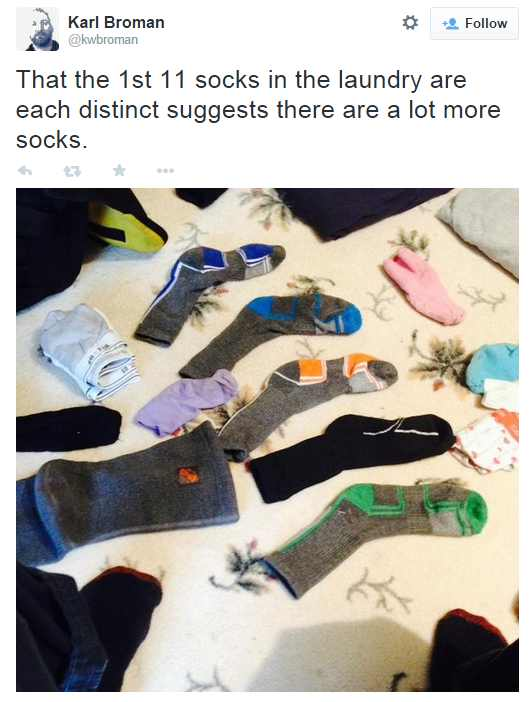

Refs:

+ [http://www.sumsar.net/blog/2014/10/tiny-data-and-the-socks-of-karl-broman/](http://www.sumsar.net/blog/2014/10/tiny-data-and-the-socks-of-karl-broman/)

+ [http://darrenjw.wordpress.com/2013/03/31/introduction-to-approximate-bayesian-computation-abc/](http://darrenjw.wordpress.com/2013/03/31/introduction-to-approximate-bayesian-computation-abc/)
  
## Introduction

Approximate Bayesian Computation (ABC) generate samples from a distribution which is not the true posterior distribution of interest, but a distribution which is hoped to be close to the real posterior distribution of interest.

Suppose we know the prior $p(\theta)$ and the likelihood $p(x|\theta)$ and want to know the posterior $p(\theta|x)$. We can simulate from the joiont distribution $p(\theta,x)$ by first simulate from $\theta^* \sim p(\theta)$ and then simulate from $x^* \sim p(x|\theta^*)$. We thus can get as many samples $(\theta^*,x^*)$ as we like. if we apply a rejection process that only keep values $\theta^*$ from samples $(\theta^*,x^*)$ if $x^*$ matches the true data $x$ we then have a sample from the posterior $p(\theta|x)$.

The rejection rate can be high, especially if the domain is continuous, so we must define what means by $x^*$ matching $x$ to keep the rejection rate in appropriate levels, ie, some $\epsilon$ for $||x-x^*|| \leq \epsilon$, for some metric $||\cdot||$. However, small values of $\epsilon$ will better approximate the posterior but will increase the rate of rejection.

ABC cannot work properly for high-dimensionaly of $x$, there will be too much rejections. In these cases the best is to find a good agreement between some statistics of $x$. For eg, forming a lower-dimensionality vector of summary statistics (ideally, sufficient statistics) $s(x)$ and accepting when $||s(x)-s(x^*)|| \leq \epsilon$.

**The algorithm**

1. Construct a generative model that produces the same type of data as you are trying to model. Assume prior probability distributions over all the parameters that you want to estimate. Just as when doing standard Bayesian modelling these distributions represents the model's information regarding the parameters before seeing any data.
1. Sample tentative parameters values from the prior distributions, plug these into the generative model and simulate a dataset.
1. Check if the simulated dataset matches the actual data you are trying to model. If yes, add the tentative parameter values to a list of retained probable parameter values, if no, throw them away.
1. Repeat step 2 and 3 a large number of times building up the list of probable parameter values.
1. Finally, the distribution of the probable parameter values represents the posterior information regarding the parameters. Intuitively, the more likely it is that a set of parameters generated data identical to the observed, the more likely it is that that combination of parameters ended up being retained.

## The Sock Problem

<center></center>

The problem is this: Given the tiny dataset of eleven unique socks, how many socks does Karl Broman have in his laundry in total? 

Step 1&2:

If you know the parameters and the data, this is the way we generate a sample:  
  
```{r, collapse=TRUE}
# The Parameters (which we do not know, but assume the following values as an eg)
n_socks  <- 18  
n_pairs  <- 7
n_odd    <- 4   # total socks = 2*n_pairs + n_odd

# The Data
n_picked <- 11

# The Generative Model
socks <- rep(seq_len(n_pairs + n_odd), rep(c(2,1), c(n_pairs,n_odd))) # label socks (same pair, same label)
socks 

pick_socks <- sample(socks, min(n_picked, n_socks)) # Simulate a sock picking
pick_socks
sock_counts <- table(pick_socks)
sock_counts
c(unique=sum(sock_counts==1), pairs=sum(sock_counts==2)) # counting amount of unique and paired socks
```

The generative model above needs adequate prior distributions for its parameters, namely, `n_socks`, `n_pairs`, `n_odd` (`n_picked` is the data and will be used to estimate the parameter's values).

For `n_socks`, since it is discrete and always positive, it could be the Poisson. But the Poisson has the mean equal to the variance which seems very restrictive in this context. We will pick the Negative Binomial for extra flexibility.

$$\text{n_socks} \sim \text{NBinom}(\mu,\sigma)$$

In `R` a negative binomial random generation is implemented by the `rnbinom(mu, size)`, where $size = -\mu^2 / (\mu - \sigma^2)$.

Assuming than an average person washes, each time, 30 socks and giving a confortable standard deviation of 15, we have:

```{r, fig.width=12}
prior_mu <- 30
prior_sd <- 15
prior_size <- -prior_mu^2 / (prior_mu - prior_sd^2)
n_socks <- rnbinom(10, mu=prior_mu, size=prior_size)
n_socks

xs <- seq(0,75)
barplot(dnbinom(xs, mu=prior_mu, size=prior_size), names.arg=xs, lwd=2, col="lightgreen",
        main="prior ratio for total number of socks", xlab="total socks", ylab="probability")
```

For `n_pairs` and `n_odd` we will place a prior on the ratio of paired socks, ie, `2*n_pairs/(2*n_pairs+n_odd)` which will vary between 0 and 1. We select a Beta for the job:

$$\text{ratio} \sim \text{Beta}(\alpha,\beta)$$

We assume that most socks are in pairs, say a ratio more than $75\%$, so let's aggregate the majority of the probability mass for the ratio around $[0.75,1]$. We'll use a Beta with a mean of $87.5\%$ and a sd of $8\%$:

```{r, collapse=TRUE}
estBetaParams <- function(mu, var) {   # estimate beta parameters
  alpha <- ((1-mu)/var - 1/mu)*mu^2
  beta  <- alpha*(1/mu - 1)
  c(alpha, beta)
}

beta_params <- estBetaParams(0.875, 0.08^2)
prior_alpha <- round(beta_params[1],0)
prior_alpha
prior_beta  <- round(beta_params[2],0)
prior_beta

xs <- seq(0,1,len=101)
plot(xs, dbeta(xs, prior_alpha, prior_beta), lwd=2, col="red", type="l",
     main="prior ratio for paired socks", xlab="ratio", ylab="density")
```

With the selection of model and priors we can make a sample function:

```{r, collapse=TRUE}
socks_sample <- function(n_picked) {
  
  # Generate a sample of prior values 
  prior_mu    <- 30
  prior_sd    <- 15
  prior_size  <- -prior_mu^2 / (prior_mu - prior_sd^2)
  n_socks     <- rnbinom(1, mu=prior_mu, size=prior_size)
  
  prior_alpha <- 14
  prior_beta  <- 2
  prop_pairs  <- rbeta(1,prior_alpha, prior_beta)
  n_pairs     <- round(prop_pairs * floor(n_socks/2), 0)
  n_odd       <- n_socks - 2*n_pairs
  
  # Simulate picking socks
  socks       <- rep( seq_len(n_pairs + n_odd), rep(c(2,1), c(n_pairs,n_odd))  )
  pick_socks  <- sample(socks, min(n_picked, n_socks))
  sock_counts <- table(pick_socks)
  
  # Returning parameters values and the counting of odd and paired socks
  c(unique     = sum(sock_counts==1), 
    pairs      = sum(sock_counts==2),
    n_socks    = n_socks,
    n_pairs    = n_pairs,
    n_odd      = n_odd,
    prop_pairs = prop_pairs
   )
}

# let's get a couple of samples to see it working:
socks_sample(11)
socks_sample(11)
```

So, let's plug the data, iterate, and get a bunch of samples:

```{r}
n_picked <- 11 # our (only!) data

sock_sim <- t( replicate(5e4, socks_sample(n_picked)) )
head(sock_sim,10)
```

We just want the subset of samples where there are `r n_picked` unique socks and $0$ pairs:

```{r}
post_samples <- sock_sim[sock_sim[,"unique"]==11 & sock_sim[,"pairs"]==0, ] # select samples where x*==x

median_hist <- function(x, ...) {
    hist(x, ...)
    abline(v = median(x), col = "darkred", lty = 2, lwd = 2)
}

median_hist(post_samples[,"n_socks"], 40, xlim = c(0, 90), yaxt = "n", ylab = "", breaks=50,
            xlab = "Number of socks", main = "Posterior on n_socks", col = "lightblue")

median(post_samples[,"n_socks"])           # median guess
occ <- table(post_samples[,"n_socks"])
as.numeric(row.names(occ)[which.max(occ)]) # mode guess
```

The mode estimation is better to maximize the possibility of being right, no matter how much wrong the estimation is. If we want to minimize the absolute error, we pick the median estimation. In this case, the median prediction is `r median(post_samples[,"n_socks"])` socks with `median(post_samples[,"n_pairs"])` = `r median(post_samples[,"n_pairs"])` pairs and `median(post_samples[,"n_odd"])` = `r median(post_samples[,"n_odd"])` singletons.

The true answer for the sock problem was:

<center></center>

### Probability sidenote

[ref](http://www.senresearch.org/exact-and-approximate-probabilities-for-laundry-socks-problem.html): we could ask what is the probability of having $k$ unique socks from drawing between some known $n_1$ singletons and $n_2$ pairs.

We can simulate the result:

```{r}
n1 <-  3
n2 <- 21
k  <- 11

sim_socks <- function(n1, n2, n_sim=1e5) {
  
  socks <- c(rep(1:n2, 2), n2+(1:n1))
  replicate(n_sim, min(which(duplicated(sample(socks)))) )
}

sim <- sim_socks(n1, n2)
mean(sim>k) # probability of no match in the first k socks is
```

or we can compute the exact probability via combinatorics:

The number of cases of $k$ non-matching socks with $i$ singletons is

$${n_1 \choose i} {n_2 \choose k-i} 2^{k-i}$$

where $2^{k-i}$ comes from the fact that we can choose either paired sock from the $k-i$ socks that come from pairs.

So, the total number of ways of getting $k$ unique socks is the sum over all possible values of $i$, namely from $0$ (no unique sock is a non-matching sock) to $k$ (all unique socks are non-matching socks), ie,

$$\sum_{i=0}^k {n_1 \choose i} {n_2 \choose k-i} 2^{k-i}$$

The total number of getting $k$ socks from $n_1$ singletons and $n_2$ pairs is

$${n_1+2n_2 \choose k}$$

So the probability we are looking for is the fraction of these two values,

$$\frac{\sum_{i=0}^k {n_1 \choose i} {n_2 \choose k-i} 2^{k-i}}{{n_1+2n_2 \choose k}}$$

```{r}
exact_socks <- function(n1, n2, k) {

  cases <- 0
  for(i in 0:k)
    cases <- cases + choose(n1,i) * choose(n2,k-i) * 2^(k-i)
  total_cases <- choose(n1+2*n2, k)
  
  cases / total_cases
}

exact_socks(n1, n2, k)
```
