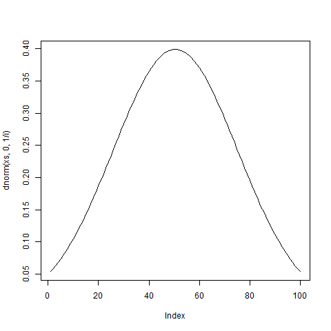
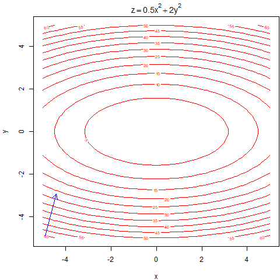

Animating 
=========

```{r, warning=FALSE}
library(animation)
```

`ani.options` control the behaviour of the animation. Some egs with default values:

```{r, eval=FALSE}
oopt = ani.options(nmax=50,         # maximum number of steps in a loop
                   interval=1,      # the time interval of the animation (unit in seconds)
                   ani.width=480,   # dimension of the animation
                   ani.height=480,
                   imgdir="images", # directory (a relative path) for images when creating HTML animation pages
                   htmlfile="index.html",      # name of the produced html file
                   autobrowse = interactive(), # whether auto-browse the animation after it is created
                   loop = TRUE,     # whether to iterate or not
                   title = "",      # the title of the html page
                   description = "" # the description of the html page
                  ) 
```

HTMLs
-----

Make HTMLs with function `saveHTML`. It produces a new [html file](dnorm_test.html) with the images in folder `images`:

```{r, echo=FALSE, eval=FALSE}
saveHTML({
  
  xs <- seq(-2,2,len=100)
  oopt <- ani.options(interval = 0.2, nmax = 5, autobrowse = FALSE)
  for (i in 1:ani.options("nmax")) {
    plot(dnorm(xs,0,1/i), type="l")
    ani.pause()
  }
  ani.options(oopt)

}, htmlfile="dnorm_test.html", 
   img.name="dnorms")
```

A package example of the Buffon's needle:

```{r, eval=FALSE, eval=FALSE}
## create an HTML animation page
saveHTML({
     par(mar = c(3, 2.5, 1, 0.2), pch = 20, mgp = c(1.5, 0.5, 0))
     ani.options(nmax = ifelse(interactive(), 300, 10), interval = 0.1)
     buffon.needle(type = "S", redraw = FALSE)
   }, 
   img.name = "buffon.needle", 
   htmlfile = "buffon.needle.html", 
   ani.height = 500, 
   ani.width = 600, 
   title = "Simulation of Buffon's Needle", 
   description = c("There are three graphs made in each step: the", 
                   "top-left, one is a simulation of the scenario, the top-right one", 
                   "is to help us understand the connection between dropping needles", 
                   "and the mathematical method to estimate pi, and the bottom one is", 
                   "the result for each dropping.")
)

ani.options(oopt)
```

Check the [result](buffon.needle.html).

GIFs
-----

To have animated GIFs it's necessary to install [ImageMagick](http://imagemagick.org/). 

Function `saveGIF` produces an animated GIF:

```{r, warning=FALSE, message=FALSE, echo=FALSE}
saveGIF({

  xs <- seq(-2,2,len=100)
  oopt <- ani.options(interval = 0.2, nmax = 5, autobrowse = FALSE)
  for (i in 1:ani.options("nmax")) {
    plot(dnorm(xs,0,1/i), type="l")
    ani.pause()
  }
  ani.options(oopt)

}, cmd.fun=system,
   movie.name="dnorm_animation.gif")
```


However, `saveGIF`might not work properly. In that case you could do it yourself. This takes the previous made pictures from `saveHTML` and create the animated GIF:

```{r, message=FALSE, error=TRUE, warning=FALSE, eval=FALSE}
im.convert(files="images/dnorms*.png",
           output="images/dnorm_animation2.gif",
           cmd.fun=system)
```



We can present the Buffon's needle here too:

```{r, message=FALSE, error=TRUE, warning=FALSE, eval=FALSE}
im.convert(files="images/buffon.needle*.png",
           output="images/buffon.needle.gif",
           cmd.fun=system)
```


This is another sample from the package:

```{r, warning=FALSE, message=FALSE, echo=FALSE}
saveGIF({
  oopt <- ani.options(interval = 0.5, nmax = 150, autobrowse = FALSE)
  par(mar = c(4, 4, 2, 0.1))
  f <- function(x,y) 0.5 * x^2 + 2 * y^2
  grad.desc(f, rg=c(-5,-5,5,5), init=c(-4.9,-4.9), gamma=0.1, tol=0.01)
  ani.options(oopt)
}, cmd.fun=system,
   movie.name="grad_animation.gif")
```



More samples [here](http://vis.supstat.com/archive.html).

