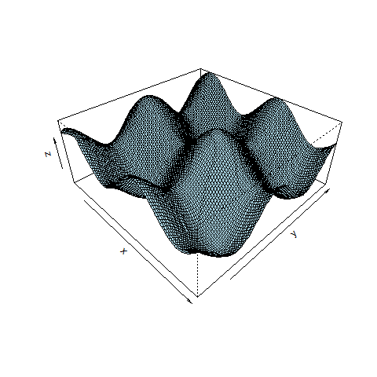
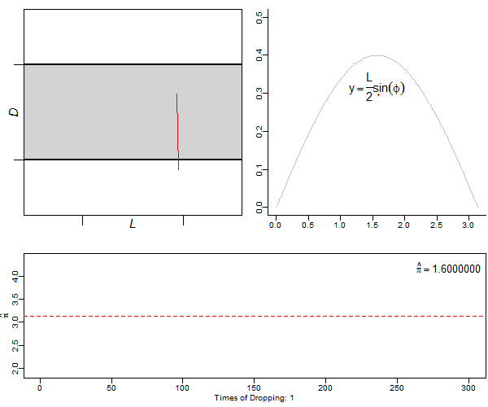
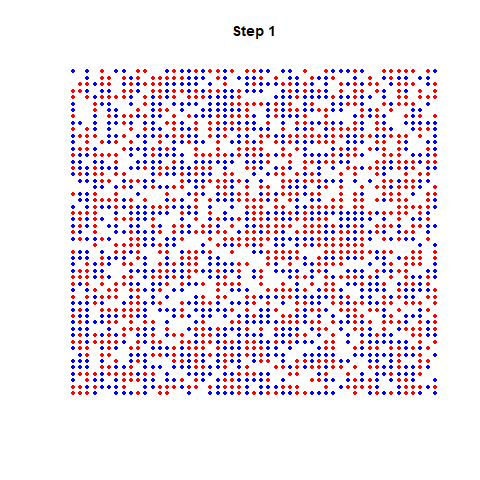

Animating 
=========

```{r, warning=FALSE}
library(animation)
```

`ani.options` control the behaviour of the animation. Some egs with default values:

```{r, eval=FALSE}
oopt = ani.options(
  nmax=50,         # maximum number of steps in a loop
  interval=0.1,      # the time interval of the animation (unit in seconds)
  ani.width=480,   # dimension of the animation
  ani.height=480,
  imgdir="images", # directory (relative path) for images when creating HTML page
  htmlfile="index.html",      # name of the produced html file
  autobrowse = interactive(), # whether auto-browse the animation after created
  loop = TRUE,     # whether to iterate or not
  title = "",      # the title of the html page
  description = "" # the description of the html page
) 
```

## Creating an animated GIF

Examples from [here](https://alstatr.blogspot.com/2014/02/r-animating-2d-and-3d-plots.html).

```{r, eval=FALSE}
library(animation)
 
saveGIF({
  
  for(i in 1:100) {
    curve(sin(x), from = -5+(i*0.05), to = 5 + (i * 0.05), col = "red", ylab = "")
    curve(cos(x), from = -5+(i*0.05), to = 5 + (i * 0.05), add = TRUE, col = "blue", ylab = "")
    legend("topright", legend=c("sin(x)","cos(x)"), fill=c("red","blue"), bty="n")
  }
  ani.options(oopt)
  
}, movie.name="sine2D_animation.gif")
```


```{r, eval=FALSE}
library(animation)
 
saveGIF({

  for(i in 1:150){

    x <- seq(-6 + (i * 0.05), 6 + (i * 0.05), length= 100)
    y <- x
    f <- function(x, y) { sin(x) + cos(y) }
    z <- outer(x, y, f)
    persp(x, y, z, theta = 45 + (i * 0.5), phi = 35, expand = 0.4, col = "lightblue")

  }
  ani.options(oopt)
  
}, movie.name="surface3D_animation.gif")


```

which produces:



HTMLs
-----

Make HTMLs with function `saveHTML`. It produces a new [html file](dnorm_test.html) with the images in folder `images`:

```{r}
saveHTML({
  
  xs <- seq(-2,2,len=100)
  oopt <- ani.options(interval = 0.2, nmax = 5, autobrowse = FALSE)
  for (i in 1:ani.options("nmax")) {
    plot(dnorm(xs,0,1/i), type="l")
    ani.pause()
  }
  ani.options(oopt)

}, htmlfile="dnorm_test.html", 
   img.name="dnorms")
```

A package example of the Buffon's needle:

```{r, eval=FALSE, eval=FALSE}
## create an HTML animation page
saveHTML({
     par(mar = c(3, 2.5, 1, 0.2), pch = 20, mgp = c(1.5, 0.5, 0))
     ani.options(nmax = ifelse(interactive(), 300, 10), interval = 0.1)
     buffon.needle(type = "S", redraw = FALSE)
   }, 
   img.name = "buffon.needle", 
   htmlfile = "buffon.needle.html", 
   ani.height = 500, 
   ani.width = 600, 
   title = "Simulation of Buffon's Needle", 
   description = c("There are three graphs made in each step: the", 
                   "top-left, one is a simulation of the scenario, the top-right one", 
                   "is to help us understand the connection between dropping needles", 
                   "and the mathematical method to estimate pi, and the bottom one is", 
                   "the result for each dropping.")
)

ani.options(oopt)
```

Check the [result](buffon.needle.html).

However, `saveGIF`might not work properly. In that case you could do it yourself. This takes the previous made pictures from `saveHTML` and create the animated GIF:

```{r, message=FALSE, error=TRUE, warning=FALSE, eval=FALSE}
im.convert(files="images/buffon.needle*.png",
           output="images/buffon.needle.gif",
           cmd.fun=system)
```



More samples [here](http://vis.supstat.com/archive.html).

## Schelling's segregation model

From [here](https://rsnippets.blogspot.com/2012/04/animating-schellings-segregation-model.html):

```{r}
# 0 - empty
# 2 - first agent type color
# 4 - second agent type color

# initialize simulation
# size      - square size
# perc.full - percentage of lots to be occupied
init <- function(side, perc.full) {
    size <- floor(side ^ 2 * perc.full / 2)
    state <- matrix(0, side, side)
    occupied <- sample(side ^ 2, 2 * size)
    state[occupied] <- c(2,4)
    return(state)
}

# plot simulation state
# state - simulation state
# i     - simulation iteration
do.plot <- function(state, i) {
    side <- dim(state)[1]
    x <- rep(1:side, side)
    y <- rep(1:side, each = side)
    par(fin=c(4,4), fig=c(0,1,0,1))
    plot(x , y, axes = F, xlab="", ylab="", col = state,
         main = paste("Step", i), pch = 19, cex = 40 / side)
}

# perform one step of simulation
# state     - simulation state
# threshold - percent of required agents of the same color
#             in neighborhood
# radius    - neighborhood radius
sim.step <- function(state, threshold, radius) {
    mod.1 <- function(a, b) { 1 + ((a - 1) %% b) }
    div.1 <- function(a, b) { 1 + ((a - 1) %/% b) }

    unhappy <- rep(NA, length(state))
    side <- dim(state)[1]
    check <- (-radius):(radius)
   
    #find unhappy agents
    for (n in which(state > 0)) {
      x <- div.1(n, side)
      y <- mod.1(n, side)
      x.radius <- mod.1(check + x, side)
      y.radius <- mod.1(check + y, side)
      region <- state[y.radius, x.radius]
      similar <- sum(region == state[n]) - 1
      total <- sum(region > 0) - 1
        unhappy[n] <- (similar < total * threshold)
    }
    vunhappy <- which(unhappy)

    # move unhappy agents
    vunhappy <- vunhappy[sample.int(length(vunhappy))]
    empty <- which(state == 0)
    for (n in vunhappy) {
      move.idx <- sample.int(length(empty), 1)
      state[empty[move.idx]] <- state[n]
      state[n] <- 0
      empty[move.idx] <- n
    }
    return(state)
}

library(animation)

# simple wrapper for animation plotting
go <- function() {
    s <- init(51, 0.75)
    for (i in 1:50) {
        do.plot(s, i)
        last.s <- s
        s <- sim.step(s, 0.6, 1)
        if (identical(last.s, s)) { break }
    }
    for (j in 1:4) {
        do.plot(s, i)
    }
    ani.options(interval = 5 / (i + 2))
}

saveGIF(go(), movie.name="schelling_animation.gif")
```

