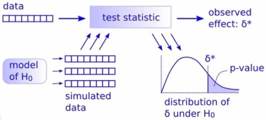

Refs:

+ Ziefler - Randomization & Bootstrap Methods using R (2011)

+ Allen Downey - There is only One Test ([post 1](http://allendowney.blogspot.pt/2011/05/there-is-only-one-test.html), [post 2](http://allendowney.blogspot.pt/2016/06/there-is-still-only-one-test.html), [youtube](https://www.youtube.com/watch?v=S41zQEshs5k))

## Introduction

Downey talks how the standard statistical tests can be seen as analytical solutions of simplified problems back when simulation was not available in pre-computer times.

When we can rely on simulation, we can follow the method presented in this diagram:

<center></center>

Herein, the *observed effect* $\delta^*$ is the value computed by a chosen test statistic over the observed data. 

The null hypothesis $H_0$ is the model asserting the observed effect $\delta^*$ was due to chance. 

The test statistic is a chosen measure of the difference between the data (either observed or simulated) with respect to $H_0$.

The probability we which to compute is $P(\delta^* | H_0)$. If $P(\delta^* | H_0)$ is small, it suggests that the effect is probably real and not due to chance. 

The *Monte Carlo p-value* (this is similar but not equal to the standard p-value of Frequentist Statistics) is the probability of having effect $\delta^*$ or something more extreme under the assumption that $H_0$ holds, ie, $p(\delta^* \text{or more extreme effects} | H_0)$. Ie, it is the ratio of effects as extreme as the number observed effect, $r$,  over the total number of simulated effects, $n$. This proportion tends to under-estimate the *p-value*, so Davison & Hinkley propose the following correction:

$$\text{MC p-value} = \frac{r+1}{n+1}$$

The next R function codes this:

```{r}
compute.p.value <- function(results, observed.effect, precision=3) {
  
  # n = #experiences
  n <- length(results)
  # r = #replications at least as extreme as observed effect
  r <- sum(abs(results) >= observed.effect)  
  # compute Monte Carlo p-value with correction (Davison & Hinkley, 1997)
  list(mc.p.value=round((r+1)/(n+1), precision), r=r, n=n)
}
```

Therefore, the procedure consists of:

1. Define the Null Hypothesis $H_0$ (assume the effect was due to chance)
2. Choose a test statistic measurement
3. Create a stochastic model of $H_0$ in order to produce simulated data
4. Produce simulated data 
5. compute the MC *p-value* and assess $H_0$

The simulation assumes all data permutations are equally probable under $H_0$ (ie, exchangeability)

If the simulation cannot be done - because it's too slow -, we must search for analytic shortcuts or other methods (but beware of their own simplifying assumptions).

Before we see some egs, let's add the next function to present the results in a histogram format:

```{r}
present_results <- function(results, observed.effect,  label="") {

  lst <- compute.p.value(results, observed.effect)
  
  hist(results, breaks=50, prob=T, main=label,
       sub=paste0("MC p-value for H0: ", lst$mc.p.value),
       xlab=paste("found", lst$r, "as extreme effects for", lst$n, "replications"))
  abline(v=observed.effect, lty=2, col="red")
}
```

### Example 1 - Replacing t-tests

Let's see this technique used to perform a permutation test that replaces a t-test (eg taken from this [youtube lecture](https://www.youtube.com/watch?v=5Dnw46eC-0o)):

```{r}
data <- list(experiment = c(27,20,21,26,27,31,24,21,20,19,23,24,28,19,24,29,18,20,17,31,20,25,28,21,27),
             control    = c(21,22,15,12,21,16,19,15,22,24,19,23,13,22,20,24,18,20))
```

Our $H_0$ model assumes that the data of both experiment and control are equal. The entire data will be resampled to produce artificial datasets to be compared with the real data; this is the stocasthic model following $H_0$. According to $H_0$ there's no problem in mixing experiment and control.

The function `resampling` performs permutation tests on experiment/control datasets (it can be used on other egs):

```{r}
resampling <- function(n, data, test.statistic) {
  
  all.data <- c(data$experiment, data$control)
  
  # get n random permutations of indexes with experiment size
  permutations <- replicate(n, sample(1:length(all.data), length(data$experiment)))
  
  # apply the test statistics for each permutation, and return all results
  apply(permutations, 2, function(permutation) {
    # all.data[ permutation] is a sample experiment
    # all.data[-permutation] is a sample control
    test.statistic(all.data[permutation], all.data[-permutation])
  })
}
```

We must also choose a test statistic.

We'll pick two test statistics to check two different hypothesis:

+ check if is there a difference of means, ie, is the experience an improvement over the control data? (herein, a higher value is better). Which is to ask if under the Null Hypothesis Model, $H_0$, what is the probability that the effect was due to chance?

+ check if the variances of both datasets are the same

```{r}
diff.means <- function(x,y) mean(x) - mean(y) 
diff.vars  <- function(x,y) var(x)  - var(y)  
```

Now we apply the simulation and present the results:

```{r}
n.resamplings <- 1e4

stats <- resampling(n.resamplings, data, diff.means)
present_results(stats, diff.means(data$experiment, data$control), 
                label="Difference of Means")

stats <- resampling(n.resamplings, data, diff.vars)
present_results(stats, diff.vars(data$experiment, data$control), 
                label="Difference of Variance")
```

So our conclusion, concerning the difference of means, is that $H_0$ has strong evidence against it, ie, the observed effect is most probably not due to chance.

Regarding the difference of variance, the simulation favors $H_0$, ie, the difference of variances is probably due to chance.

### Example 2 - Replacing $\chi^2$-tests

> Suppose you run a casino and you suspect that a customer has replaced a die provided by the casino with a ``crooked die''; that is, one that
has been tampered with to make one of the faces more likely to come up
than the others.  You apprehend the alleged cheater and confiscate the die,
but now you have to prove that it is crooked.  You roll the die 60 times
and get the following results: 

<center>
```{r, echo=FALSE, results="asis", warning=FALSE}
library(xtable)

df <- data.frame(value=1:6, frequency=c(8,9,19,6,8,10))
tab <- xtable(df, align="ccc")
print(tab, type="html")
```
</center>

> What is the probability of seeing results like this by chance? -- [ref](http://allendowney.blogspot.pt/2011/05/there-is-only-one-test.html)

```{r}
observed <- c(8,9,19,6,8,10)

data <- list(observed = observed, 
             expected = rep(round(sum(observed)/6),6)) # the most probable result
```

Our chosen $H_0$ states that the dice is fair.

The test statistic is $\chi^2$:

> The chi-squared test is used to determine whether there is a significant difference between the expected frequencies and the observed frequencies in one or more categories -- [wikipedia](https://en.wikipedia.org/wiki/Chi-squared_test)

```{r}
chiSquared <- function(expected, observed) {
  sum((observed-expected)^2/expected)
}
```

Let's produce the stochastic model for $H_0$:

```{r}
resampling <- function(n, data, test.statistic) {

  n.throws <- sum(data$observed)
  
  get_throws <- function() {
    throws <- c(1:6,sample(1:6, n.throws, rep=TRUE)) # add 1:6 to prevent zeros
    as.numeric(table(throws)) - 1                    # -1 removes those extra
  }
  
  samples <- replicate(n, get_throws()) # get n dice frequency throws
  
  apply(samples, 2, function(a.sample) {test.statistic(data$expected, a.sample)})
}
```

Now we are ready to perform the simulation:

```{r}
n.resamplings <- 1e4
stats <- resampling(n.resamplings, data, chiSquared)
present_results(stats, chiSquared(data$expected, data$observed))
```

There are some evidence that the dice might not be fair.

We can check another test statistic, say chiModule (sum the absolute differences instead of summing the squares). While there is no analytic solution, and so no classical test, here we just need to replace the test statistic `chiSquared` with this one:

```{r}
chiModule <- function(expected, observed) {
  sum(abs(observed-expected)/expected)
}

stats <- resampling(n.resamplings, data, chiModule)
present_results(stats, chiModule(data$expected, data$observed))
```

This is an expected result, since the module does not punish extreme values 
as the square version does. This means that the 19's threes are not so important here. That's why this second simulation is not that certain about rejecting $H_0$.

## Bootstrap

> The basic idea of bootstrapping is that inference about a population from sample data (sample -> population) can be modeled by resampling the sample data and performing inference on (resample -> sample). As the population is unknown, the true error in a sample statistic against its population value is unknowable. In bootstrap resamples, the 'population' is in fact the sample, and this is known; hence the quality of inference from resample data -> 'true' sample is measurable -- [wikipedia](http://en.wikipedia.org/wiki/Bootstrapping_(statistics))

<!-- This technique should be used when: -->

<!-- + the theoretical distribution of a statistic of interest is complicated or unknown. Since the bootstrapping procedure is distribution-independent it provides an indirect method to assess the properties of the distribution underlying the sample and the parameters of interest that are derived from this distribution. -->

<!-- + the sample size is insufficient for straightforward statistical inference. If the underlying distribution is well-known, bootstrapping provides a way to account for the distortions caused by the specific sample that may not be fully representative of the population. -->

<!-- + power calculations have to be performed, and a small pilot sample is available. Most power and sample size calculations are heavily dependent on the standard deviation of the statistic of interest. If the estimate used is incorrect, the required sample size will also be wrong. One method to get an impression of the variation of the statistic is to use a small pilot sample and perform bootstrapping on it to get impression of the variance. -->

The bootstrap uses Monte Carlo simulations to resample many datasets based on the original data. These resamples are used to study the variation of a given test statistic. 

The bootstrap assumes that the different samples from the observed data are independent of one another.

Here's a simple eg: one knows a sample of size 30 from a population with $\mathcal{N}(0,1)$ distribution. In practice we don't know the population distribution (otherwise, the bootstrap would not be needed), but let's assume that in order to compare results. Say, we wish to find out about the variation of its mean:

```{r}
set.seed(333)
my.sample <- rnorm(30)

test.statistic <- mean
n.resamplings  <- 5e4

# execute bootstrap (resamplig from just the original sample):
boot.samples <- replicate(n.resamplings, test.statistic(sample(my.sample, replace=TRUE)))
# compare it with samples taken from the population:
real.samples <- replicate(n.resamplings, test.statistic(sample(rnorm(30), replace=TRUE)))

plot( density(real.samples), ylim=c(0,2.5), main="mean distributions")
lines(density(boot.samples), col="red")
abline(v=0, lty=2) # true value
legend("topright", c("from population", "from bootstrap", "true mean"), col=c(1,2,1), lty=c(1,1,2))
```

This can also be done with the `boot` package (more [info](http://www.statmethods.net/advstats/bootstrapping.html)):

```{r, warning=FALSE}
library(boot)

# boot() needs a function applying the statistic to the original data over i, a vector of indexes
f <- function(data,i) { test.statistic(data[i]) }

boot.stat    <- boot(my.sample, f, n.resamplings)
boot.samples <- boot.stat$t # recover the bootstrap samples
boot.ci(boot.stat)          # compute confidence intervals
```

### Bayesian Bootstrap

> In standard bootstrapping observations are sampled with replacement. This implies that observation weights follow multinomial distribution. In Bayesian bootstrap multinomial distribution is replaced by Dirichlet distribution -- [ref](http://rsnippets.blogspot.pt/2012/11/simple-bayesian-bootstrap.html)

```{r, warning=FALSE,message=FALSE}
library(gtools) # use: rdirichlet

set.seed(333)
n.resamplings <- 1000

mean.bb <- function(x, n) {
  apply( rdirichlet(n, rep(1, length(x))), 1, weighted.mean, x = x )
}

boot.bayes <- mean.bb(my.sample, n.resamplings)
plot(density(real.samples), ylim=c(0,2.5))
lines(density(boot.bayes), col="red")
quantile(boot.bayes, c(0.025, 0.975)) # find credible intervals
```

> [(Rubin (1981)](http://projecteuclid.org/DPubS?service=UI&version=1.0&verb=Display&handle=euclid.aos/1176345338) introduced the Bayesian bootstrap. In contrast to the frequentist bootstrap which simulates the sampling distribution of a statistic estimating a parameter, the Bayesian bootstrap simulates the posterior distribution.

> The data, X, are assumed to be independent and identically distributed (IID), and to be a representative sample of the larger (bootstrapped) population. Given that the data has N rows in one bootstrap replication, the row weights are sampled from a Dirichlet distribution with all N concentration parameters equal to 1 (a uniform distribution over an open standard N-1 simplex). The distributions of a parameter inferred from considering many samples of weights are interpretable as posterior distributions on that parameter -- LaplacesDemon helpfile

### Using `bayesboot`

This package from Rasmus Baath implements a Bayesian bootstrapping described [here](http://www.sumsar.net/blog/2015/07/easy-bayesian-bootstrap-in-r/):

```{r}
library(bayesboot)

boot.bayes2 <- bayesboot(my.sample, test.statistic)

plot(density(real.samples), ylim=c(0,2.5))
lines(density(boot.bayes2$V1), col="red")
summary(boot.bayes2)
```

To compare a statistic between two groups, we bootstrap each and compute the difference to calculate the posterior difference ([eg from here](http://www.sumsar.net/blog/2016/02/bayesboot-an-r-package/)):

```{r}
# Heights of the last ten American presidents in cm (Kennedy to Obama).
heights <- c(183, 192, 182, 183, 177, 185, 188, 188, 182, 185)

# The heights of opponents of American presidents (first time they were elected).
# From Richard Nixon to John McCain
heights_opponents <- c(182, 180, 180, 183, 177, 173, 188, 185, 175)

# Running the Bayesian bootstrap for both datasets
b_presidents <- bayesboot(heights,           test.statistic)
b_opponents  <- bayesboot(heights_opponents, test.statistic)

# Calculating the posterior difference and converting back to a 
# bayesboot object for pretty plotting.
b_diff <- as.bayesboot(b_presidents - b_opponents)
plot(b_diff)
```

It seems the presidential winner tends to have more height than his opponent.

### Example 1 - Obtaining a Confidence Interval

Let's use the same data as in the first eg:

```{r}
data <- list(experiment = c(27,20,21,26,27,31,24,21,20,19,23,24,28,19,24,29,18,20,17,31,20,25,28,21,27),
             control    = c(21,22,15,12,21,16,19,15,22,24,19,23,13,22,20,24,18,20))
```

This next resampling function selects bootstrap samples from the data and produces a population of difference of means.

```{r}
resampling <- function(n, data, test.statistic) {
  
  size.experiment <- length(data$experiment)
  size.control    <- length(data$control)

  one.bootstrap <- function() {
    boot.experiment <- sample(data$experiment, size.experiment, replace=TRUE)
    boot.control    <- sample(data$control,    size.control,    replace=TRUE)
    test.statistic(boot.experiment, boot.control)
  }
  
  replicate(n, one.bootstrap())
}
```

Now let's execute the bootstrap and reuse the previous `present_results`. Notice that now the shown Monte Carlo p-value does not make sense in this context, and should be around $50%$, ie, the observed difference of means should be around the median of the bootstrap empirical distribution:

```{r}
n.resamplings <- 1e4
stats <- resampling(n.resamplings, data, diff.means)
present_results(stats, diff.means(data$experiment, data$control))
quantile(x=stats, probs = c(.025,.975)) # 95% confidence interval
```

Concerning the confidence interval, since zero is not included, we could say that $H_0$ - ie, the difference of means is due to chance - is not backed by evidence.

Let's compare the bootstrap's confidence interval with the classic t-test and the bayesian approach:

```{r, warning=FALSE, message=FALSE}
# Using the t-test should produce similar results
t.test(data$experiment, data$control)$conf.int

# Using the bayesian version of the t-test
# devtools::install_github("rasmusab/bayesian_first_aid")
library(BayesianFirstAid)
bayes.t.test(data$experiment, data$control, n.iter=1e4) 
```

Or using `bayesboot` package:

```{r}
library(bayesboot)

experiment.means <- bayesboot(data$experiment, mean, R=1e4)
control.means    <- bayesboot(data$control,    mean, R=1e4)
stats            <- (experiment.means - control.means)$V1
quantile(x=stats, probs = c(.025,.975)) # 95% confidence interval

present_results(stats, diff.means(data$experiment, data$control))
```

If we wish to compute the MC *p-value* we could consider the entire data, bootstrap it, and then split the simulated data accordingly to the sizes of the experiment and control datasets before applying the chosen test statistic:

```{r}
resampling <- function(n, data, test.statistic) {
  
  all.data        <- c(data$experiment, data$control)
  size.all.data   <- length(all.data)
  size.experiment <- length(data$experiment)

  one.bootstrap <- function() {
    boot.all.data <- sample(all.data, size.all.data, replace=TRUE)
    test.statistic(boot.all.data[1:size.experiment],    # split bootstrap data
                   boot.all.data[(size.experiment+1):size.all.data])
  }
  
  replicate(n, one.bootstrap())
}
```

Now, the Monte Carlo *p-value* makes sense. The bootstrap procedure mirrors the difference of means between the observed experiment and control data:

```{r}
n.resamplings <- 1e4
stats <- resampling(n.resamplings, data, diff.means)
present_results(stats, diff.means(data$experiment, data$control))
```

### Example 2 -- Pearson correlation of two samples

We wish to compute a sampling distribution of the correlation between these observed LSAT and GPA scores:

```{r}
data <- list(LSAT = c(576, 635,558, 578, 666, 580, 555, 661, 651, 605, 653, 575, 545, 572, 594),
             GPA  = c(3.39,3.3,2.81,3.03,3.44,3.07,3.0,3.43,3.36,3.13,3.12,2.74,2.76,2.88,2.96))
```

The Pearson's correlation coefficient for a sample $(x_i,y_i), i=1 \ldots n$ can be calculated as follows:

$$r_{xy} = \frac{1}{n-1} \sum_{i=1}^n \frac{x_i - \overline{x}}{s_x} \frac{y_i - \overline{y}}{s_y}$$

This is computed by:

```{r}
# pre: x, y are samples with the same length
pearson.coor.sample <- function(x,y) {
  sum( ((x-mean(x))/sd(x)) * ((y-mean(y))/sd(y))) / (length(x)-1)
}
```

And this is the resampling function:

```{r}
# resampling for Pearson correlation
resampling <- function(n, data, test.statistic) {
  
  size.sample <- length(data[[1]])

  one.bootstrap <- function() {
    # select a subset, but the original pairs must be kept together
    permutation <- sample(1:size.sample, size.sample, replace=TRUE)
    x <- data[[1]][permutation]
    y <- data[[2]][permutation]
    test.statistic(x,y)
  }

  replicate(n, one.bootstrap())
}
```

Let's simulate it and then compare the results with the frequentist and bayesian alternatives:

```{r, collapse=TRUE}
n.resamplings <- 1e4
stats <- resampling(n.resamplings, data, pearson.coor.sample)
# again, the shown MC p-value is not a p-value, but should be around 50%
present_results(stats, pearson.coor.sample(data$LSAT, data$GPA))
mean(stats)
quantile(x = stats, probs = c(.025,.975)) # 95% confidence interval

# Using cor.test to find the correlation betweem paired samples
cor.test(data$LSAT, data$GPA)$conf.int

# The bayesian version, not surprisingly, it's closer to the resampling results
bayes.cor.test(data$LSAT, data$GPA, n.iter=n.resamplings) 
```

## Choosing between resampling and bootstrap tests

Here's a quote from Ziefler's book (page 174):

> The randomization/permutation test and the bootstrap test were introduced in the
previous two chapters as methods to test for group differences. Which method
should be used? From a statistical theory point of view, the difference between
the two methods is that the randomization method is conditioned on the marginal
distribution under the null hypothesis. This means each permutation of the data
will have the same marginal distribution. The bootstrap method allows the marginal
distribution to vary, meaning the marginal distribution changes with each replicate
data set. If repeated samples were drawn from a larger population, variation would be
expected in the marginal distribution, even under the null hypothesis of no difference. This variation in the marginal distribution is not expected; however, there is only one sample from which groups are being randomly assigned so long as the null hypothesis is true. Thus the choice of method comes down to whether one should condition on the marginal distribution or not. [...]

> The choice of analysis method
rests solely on the scope of inferences the researcher wants to make. If inferences to
the larger population are to be made, then the bootstrap method should be used, as it
is consistent with the idea of sample variation due to random sampling. In general,
there is more variation in a test statistic due to random sampling than there is due to random assignment. That is, the standard error is larger under the bootstrap. Thus,
the price a researcher pays to be able to make broader inferences is that all things
being equal, the bootstrap method will generally produce a higher p-value than the
randomization method.