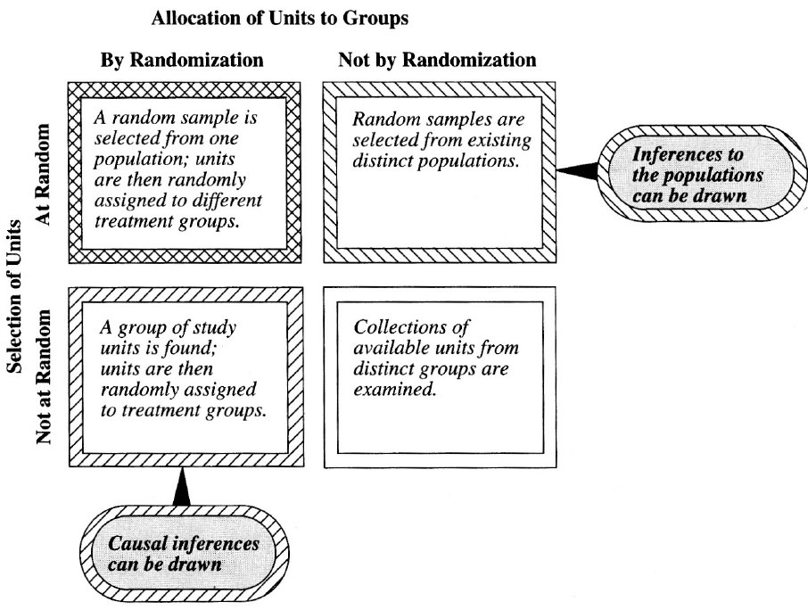

```{r setup, include=FALSE}
knitr::opts_chunk$set(echo = TRUE)
set.seed(101)
```

```{r, message=FALSE}
library(magrittr)
library(resampledata)
```

Refs

+ [Chihara, Hesterberg - Mathematical Statistics with Resampling and R 2ed (2018)](https://sites.google.com/site/chiharahesterberg/home), caps 1--4

+ [Cobb - The Intr Stats Course, A Ptolemaic Curriculum (2007)](https://escholarship.org/uc/item/6hb3k0nz)

We will some of the resampling with the [two buckets model](http://www.di.fc.ul.pt/~jpn/r/bootstrap/buckets.html):

```{r}
# multiplier == 0 represents infinite population (ie, no replacement)
make.bucket1 <- function(universe, multiplier=1) {
  if (multiplier>0)
    universe <- c(replicate(multiplier, universe))
  function(n.sample) {
    sample(universe, n.sample, rep=ifelse(multiplier==0, TRUE, FALSE))
  }
}

# uses the bucket1 urn to generate a sample of size 'size.sample'
# and applies the given statistic function 
make.bucket2 <- function(bucket1, size.sample, statistic) {
  function(n) {
    replicate(n, bucket1(size.sample) %>% statistic) %>% 
    as.vector 
  }
}

compute.p.value <- function(results, observed.effect, precision=3) {
  # n = #experiences
  n <- length(results)
  # r = #replications at least as extreme as observed effect
  r <- sum(abs(results) >= observed.effect)  
  # compute Monte Carlo p-value with correction (Davison & Hinkley, 1997)
  list(mc.p.value=round((r+1)/(n+1), precision), r=r, n=n)
}

present_results <- function(results, observed.effect, label="", breaks=50) {
  lst <- compute.p.value(results, observed.effect)
  
  hist(results, breaks=breaks, prob=T, main=label,
       sub=paste0("MC p-value for H0: ", lst$mc.p.value),
       xlab=paste("found", lst$r, "as extreme effects for", lst$n, "replications"))
  abline(v=observed.effect, lty=2, col="red")
}
```

### Permutation Tests

From Cobb:

> How many of us devote much time in our class to the difference between model and reality here? One of the most important things our students should take away from an introductory course is the habit of always asking,\Where was the randomization, and what inferences does it support" How many of us ask our students, with each new data set, to distinguish between random sampling and random assignment, and between the corresponding differences in the kinds of inferences supported -- from sample to population if samples have been randomized, and from association to causation if assignment to treatment or control has been randomized, as illustrated

<center></center>

The **null hypothesis** is the _status quo_, where we assume no effect. The **alternative hypothesis** is the statement that there is a real effect. Usually they are denoted $H_0, H_A$.

Hypotheses involve a statement about a population parameter, usually denoted $\theta$. Then we'll have $H_0: \theta = \theta_0$ and $H_A: \theta \text{ op }  \theta_0$, where op usually is $<,>,\neq$.

In order to do this, it is chosen a **test statistic**, T, which is a numerical function of the data whose value determines the result of the test. When we apply T to the original data $x$, we get the **observed effect**, $t=T(x)$.

A **p-value** is the probability that chance alone ($H_0$ being true) could produce a test statistic as extreme as the observed effect, $P(T\geq t)$.

It is possible to apply lots of different statistical tests to check if $H_0$ is credible or not (ie, if chance alone produced the effect). An alternative to those tests (like the t-test) is the permutation test.

Consider having a dataset with treatment and control data. For a permutation test, this is all data. It randomly decides where to place each datum (a resampling of the original sample). For that resample it then applies the test statistic and save it. Then it repeats the previous steps as many as we want. As Cobb says: _Reshuffe, redeal, and recompute__.

There is no need for the usual assumptions, no normality is needed.

There must be some care if there are two groups that we sampled from different distributions. Usually permutation tests are robust even in this situation. The major exception is when populations have different variance and are quite dissimilar in size.

We must also assume that observations are independent and exchangeable.

### One-sided permutation test

A study was conducted at a bar to check how many drinks and hotwings males and females had. The sample is in dataset `Beerwings`:

```{r}
head(Beerwings)
```

Let's consider we want to check if males eat more hotwings than females. We are using the mean as the statistic here. The null hypothesis, then, is the status quo, $\mu_M = \mu_F$, while the alternative hypothesis is that males eat more than females:

$$H_0: \mu_M = \mu_F; ~ H_A: \mu_M > \mu_F$$
This is an eg of a one-sided permutation test.

```{r}
group.M  <- Beerwings$Hotwings[Beerwings$Gender=="M"] # group 1
group.F  <- Beerwings$Hotwings[Beerwings$Gender=="F"] # group 2

observed.effect <- mean(group.M) - mean(group.F)
```

The next code executes a permutation test with these hypotheses:

```{r}
all.data <- c(group.M, group.F)

diff.means <- function(indexes) {
  group1 <- 1:length(group.M)
  indexes.group1 <- indexes[ group1]
  indexes.group2 <- indexes[-group1]
  mean(all.data[indexes.group1]) - mean(all.data[indexes.group2])
}

bucket1 <- make.bucket1(1:length(all.data), 1)
bucket2 <- make.bucket2(bucket1, length(all.data), diff.means)

results <- bucket2(1e4)
present_results(results, observed.effect, "Difference of Means", breaks=40)
```

Since the p-value is 0.001 it is evidence that supports the alternative hypothesis, that there is a significant difference of means between the genres in this study. 

If these people were selected inside a bar, then we cannot say anything about the population, since the group is not a random sample.

We can easily use any other statistic. The next eg uses just the mean of male drinking:

```{r}
mean.group.1 <- function(indexes) {
  group1 <- 1:length(group.M)  # males were placed at the first indexes
  indexes.group1 <- indexes[group1]
  mean(all.data[indexes.group1])
}

bucket2 <- make.bucket2(bucket1, length(all.data), mean.group.1)

results <- bucket2(1e4)
present_results(results, mean(group.M), "Difference of Means", breaks=30)
```

We could choose statistics, like the median or the trimmed mean, to achieve more robust results, if large outliers are in the sample.

<!--
The fact that both have found the same number of extreme effects is not a coincidence:

**Theorem**: In a permutation test, if statistics $T_1, T_2$ are related by a strict increasing function $T_1(X^*) = f(T_2(X^*))$, where $X^*$ is any permutation resample of the original sample, then both will yield the same P-value.
-->

### Two-sided permutation tests 

Above we start assuming that males drink more than females. However this assumption can be wrong. We can just try to find evidence that there is a drink gender difference (females could drink more). So, our hypothesis becomes a two-sided test:

$$H_0: \mu_M = \mu_F; ~ H_A: \mu_M \neq \mu_F$$

```{r}
observed.effect <- abs(mean(group.M) - mean(group.F))

diff.means <- function(indexes) {
  group1 <- 1:length(group.M)
  indexes.group1 <- indexes[ group1]
  indexes.group2 <- indexes[-group1]
  abs(mean(all.data[indexes.group1]) - mean(all.data[indexes.group2]))
}

bucket1 <- make.bucket1(1:length(all.data), 1)
bucket2 <- make.bucket2(bucket1, length(all.data), diff.means)

results <- bucket2(1e4)
present_results(results, observed.effect, "Difference of Means", breaks=20)
```

### Non independent observations

Consider the following results of a diving competition:

```{r}
head(Diving2017)
```

We would like to check if the result differences between semifinal and final are due to chance, or is there some effect happening.

This can be handled as a difference of means. However, _the data is not independent_. There are paired values from the same athlete!

To solve this, we can simply swap the colunms randomly, for each athlete, of each resampling:

```{r}
group.semi  <- Diving2017$Semifinal
group.final <- Diving2017$Final

observed.effect <- (group.final - group.semi) %>% mean %>% abs
```

The swap is done by multiplying the row differences with +1 or -1.

```{r}
n.rows <- length(group.final)

diff.means.matched <- function(signals) {
  ((group.final - group.semi) * signals) %>% mean %>% abs
}

bucket1 <- make.bucket1(c(-1,1), 0)  # generate random +1s/-1s
bucket2 <- make.bucket2(bucket1, n.rows, diff.means.matched)

results <- bucket2(1e4)
present_results(results, observed.effect, "Difference of Means", breaks=40)
```

So, the p-value is around 26% so chance alone could account for the differences.


## Sampling Distributions

The **sampling distribution** is the probability distribution of the values taken from a given statistic. Since the statistic value depends of the values of a random sample, it can be seen as a random variable that follows a certain distribution.

Many examples are known analytically. For eg, given $n$ iid normal random vars, the mean statistic also follows a normal sampling distribution:

$$X_i \sim \mathcal{N}(\mu,\sigma^2) \implies \bar{X} \sim \mathcal{N}(\mu,\frac{\sigma^2}{n})$$
Let's check it:

```{r}
n <- 30
results <- replicate(1e4, rnorm(n) %>% mean) # get 1e3 means

hist(results, breaks=50, main="sampling distribution", prob=T)
curve(dnorm(x,0,1/sqrt(n)), from=-.6, to=.6, col="red", lwd=2, add=T)
```

### Generating RVs from a given distribution

Let $X_i, i=1\ldots 10$ be a random sample from distribution  with pdf $f(x)=2/x^3, x \geq 1$. Let $X_{min}$ be the minimum of the sample (itself a random var). What is $p(X_{min}\leq 1.2)$?

Analytically, we need the cdf:

$$F(x) = \int_1^x \frac{2}{t^3} dt = 1 - \frac{1}{x^2}$$

Using a theorem that states that the minimum of $n$ iid random vars ($X_i \sim f$) follows a distribution with pdf:

$$f_{min}(x) = n(1-F(x))^{n-1}f(x)$$
we compute

$$f_{min} = \frac{20}{x^{21}}, x\geq 1$$

and so,

$$p(X_{min}\leq 1.2) = \int_1^{1.2} \frac{20}{x^{21}} dx = 1-\frac{1}{1.2^{20}} = 0.974$$

To use a sampling strategy, we need to generate random values from $f$. For that, we use the _Probability Integral Transformation_ that states

$$X \sim f_x \implies F_X(X) \sim \mathcal{U}(0,1)$$

```{r}
F._1 <- function(y) { 1/sqrt(1-y) } # solving y=1-1/x^2 for x

results <- replicate(5e4, F._1(runif(10,0,1)) %>% min)
(results<=1.2) %>% mean
```

### Using the Central Limit Theorem

The CLT states that given iid $X_i, i=1,\ldots n$ with mean $\mu$ and variance $\sigma^2$, then for any constant $z$

$$lim_{n \rightarrow \infty} P \Big( \frac{\bar{X}-\mu}{\sigma/\sqrt{n}} \leq z \Big) = \Phi(z)$$
where $\Phi$ is the cdf of $\mathcal{N}(0,1)$.

Let's have iid $X_1, \ldots, X_{30} \sim \Gamma(5,2)$, a Gamma with shape=5 and rate=2. What's $P(\bar{X}>3)$?

The mean for this gamma is $5/2$ and its variance is $5/2^2$. Then using the CLT,

$$P(\bar{X}>3) = P \Big( \frac{\bar{X}-5/2}{\sqrt{5/2^2}/\sqrt{30}} > \frac{3-5/2}{\sqrt{5/2^2}/\sqrt{30}} \Big) \approx P(Z > 2.4495)$$
this is:

```{r}
1-pnorm(2.4495)
```

Using simulation (R already has a random generator for gammas):

```{r}
results <- replicate(5e4, rgamma(30,5,2) %>%  mean)
(results>3) %>%  mean
```

## Bootstrap and Confidence Intervals

If we do not know the parameters of the population, we need to move from probability to statistics. Herein, we only have the data and a statistic estimated from the data. How to estimate the sampling distribution of that statistic?

The **bootstrap** says that since the sample approximates the population, resampling from the sample approximates taking many samples from the population. So, the **bootstrap distribution** of a statistic approximates the sampling distribution of that statistic.

```{r}
bootstrap <- function(n, original.sample, statistic) {
  size <- length(original.sample)

  replicate(n, sample(original.sample, size, rep=T) %>% statistic)
}
```

Let's check an eg:

```{r, collapse=TRUE}
real.mu <- 3    # unknown parameters
real.sd <- 1.5

original.sample <- rnorm(30, real.mu, real.sd)

results <- bootstrap(1e4, original.sample, mean)

hist(results, breaks=50, prob=T)
#red curve shows the sampling distribution
curve(dnorm(x,real.mu,real.sd/sqrt(30)), col="red", lwd=2, add=T)

# get bootstrap confidence interval
quantile(results, probs=c(0.025,0.975))
```

THe bootstrap distribution for statistic $\hat{\theta}$ approximates de spread and shape of the sampling distribution for $\hat{\theta}$. But the distribution center is the center of the original sample. If the center of the distribution differs from the observed statistic, it indicates bias.

```{r}
mean(original.sample)
mean(results)
```

Let's try an eg with a skewed distribution:

```{r}
n <- 30
real.shape <- 1
real.rate <- .5
original.sample <- rgamma(n, real.shape, real.rate)

results <- bootstrap(1e4, original.sample, mean)

hist(results, breaks=50, prob=T)
#red curve shows the sampling distribution
curve(dgamma(x,n*real.shape,n*real.rate), col="red", lwd=2, add=T)
```

If we have two samples and wish to, say, compare the difference of means, we need to bootstrap twice, once per sample.

Here's a dataset with testosterone levels per gender in the practice of skateboarding:

```{r}
head(Skateboard)
```

Is the difference of means of testosterone per gender significant?

```{r, collapse=TRUE}
group.F <- Skateboard[Skateboard$Experimenter=="Female",]$Testosterone
group.M <- Skateboard[Skateboard$Experimenter=="Male",  ]$Testosterone

results.F <- bootstrap(1e4, group.F, mean)
results.M <- bootstrap(1e4, group.M, mean)

results <- results.F - results.M

hist(results, breaks=50, prob=T)
abline(v=mean(group.F)-mean(group.M), col="red", lwd=2)

quantile(results, c(.025,.975))
```


