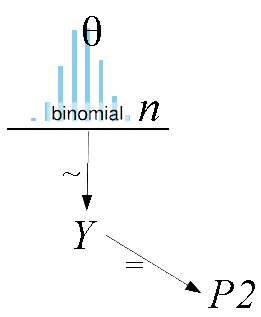
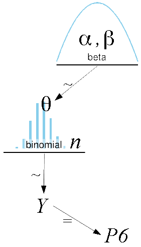

Current version of [OpenBUGS](http://www.openbugs.info/w/Downloads) needed.

Refs:

+ Lunn et al. **The BUGS Book** [website](http://www.mrc-bsu.cam.ac.uk/bugs/thebugsbook/exercises/)

+ Kruschke **Doing Bayesian Data Analysis**

BUGS allow us to do statistical inference using a graphical model approach:

1. Start with the model describing assumptions concerning the relationships of the problem
2. Feed the model with the available data
3. Use an engine to obtain approximated inferences about the unobserved variables

The model is described in a declarative way. It has two kinds of connections:

+ logical dependence which is represented by `<-`, there is not randomness here, just a simple assignment. At the right there is an expression

+ stochastic dependence which is represented by `~`. At the right there is a statistical distribution

BUGS supports many distributions. Some of them:

+ Normal, `dnorm(mean,precision)`, precision = 1/variance

+ Bernoulli, `dbern(p)`, p is the success probability

+ Binomial, `dbin(p,n)`, p is the success probability and n is the number of trials

+ Categorical, `dcat(p[])`, p is a vector with a discrete distribution

+ Uniform, `dunif(a,b)`, uniform between [a,b]

+ Beta, `dbeta(a,b)`

+ Gamma, `dgamma(a,b)`

+ Logistic, `dlogis(mu, tau)`

+ Exponential, `dexp(theta)`

+ Student's t, `dt(mean, tau, k)`, where $k$ is the degrees of freedom

+ Pareto, `dpar(a,b)`, $p(x|a,b)=ab^ax^{-(a+1)}$

+ Poisson, `dpois(theta)`

+ Geometrix, `dgeom(theta)`

+ Beta-binomial, `dbetabin(a,b,n)`

+ Multinomial, `x[1:R] ~ dmulti(theta[], n)`, $n$ events each with R mutually exclusive outcomes with probabilities $\theta_1\ldots \theta_R$

Vector's use:

+ `v[i]`, the ith position

+ `v[a:b]`, (v[a], v[a+1], ..., v[b])

+ `v[i,]`, the ith row

+ `v[,j]`, the jth column

Check [BUGS's manual](http://www.politicalbubbles.org/bayes_beach/manual14.pdf#page=56) for more information.

First Example
--------------
Let's try a simple example: if we flip a fair coin 8 times, what is the probability of seeing 2 or less heads?

First, we can solve this analitically without BUGS. Given $Y \sim Binomial(0.5,8)$, we wish to know $Pr(Y \le 2)$. That is,

$$Pr(Y \le 2) = \sum_{y=0}^2 p(y|\pi=0.5, n=8) = \sum_{y=0}^2 {8 \choose y} (0.5)^y (1-0.5)^{8-y} = 0.1445$$

Or in R:

```{r}
pbinom(2, size=8, prob=0.5)
```

Now, let's show how to simulate it using BUGS.

Our example is modelled with two assigments (step is BUGS step function, ie, returns 1 if the input is non-negative):

```{r, eval=FALSE}
  Y  ~ dbin(0.5, 8)
  P2 <- step(2.5-Y) # i.e., is Y <= 2?
```

In [diagram](http://doingbayesiandataanalysis.blogspot.pt/2013/10/diagrams-for-hierarchical-models-new.html):

<center></center>

Let's show how to define and run this model using R to communicate with BUGS:

```{r, message=TRUE}
library(BRugs)

# Function to draw histograms of sample results
draw.hist <- function(data, text="") {
  tmp <- hist(data, breaks=0:(max(data)+1), xaxt="n", right=FALSE, freq=TRUE, main=text)
  axis(1, at=tmp$mids, labels=0:max(data))
}

#------------------------------------------------------------------------------
# THE MODEL

# Specify the model in BUGS language, but save it as a string in R:
modelString = "
  # BUGS model specification begins ...
  model {
      Y ~ dbin(0.5, 8)
      P2 <- step(2.5-Y) # i.e., is Y <= 2?
  }
  # ... BUGS model specification ends.
" # close quote to end modelString

# Write the modelString to a file, using R commands:
writeLines(modelString,con="model.txt")
# Use BRugs to send the model.txt file to BUGS, which checks the model syntax:
modelCheck( "model.txt" )
#------------------------------------------------------------------------------
# INTIALIZE THE CHAIN.

modelCompile()  # BRugs command tells BUGS to compile the model.
modelGenInits() # BRugs command tells BUGS to randomly initialize a chain.
#------------------------------------------------------------------------------
# RUN THE CHAINS.

# BRugs tells BUGS to keep a record of the sampled values:
samplesSet( c("Y","P2") )
# R command defines a new variable that specifies an arbitrary chain length:
chainLength = 20000
# BRugs tells BUGS to generate a MCMC chain:
modelUpdate( chainLength )
#------------------------------------------------------------------------------
# EXAMINE THE RESULTS.

YSample <- samplesSample( "Y" ) # BRugs asks BUGS for the sample values.
# The simulated results of flips of heads
head(YSample, n=100) 
draw.hist(YSample, "num. of heads")
P2Sample <- samplesSample( "P2" ) # But it's P2 that matter to us
# we can see them (there are 10k samples, 0 if there were more than two heads, 1 otherwise)
head(P2Sample, n=50) 
draw.hist(P2Sample, "less or equal than 2 heads?")
samplesStats( "Y" ) # BRugs asks BUGS for summary statistics.
P2Summary <- samplesStats( "P2" )
P2Summary
```

We see that the mean is `r P2Summary$mean`, quite close to the true answer.

To avoid repeating the initial steps, let's make a function for them:

```{r}
run.model <- function(model, samples, data=list(), chainLength=10000, burnin=0.10, 
                      init.func, n.chains=1, thin=1) {
  
  writeLines(model, con="model.txt")  # Write the modelString to a file
  modelCheck( "model.txt" )           # Send the model to BUGS, which checks the model syntax
  if (length(data)>0)                 # If there's any data available...
    modelData(bugsData(data))         # ... BRugs puts it into a file and ships it to BUGS
  modelCompile(n.chains)              # BRugs command tells BUGS to compile the model
  
  if (missing(init.func)) {
    modelGenInits()                   # BRugs command tells BUGS to randomly initialize a chain
  } else {
    for (chain in 1:n.chains) {       # otherwise use user's init data
      modelInits(bugsInits(init.func))
    }
  }
  
  modelUpdate(chainLength*burnin)     # Burn-in period to be discarded
  samplesSet(samples)                 # BRugs tells BUGS to keep a record of the sampled values
  samplesSetThin(thin)                # Set thinning
  modelUpdate(chainLength)            # BRugs command tells BUGS to randomly initialize a chain
}
```

Coin eg
---------

A defective coin minting machine produces coins whose probability of Heads is a random variable Q with pdf $$f_Q(q) = 3q^2, q \in [0,1] $$

A coin produced by this machine is tossed repeatedly, with successive tosses assumed to be independent. Let A be the event that the first toss of this coin results in Heads, and let B be the event that the second toss of this coin results in Heads.

The probability $P(A)$ is the expected value of tossing Heads:

$$E[q] = \int_0^1 3q^2\times q~dq = 0.75$$

It's possible to simulate this in Bugs. However, we need to create a random generator of this pdf. For that we use the inverse transformation [technique](http://www.di.fc.ul.pt/~jpn/r/ECS/index.html#invTransf):

Compute the cdf: $$F_Q(q) = q^3$$ and its inverse $$F_Q^{-1}(u)=u^{1/3}$$

```{r}
modelString = "
  model {
    u    ~  dunif(0,1)
    fq   <- pow(u,1/3)
    Toss ~  dbern(fq)
  }
"

run.model(modelString, samples=c("fq"), chainLength=50000)
samplesStats("fq")$mean
```

Say we wish to compute the posterior pdf $f_{Q|A}$ after event $A$.

$$f_{Q|A}(q|A) = \frac{f_Q(q) p(A|q)}{\int_0^1 f_Q(q) p(A|q)~dq}$$

The prior $f_Q(q)$ is the uniform, so $f_Q(q)=1$.

The likelihood $p(A|q)$ is given by $P_Q(X \le q)$ which is the cdf $F_Q(q) = q^3$, so:

$$f_{Q|A}(q|A) = \frac{1 \times q^3}{\int_0^1 1 \times q^3~dq} = \frac{q^3}{1/4} = 4q^3$$

What is the expected value of tossing Heads after event $A$?

$$E[q|A] = \int_0^1 4q^3\times q~dq = 0.8$$

Let Bugs it:

```{r}
data.list = list(
  Toss = 1  # event A
)

run.model(modelString, samples=c("fq"), data=data.list, chainLength=50000)
samplesStats("fq")$mean
# comparing the empirical data with the analytical solution:
hist(samplesSample( "fq" ), breaks=50, prob=T)
curve(4*x^3, col="red", lwd=2, add=T)
```


Random Variable Transformation
-----------------------

The next eg asks questions after a transformation of the random variable:

We have $Z \sim N(0,1)$. From $Z$ we obtain $Y=(2Z+1)^3$. What is its distribution, expected value and $Pr(Y>10)$? This problem has a non-trivial analytical solution but can be easily simulated:

```{r}
modelString = "
  model {
      Z ~ dnorm(0, 1) # note: 1 is precision = 1/variance
      Y <- pow(2*Z+1, 3)
      P10 <- step(Y-10)
  }
"
run.model(modelString, samples=c("Y","P10"), chainLength=50000)
```

Now we can answer the questions:

```{r}
# Its distribution
YSample <- samplesSample( "Y" )
hist(YSample, prob=TRUE)  
lines(density(YSample, adjust=5), col="red", lwd=2)
# Its expected value
samplesStats("Y")$mean
# Pr(Y>10)
samplesStats("P10")$mean
```

Analytically the expected value is $13$ and $Pr(Y>10) \approx 0.2820$. The simulated results are very close.

An otherwise intractable problem
--------------------

We have $20$ equal items to repair. The unit repair cost is given by a gamma with mean $100$ euros and sd $50$ euros. We have $1000$ euros for repairs. How many items, on average, will we be able to repair?

A gamma(a,b) distribution has mean $\frac{a}{b}$ and variance $\frac{a}{b^2}$. So the gamma for this exercise must be gamma(4,0.04).

To use BUGS we will add 20 Y random variables, where $Y_i$ is the cost of item i. We'll compute a cumulative vector of costs, `cum.cost`, where `cum.cost[i]` is the sum of the first i items. Then we'll make a `cum.step` vector that consists of $1,2,\ldots,M,0,0,\ldots$ where $M$ is the last item we fix before running out of money. Then we just need to find that $M$ which is the maximum value of `cum.step`. The maximum will be found using the `ranked` function.

```{r}
modelString = "
  model {
      for(i in 1:20) {
        Y[i] ~ dgamma(4, 0.04)
      }

      cum.cost[1] <- Y[1]
      for(i in 2:20) {
        cum.cost[i] <- cum.cost[i-1] + Y[i]
      }

      for(i in 1:20) {
        cum.step[i] <- i * step(1000 - cum.cost[i])  # 1,2,...,M,0,0,...
      }

      answer <- ranked(cum.step[],20)
  }
"
run.model(modelString, samples=c("answer", "Y[1]"), chainLength=50000)

samplesStats("Y[1]") # just to check if the mean and sd are ok (must be close to 100 and 50)
samplesStats("answer")$mean  # what we want to know!
```

Prediction eg
-------------

A hospital will begin a new high-risk treatment. Other hospitals that do it have a risk of death $\theta$ around $10\%$ and it will be quite surprisingly if it was less than $3\%$ and more than $20\%$ (say that this interval occupies $90\%$ of the probability mass). This is our prior information, which will be modelled by a convenient  beta distribution:

```{r, warning=FALSE, message=FALSE}
library(rriskDistributions) # for finding distribution parameters

prior.dist <- get.beta.par(p=c(.05,.5,.95),q=c(.03,.1,.2), plot=FALSE, show.output=FALSE)
prior.shape1 <- prior.dist[["shape1"]]
prior.shape1
prior.shape2 <- prior.dist[["shape2"]]
prior.shape2

xs <- seq(0,1,len=100)
plot(xs, dbeta(xs,prior.shape1,prior.shape2), type="l", col="red", main="prior distribution")
```

Now suppose the hospital is expected to perform $20$ operations. How many deaths $Y$ should we expect? What is the probability of having at least $6$ deaths, ie, $Pr(Y \ge 6)$?

Our death rate is $\theta \sim \text{Beta}(3.42,28.46)$. The number of deaths are modeled by $Y|\theta \sim \text{Binomial}(\theta,20)$. Analytically, prediction of $Y$ is given by a $\text{Beta-Binomial}(3.42,28.46,20)$ which mean is $\frac{20\times 3.42}{3.42+28.46} \approx 2.14$. This is the expected number of deaths.

To compute $Pr(Y \ge 6)$:

```{r}
library(VGAM)

1-pbetabinom.ab(5,size=20,shape1=3.42,shape2=28.46) # Pr(Y >= 6) = 1 - Pr(Y <= 5)
```

Now the respective simulation:

<center></center>

```{r}
modelString = "
  model {
      theta ~ dbeta(3.42, 28.46)
      Y ~ dbin(theta, 20)
      P6 <- step(Y - 5.5)
  }
"
run.model(modelString, samples=c("Y", "P6"), chainLength=20000)

samplesStats("Y") # mean should be close to 2.14
samplesStats("P6")$mean  # Pr(Y >= 6)
```

Conjugate inference
-------------

The previous hospital executed $n=10$ high risk treatments and observed $y=0$ deaths. Using the prior for the risk of death $\theta \sim \text{Beta}(3.42,28.46)$ from the previous exercise, what will be the posterior distribution given this data? Also, what is the probability of the next patient dying? What is the probability of having 2 or more deaths in the next 20 operations?

Using the [conjugate functions](http://en.wikipedia.org/wiki/Conjugate_prior), we know that for a prior $\theta \sim \text{Beta}(a,b)$ and a sampling distribution $y|\theta,n \sim\text{Binomial}(\theta,n)$ the posterior distribution is given by $\theta|y,n \sim \text{Beta}(a+y,b+n-y)$. In this case, the posterior distribution is $\text{Beta}(3.42+0,28.46+10-0)=\text{Beta}(3.42,38.46)$.

Plotting the prior and posterior distributions together we see that the amount of uncertainty as diminished (we know more data now):

```{r}
xs <- seq(0,1,len=50)
plot(xs,dbeta(xs,3.42,28.46), type="l", ylim=c(0,11))
points(xs, dbeta(xs,3.42,38.46), type="l", col="red")
legend("topright", c("prior", "posterior"), col = c("black","red"), lwd=1) 
```

With the posterior we can answer the next question:

```{r}
# Q: What is the probability of the next patient dying?
# A: The mean of the posterior, in this case, X ~ Beta(a,b) => E[X] = a/(a+b)
3.43/(3.42+38.46)
```

And we use the preditive function $\text{Beta-Binomial}(3.42,38.46,20)$ to answer the final question:

```{r}
# Q: What is the probability of having 2 or more deaths in the next 20 operations, Pr(Y>=2)?
1-pbetabinom.ab(1,size=20,shape1=3.42,shape2=38.46) # Pr(Y >= 2) = 1 - Pr(Y <= 1)
```

Before this data, this same question would evaluate to $58\%$. But because the excellent first results at the hospital, the estimation is revised to just $46\%$

Now (surprise!) let's do this using BUGS:

```{r}
modelString = "
  model {
      theta  ~ dbeta(3.42, 28.46)  # prior
      y      ~ dbin(theta, n)      # likelihood
      Y.pred ~ dbin(theta, 20)     # predictive distribution
      Q3 <- step(Y.pred - 1.5)     # = 1 if Y.pred >= 2, = 0 otherwise
  }
"

# We list the data we know, in this case, there were 0 deaths in 10 operations
data.list = list(
    y = 0, 
    n = 10
)

run.model(modelString, samples=c("theta", "Q3"), data=data.list, chainLength=50000)

samplesStats("theta")$mean  # the posterior risk of death in 20 trials
samplesStats("Q3")$mean     # Pr(Y>=2)
```

BUGS adds the data from the data list into the model and propagate that information for the other nodes, including the nodes we care about (in this eg, theta and Q3).

Note: if we need to input multidimensional data, use like this: `list( X=structure(.Data=c(1,2,3,4,5,6), .Dim=c(2,3)) )` which defines a matrix with 2 rows and 3 columns (values are placed by row)

Just to compare, let's say we still do not have the previous data. Then the same answers would be computed by the following model (notice that there is no data list):

```{r}
modelString = "
  model {
      theta  ~ dbeta(3.42, 28.46)  # prior
      Y.pred ~ dbin(theta, 20)     # predictive distribution
      Q3 <- step(Y.pred - 1.5)     # = 1 if Y.pred >= 2, = 0 otherwise
  }
"
run.model(modelString, samples=c("theta", "Q3"), chainLength=50000)

samplesStats("theta")$mean  # the posterior risk of death in 20 trials
samplesStats("Q3")$mean     # Pr(Y>=2)
```

We got the expected $10\%$ risk of death (the prior information we had) and the $58\%$ that we already knew.

Discrete parameters
-------------------

We have three coins in my pocket. One $c_1$ is biased 3:1 to tails, one $c_2$ if fair, and another $c_3$ is biased 3:1 to heads. I pick one coin at random and toss it observing heads. What the posterior _distribution_ of the next toss is heads again?

Each coin has a probability of being pick of $1/3$, i.e., $p(c_i)=1/3, i=1,2,3$. Let's call $\theta_i$ the probability of tossing heads for coin $c_i$. The likelihood of tossing heads ($y=1$) or tails ($y=0$) is $p(y|\theta_i) = \theta_i^y (1-\theta_i)^{1-y}$. 

We can get the posterior $p(\theta|y=1)$ using Bayes' theorem. So,

$$
\begin{array}{cccc}
\theta_i & p(\theta_i) & p(y=1|\theta_i) & p(\theta_i|y=1) \\
  0.25 & 0.33 & 0.25 & 0.167 \\
  0.50 & 0.33 & 0.50 & 0.333 \\
  0.75 & 0.33 & 0.75 & 0.5 
\end{array}
$$

After observing a heads, the distribution changed accordingly. Eg, now there's more chance that the coin we have in the hand in the head biased coin ($50\%$ chance).

To compute the probability of the next toss $y_1$ is heads:

$$p(y_1=1|y=1) = \sum_i p(y_1=1|\theta_i) p(\theta_i|y=1) = 7/12 \approx 0.583$$

With BUGS:

```{r}
modelString = "
  model {
      coin ~ dcat(p[]) # coin is modeled by a categorical distribution
        # ie, it outputs 1,2..n where the given vector p[] has the respective probabilities
        # in this eg it will output k=1,2 or 3 which corresponds to coin c_k

      y           ~ dbern(true.theta)   # the toss depends on the true coin we picked
      true.theta <- theta[coin]         # this can be coin 1,2,3 each with its theta
      
      for(i in 1:3) {
        p[i] <- 1/3         # creating vector p = {1/3,1/3,1/3}
        theta[i] <- 0.25*i  # creating vector theta = {0.25,0.50,0.75}
        coin.prob[i] <- equals(coin,i)  # data for the posterior distribution
      }

      y1 ~ dbern(true.theta)  # the outcome of the next toss
  }
"

data.list = list(
    y = 1
)

run.model(modelString, samples=c("coin.prob","y1"), data=data.list, chainLength=50000)

samplesStats("y1")$mean   # the probability that next coin is heads
samplesStats("coin.prob") # the posterior probability
```

Let's say we had four tosses, with 3 heads and 1 tail, $y$ is now a vector of four positions:

```{r}
modelString = "
  model {
      coin ~ dcat(p[]) # coin is modeled by a categorical distribution
        # ie, it outputs 1,2..n where the given vector p[] has the respective probabilities
        # in this eg it will output k=1,2 or 3 which corresponds to coin c_k

      for (i in 1:nTosses) {
        y[i] ~ dbern(true.theta)
      }
      true.theta <- theta[coin]         # this can be coin 1,2,3 each with its theta
      
      for(i in 1:3) {
        p[i] <- 1/3         # creating vector p = {1/3,1/3,1/3}
        theta[i] <- 0.25*i  # creating vector theta = {0.25,0.50,0.75}
        coin.prob[i] <- equals(coin,i)  # data for the posterior distribution
      }

      y1 ~ dbern(true.theta)  # the outcome of the next toss
  }
"

data.list = list(
    y = c(1,1,1,0), 
    nTosses = 4
)

run.model(modelString, samples=c("coin.prob","y1"), data=data.list, chainLength=50000)

samplesStats("y1")$mean   # the probability that next coin is heads
samplesStats("coin.prob") # the posterior probability
```

Notice that the order of heads and tails given in the data list is considered irrelevant because of the [exchangeability assumption](http://en.wikipedia.org/wiki/Exchangeable_random_variables). A sequence of random variables that are iid conditional on some underlying distributional form is exchangeable.

Non-conjugate eg
---------------

In the hospital eg, we which to infer the risk of death $\theta$ having $y$ deaths after $n$ operations. The likelihood, up to a constant, is $p(y|\theta) \propto \theta^y (1-\theta)^{n-y}$ and we choose a non-conjugate normal prior given by the logistic transform of $\theta$:

$$\text{logit} \theta = \log \frac{\theta}{1-\theta} =\sim Normal(0,2.71)$$

With this prior there's no conjugate to find a well-behaved closed form of the posterior $p(\theta|y,n)$. BUGS to the rescue:

```{r}
modelString = "
  model {
      y ~ dbin(theta, n)  # likelihood
      logit(theta) <- logit.theta
      logit.theta ~ dnorm(0, 0.368)  # precision: 1/2.71 = 0.368
  }
"

data.list = list(
    y = 10,  # our data: 10 deaths after 100 operations 
    n = 100
)

run.model(modelString, samples=c("theta"), data=data.list, chainLength=50000)
samplesStats("theta")
thetaSample <- samplesSample("theta")
samplesDensity("theta", mfrow = c(1, 1))
```

Let's say we wish to fit a beta to this data:

```{r, warning=FALSE}
library(MASS) 
beta.fit <- fitdistr(thetaSample,"beta",list(shape1=1,shape2=1)) 
beta.fit
# let's draw & compare both densities
samplesDensity("theta", mfrow = c(1, 1))
xs <- seq(0,1,len=100); points(xs, dbeta(xs,beta.fit$estimate[1],beta.fit$estimate[2]), type="l", add=TRUE)
```

Sidenote: logit is the inverse of the sigmoid function; for a probability $p$, logit(p) means the log-odds of $p$, ie, log(p/(1-p)). Logit is the quantile function of the [logistic distribution](http://en.wikipedia.org/wiki/Logistic_distribution):

```{r}
logit <- function (x) log(x/(1-x))
logit(0.34)
qlogis(0.34)
```

Multi-parameter Model
---------------------

Assume the following model (described below in BUGS) and we wish to make a marginal inference about the unknown number of degrees of freedom:

$$p(d|y) = \int_\mu \int_r p(\mu,r,d|y) dr d\mu$$

```{r}
modelString = "
  model {
      ### Likelihood
      for (i in 1:n) {
        y[i] ~ dt(mu,r,d)
      }
  }
"

# first generate 100 dummy observations given some initial parameter values
data.list = list(
    n=100, mu=0, r=1, d=4
)

run.model(modelString, samples=c("y"), data=data.list, chainLength=10000)
n <- 100
ys <- rep(NA,n)
for(i in 1:n) {
  ys[i] <- samplesStats(paste0("y[",i,"]"))$mean
}
head(ys, n=12)
```

With this dummy dataset, let's feed the model with some 'vague' priors and execute it again

```{r}
modelString = "
  model {
      ### Likelihood
      for (i in 1:n) {
        y[i] ~ dt(mu,r,d)
      }
      ### Priors
      mu ~ dnorm(gamma, precision)
      r  ~ dgamma(alpha, beta)
      d  ~ dcat(p[])
      p[1] <- 0
      for (i in 2:30) {p[i] <- 1/29}
      ### Values for 'vague' priors
      alpha <- 0.001
      beta  <- 0.001
      gamma <- 0
      precision <- 0.0001
  }
"

data.list = list(
    n=100, y=ys
)

# sometimes it is necessary to tell BUGS where to start, especially in cases
# of distributions with large variances, where BUGS might create inappropriate
# starting values or simply it's unable to produce a starting value. 
# JAGS chooses a 'central' value which avoids this problem.

n.chains <- 3
mus <- c(0,1,2)  # more chains => these vectors should have more values
rs  <- c(1,1.2,2)
ds  <- c(10,15,20)

# Herein, it's used a closure with a local var 'i' that determines which chain
# is being initialized

genInitFactory <- function()  {
  i <- 0
  function() {
    i <<- i + 1
    list( 
      mu = mus[i],
      r  = rs[i],
      d  = ds[i]
    ) 
  }
}

run.model(modelString, samples=c("d"), data=data.list, chainLength=25000, init.func=genInitFactory(), n.chains=n.chains)

samplesStats("d")
samplesDensity("d", mfrow = c(1, 1))
```

Another eg: messages received
-----------------------------

This eg was adapted from [Probabilistic Programming and Bayesian Methods for Hackers](http://nbviewer.ipython.org/github/CamDavidsonPilon/Probabilistic-Programming-and-Bayesian-Methods-for-Hackers/tree/master/) which is an introduction of MCMC for Python using the library PyMC.

> You are given a series of daily text-message counts from a user of your system. The data, plotted over time, appears in the chart below. You are curious to know if the user's text-messaging habits have changed over time, either gradually or suddenly. How can you model this?

This is the data:

```{r, fig.width=12}
msg.data <- read.csv("txtdata.csv")[,1]
length(msg.data)
head(msg.data)
space <- 0.2
width <- 1
barplot(msg.data, names.arg=1:73, space=space, width=width, xlab="days", ylab="#messages")
```

We start modelling the number of messages, at a given day $i$, $C_i$, with a Poisson. We will assume that there will be one moment when this parameter will change. So, at a day $\tau$ the Poisson parameter will change from, say, $\lambda_1$ to $\lambda_2$. So,

$$C_i \sim Poisson(\lambda_1), i \leq \tau$$
$$C_i \sim Poisson(\lambda_2), i > \tau$$

If the data does not provide evidence for this assumption, we will expect that $\lambda_1 = \lambda_2$.

Since we don't know the $\lambda_i$ parameters, we will need to include them in model as random variables. In this case, we use an exponential to model our uncertainty (we know that they must be positive), ie,

$$\lambda_i \sim Exp(\alpha)$$

where $\alpha$ is a hyperparameter (parameter of a parameter). Of course, we do not know $\alpha$ either, so we could also model it, but since its effect is smaller, we decide to  make it equal to the inverse of the average of the data because

$$\frac{1}{N} \sum_{i=1}^N C_i \approx E[\lambda | \alpha] = \frac{1}{\alpha}$$

We still need to model $\tau$. Since we don't have any extra information, let's give equal probability for every day:

$$\tau \sim DiscreteUniform(1,73)$$

So, let's write this all, BUGS way:

```{r}
modelString = "
  model {
      tau ~ dcat(day[])       # the day that the Poisson parameter changes
      
      lambda1 ~ dexp(alpha)   # the Poisson parameter before the change
      lambda2 ~ dexp(alpha)   # the Poisson parameter after  the change

      for(i in 1:N) {
        day[i] <- 1/N         # each day has an a priori equal probability 
        lambdas[i] <- step(tau-i) * lambda1 + step(i-tau-1) * lambda2
        msgs[i] ~ dpois(lambdas[i])
      }

  }
"

data.list = list(
  alpha = 1 / mean(msg.data), 
  N = length(msg.data),
  msgs  = msg.data
)

run.model(modelString, samples=c("tau", "lambda1", "lambda2"), data=data.list, chainLength=1e5)

samplesStats("tau")      # stats of the posterior for the phase change
samplesStats("lambda1")  # stats of the posterior for the 1st interval
samplesStats("lambda2")  # stats of the posterior for the 2nd interval
hist(samplesSample("tau"), prob=TRUE, breaks=c(0,40.5,41.5,42.5,43.5,44.5,75), xlim=c(39,46), main="tau")
hist(samplesSample("lambda1"), prob=TRUE, xlim=c(15,21), breaks=100, main="lambda1")
hist(samplesSample("lambda2"), prob=TRUE, xlim=c(19,26), breaks=100, main="lambda2")
```

So the model, after processing the data, proposes the following scenario:

```{r, fig.width=12}
barplot(msg.data, names.arg=1:73, space=space, width=width, xlab="days", ylab="#messages")
lines(((1:73)-.5)*(width+space),c(rep(17.9,44),rep(22.7,29)), lwd=2, col="red")
```

Mixture of Priors
--------------

We have a coin that might the biased or fair. We assume a prior probability of 0.9 of being fair. We observe 15 heads out of $n=20$ tosses. What is the posterior probability of being biased?

For two prior distributions, $p_1, p_2$, the overall distribution is a mixture:

$$p(\theta) = q \times p_1(\theta) + (1-q) \times p_2(\theta) $$

where $q$ is the assessed probability.

After observing data $y$:

$$p(\theta|y) = q' \times p_1(\theta|y) + (1-q') \times p_2(\theta|y) $$

where:

$$p_i(\theta|y) \propto p(y|\theta) p_i(\theta)\\
q' = \frac{q~p_1(y)}{q~p_1(y) + (1-q)~p_2(y)}\\
p_i(y) = \int p(y|\theta) p_i(\theta) d\theta$$

```{r}
modelString = "
  model {
      heads ~ dbin(p, n) # Likelihood

      p <- theta[pick] # p might be biased (pick=2) or unbiased (pick=1)

      pick ~ dcat(q[]) # pick=i => prior assumption i was selected
      q[1] <- 0.9      # pick is modeled by a categorical distribution
      q[2] <- 0.1      # ... with these values

      theta[1] <- 0.5       # theta for the fair coin
      theta[2] ~ dunif(0,1) # vague prior for the biased coin

      biased <- pick-1  # 1 if biased, 0 if unbiased
  }
"

data.list = list(
    heads=15, n=20
)

run.model(modelString, samples=c("biased","theta[2]"), data=data.list, chainLength=50000)

biasedSample <- samplesSample( "biased" )
draw.hist(biasedSample, "biased coin?")
samplesDensity("theta[2]", mfrow = c(1, 1))
samplesStats(c("biased","theta[2]"))
```

The initial 10% chance of being biased became, after the data, 26%.

Sensitivity Analysis
-------------------

Sensitivity Analysis, in the Bayesian framework, checks if a prior distribution has unintented sensitivity to apprently innocuous non-informative assumptions. Since there is no such thing as a true prior, we must be forced to test several options and check what are the implications to estimation.

If we are unable to prevent this implications, this might mean we don't have enough and we must work to provide and justify, with previous knowledge, a proper informative prior.

An eg. Suppose we enter a town of unknown size and check that a bus has number $y=100$. Assuming the buses are numbered from $1\ldots N$, where $N$ is the unkown number of city buses. How large might $N$ be?

We assume $p(y|N) = 1/N$. The maximum likelihood estimate would say $N=100$ buses which is not reasonable!

Let's assume a uniform distribution for N, giving a maximum number of $M$ possible buses, ie, $p(N) = 1/M$.

```{r}
modelString = "
  model {
      y ~ dcat(p[])    # Likelihood

      for(i in 1:M) {
        p[i] <- step(N - i+0.01)/N  # only values <= N have positive probability
      }

      N ~ dcat(p.unif[])  # N is itself a random variable (what we want to know)
      for(i in 1:M) {
        p.unif[i] <- 1/M  
      }      
  }
"

data.list = list(
    M=5000, y=100  # let's try a upper bound of 1k buses
)

run.model(modelString, samples=c("N"), data=data.list, chainLength=5000)

samplesStats(c("N"))
```

This simulation says a mean of 1200 buses and a median of 690 reflecting a high skewed distribution:

```{r}
NSample <- samplesSample( "N" )
hist(NSample, breaks=50)
```

Is this sensible? Our bounded posterior is proper (ie, it sums to 1) but the unbounded ($M \rightarrow \infty$) is not. It turns out that this makes the model extremely sensitive to initial assumptions, even to the value of $M$ that should not be relevant. To check this, let's run the model with $M=10000$:

```{r}
data.list = list(
    M=10000, y=100 
)

run.model(modelString, samples=c("N"), data=data.list, chainLength=5000)

samplesStats(c("N"))
```

Now the mean is 2061 (!) and the median 1021. This reveals a serious problem with the model!

The next model revision uses a Jeffrey's suggestion of $p(N) \propto 1/N$ which can me made proper with a known $M$:

```{r}
modelString = "
  model {
      y ~ dcat(p[])    # Likelihood

      for(i in 1:M) {
        p[i] <- step(N - i+0.01)/N  # only values <= N have positive probability
      }

      N ~ dcat(p.jeffrey[])  # N is itself a random variable (what we want to know)
      for(i in 1:M) {
        reciprocal[i] <- 1/i
        p.jeffrey[i] <- reciprocal[i]/sum.reciprocals
      }      
      sum.reciprocals <- sum(reciprocal[])  # used to normalize p.jeffrey[]
  }
"

data.list = list(
    M=5000, y=100  # let's try an upper bound of 5k buses
)

run.model(modelString, samples=c("N"), data=data.list, chainLength=5000)

samplesStats(c("N"))
```

Let's compare with $M=10000$:

```{r}
data.list = list(
    M=10000, y=100  # let's try an upper bound of 10k buses
)

run.model(modelString, samples=c("N"), data=data.list, chainLength=5000)

samplesStats(c("N"))
```

Now the increasing of $M$ had little effect of the estimates, both for the mean and the median!

_Please continue to [part 2](part2.html)_
