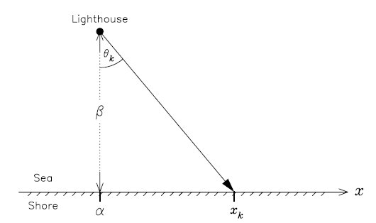

Introduction
=====================

<!-- inspired by from http://stats.stackexchange.com/questions/254907/ -->

Refs:

+ D.S.Sivia - [Data Analysis, A Bayesian Tutorial](https://www.amazon.com/dp/0198568320)
+ Stephen F. Gull - [Bayesian Inductive Inference and Maximum Entropy](bayes.wustl.edu/sfg/why.pdf)

This problem was first presented by Stephen F. Gull in 1988 and can be stated as:

> A lighthouse is somewhere off a piece of straight coastline at a position $\alpha$ along the shore and a distance $\beta$ out at sea. It emits a series of short highly collimated flashes at random intervals and hence at random azimuths. These pulses are intercepted on the coast by photo-detectors that record only the fact that a flash has occurred, but not the angle from which it came. N flashes have so far been recorded at positions {$x_k$}. Where is the lighthouse?’ -- Sivia, pg.29

<center></center>
<center> _Problem diagram (also from Sivia)_ </center>

<br>

As implied in the description, the angle $\theta$ is uniform over $\pm \pi/2$, so 

$$p(\theta | \alpha, \beta) = \frac{1}{\pi}$$

The position $x$ is given by

$$x = \beta \tan \theta + \alpha$$

The rule of variable transformation, $p(x) dx = p(\theta) d\theta$, allows us to compute $p(x | \alpha, \beta)$:

$$p(x | \alpha, \beta) = p(\theta | \alpha, \beta) \left| \frac{d\theta}{dx} \right|$$

Since $x = \beta \tan \theta + \alpha$, if we differenciate $\theta$ wrt $x$:

$$\frac{d\theta}{dx} = \beta \sec^2\theta = \beta (\tan^2\theta + 1) = 
\beta \left[\left(\frac{x-\alpha}{\beta}\right)^2 + 1\right] = \frac{\beta}{(x-\alpha)^2 + \beta^2}$$


<!--

Since $x = \beta \tan \theta + \alpha$, if we differenciate both sides wrt $x$, it give us:

$$\beta \sec^2\theta  \frac{d\theta}{dx} = (x-\alpha)  \frac{d\theta}{dx}$$
$$\beta \sec^2\theta  \frac{d\theta}{dx} = 1$$
Using the trignometric identity $\sec^2\theta = \tan^2\theta + 1$,

$$\beta (\tan^2\theta + 1)  \frac{d\theta}{dx} = 1$$

and that $x = \beta \tan \theta + \alpha \iff \tan \theta = (x_k-\alpha)/\beta$

$$\beta \left(\left(\frac{x-\alpha}{\beta}\right)^2 + 1\right)  \frac{d\theta}{dx} = 1$$
Placing it on the other side, and simplifying a bit:

$$\frac{d\theta}{dx} = \frac{\beta}{(x-\alpha)^2 + \beta^2} $$
-->

So, getting back to $p(x | \alpha, \beta)$:

$$p(x | \alpha, \beta) = p(\theta | \alpha, \beta) \left| \frac{d\theta}{dx} \right| = \frac{1}{\pi} \frac{\beta}{(x-\alpha)^2 + \beta^2}$$

This distribution is precisely the [Cauchy distribution](http://mathworld.wolfram.com/CauchyDistribution.html). It has two parameters, $x_0$, location (which we called $\alpha$, above), and $\beta>0$, scale:

$$p(x|x_0,\beta) = \frac{1}{\pi} \frac{\beta}{(x-x_0)^2 + \beta^2}$$

Notice that this is a two paramater problem, $\alpha$ and $\beta$.

Known $\beta$
=====================

First, let's consider we know $\beta$, the distance from shore, and we wish to find

$$p(\alpha | \{x_k\}, \beta)$$

Using Bayes' theorem:

$$p(\alpha | \{x_k\}, \beta) \propto p(\{x_k\} | \alpha, \beta) p(\alpha | \beta)$$

and since $\alpha \perp \beta$, $p(\alpha | \beta) = p(\alpha)$.

The prior $p(\alpha)$ can be modelled by a uniform over a large enough segment $[x_{min}, x_{max}]$, ie, $p(\alpha) = 1/(x_{max}-x_{min})$.

For the data likelihood $p(\{x_k\} | \alpha, \beta)$ we consider that each datum $x_k$ is iid, so:

$$p(\{x_k\} | \alpha, \beta) = \prod_{k=1}^N p(x_k | \alpha, \beta)$$

And since the prior for $\alpha$ is uniform, we finally get:

$$p(\alpha | \{x_k\}, \beta) \propto p(\{x_k\} | \alpha, \beta)$$

<!-- The log posterior is:

$$\log p(\alpha | \{x_k\}, \beta) = C - \sum_{k=1}^N \left( \beta^2 + (x_k-\alpha)^2 \right)$$

where $C$ includes everything not regarding $\alpha$.

```{r, eval=FALSE, echo=FALSE}
make_log_posterior <- function (x_k, beta) {
  Vectorize(function (alpha_hat) {
              - sum( log(beta^2 + (x_k - alpha_hat)^2) )  
           })
}
```

-->

Let's try some R.

The next function is a factory that creates the log posterior function for a given data:

```{r}
# outputs function log p(alpha|x_k,beta) 
#
# computes the cauchy pdf for the likelihood p(x_k|alpha,beta), since the prior(alpha)
# is constant and does not contribute to find the posterior distribution shape
make_log_posterior <- function (x_k, beta) {
  Vectorize(function (alpha_hat) {
              sum( log((beta/pi) / (beta^2 + (x_k - alpha_hat)^2)) )
           })
}
```

Let's create a dataset:

```{r}
alpha <- 10 # unkonwn true values
beta  <- 30 # this is known for now
##################
set.seed(123)
N       <- 1024
theta_k <- runif(N,-pi/2,pi/2)
x_k     <- beta * tan(theta_k) + alpha
```

And check it:

```{r}
log_posterior <- make_log_posterior(x_k, beta)
curve(log_posterior, from=-25, to=25, n=500, xlab=bquote(alpha), ylab="")
```

We see that there's a maximum over there, but we are working with logs (btw, we must work with logs to make sums, since working directly with products would easily result in under/overflows).

After the logs are computed, we can get the shape of the posterior (to get the true posterior -- a distribution -- we would need to find the normalizing factor, which is irrelevant here):

```{r}
posterior_shape <- function(xs, log_posterior) {
  log_alphas    <- log_posterior(xs)        # compute log posterior for a grid of values
  log_alpha_max <- max(log_alphas)            
  alphas <- exp(log_alphas - log_alpha_max) # subtract from L_max, and exponentiate
  alphas                                    #  then the max value will be 1
}

xs <- seq(0,20,len=1000)
plot(xs, posterior_shape(xs, log_posterior), type="l", xlab=bquote(alpha), ylab="")
abline(v=alpha, col="grey40", lty=2)
```

The likelihood is given by a Cauchy, which is a symmetric distribution, and it would be natural to assume that the mean would be a good estimator. However:

```{r}
mean(x_k)
```

The mean is not a good estimator because we cannot apply the [Central Limit Theorem](https://en.wikipedia.org/wiki/Central_limit_theorem) (CLT). The CLT only works when the data is iid (which it is) and sampled from a distribution with finite mean (which it is not). _The Cauchy does not have a mean_.

The Cauchy does have a median, $x_0$, which can be used as an estimator here:

```{r}
median(x_k)
```

but does not give as much information as the posterior does.

The posterior might be multimodal when the data is sufficiently appart:

```{r}
x2_k <- c(0,0,200,400,400)
log_posterior2 <- make_log_posterior(x2_k, beta)

xs <- seq(-100,500,len=1000)
plot(xs, posterior_shape(xs, log_posterior2), type="l", xlab=bquote(alpha), ylab="")
```


Unknown $\beta$
=====================

If we also don't know $\beta$ then we have to add a prior to it. 

Let's assume $\alpha \perp \beta$, so we get:

$$p(\alpha, \beta | \{x_k\}) \propto p(\{x_k\} | \alpha, \beta) p(\alpha) p(\beta)$$

If we also assume that $\beta$ is uniform over some interval [$0,y_{max}$], then the posterior is proportional to the likelihood:

$$p(\alpha, \beta | \{x_k\}) \propto p(\{x_k\} | \alpha, \beta)$$

We can use R to check how the posterior would look like for our previous eg:

```{r}
log_joint_posterior <- function (x_k, alfa, beta) {
  sum( log((beta/pi) / (beta^2 + (x_k - alfa)^2)) )
}
```

And check our sample dataset using a grid search:

```{r}
x_min <- 0; x_max <- 20; y_max <- 50
alphas <- seq(x_min, x_max)
betas  <- seq(    0, y_max)

f <- function(a,b) log_joint_posterior(x_k, a, b)

log_grid_values <- outer(alphas, betas, Vectorize(f))

grid_values <- matrix(posterior_shape(log_grid_values, log_posterior),
                      nrow=length(alphas), ncol=length(betas))
```

This requires a 3D plot:

```{r}
persp(alphas, betas , grid_values,
      xlab=bquote(alpha), ylab=bquote(beta), zlab="", 
      main="" , cex=0.7, lwd=0.1  , 
      xlim=c(x_min,x_max), ylim=c(0,y_max), zlim=c(0,1),
      theta=80, phi=30, d=5.0, shade=0.05)
title(bquote(paste(p,"(",alpha,",",beta,"|",x[k],")")))
```

Or a contour map:

```{r, fig.height=6, fig.width=6}
contour(alphas, betas, grid_values, xlim=c(4,15), ylim=c(20,40))
points(alpha, beta, pch=3, col="blue", lwd=2) # true value
legend("topright",c("true position"), col="blue", pch=3, pt.cex=1.2, pt.lwd=2) 
```

Using Stan
-----------

```{r, message=FALSE, warning=FALSE}
library(rstan)
```

The next Stan program models our problem (adapted from [here](http://stats.stackexchange.com/questions/254907)):

```{r}
model <- '
  data {
    int<lower=0> N;
    real x_[N];
  }
  
  parameters {
    real alpha;
    real<lower=0> beta;
    real<lower=-pi()/2, upper=pi()/2> angle[N];
  }
  
  model {
    vector[N] flashes;
    
    alpha ~ uniform(0, 20);
    beta  ~ uniform(0, 50);

    for (k in 1:N) {
      x_[k] ~ cauchy(alpha, beta);
    }    
  }
'
```

Let's compile and run the model in Stan:

```{r, message=FALSE, warning=FALSE, results='hide', errors=FALSE}
n <- 100  # get a subset of the data
stan_input <- list(x_=x_k[1:n], N=n)

fit  <- stan(model_code=model, data=stan_input, iter=1000, verbose=FALSE)
fit2 <- stan(fit=fit, data=stan_input, iter=5000, warmup=2000, verbose=FALSE)
```

```{r}
print(fit2, pars=c("alpha", "beta"))
```

These are the empirical posteriors (the vertical red line is the true parameter value):

```{r}
la <- extract(fit2)
alpha_hats <- as.numeric(la$alpha)
beta_hats  <- as.numeric(la$beta)
```

```{r}
hist(x=alpha_hats, breaks=100, xlab=bquote(alpha), ylab="",main="", yaxt='n')
abline(v=alpha, col="red", lwd=2)
```

```{r}
hist(x=beta_hats, breaks=100, xlab=bquote(beta), ylab="",main="", yaxt='n')
abline(v=beta, col="red", lwd=2)
```

