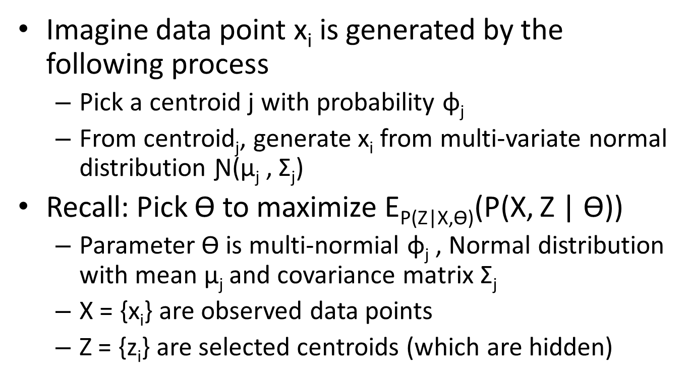

```{r, message = FALSE, tidy = FALSE, echo = F}
## knitr configuration: http://yihui.name/knitr/options#chunk_options
opts_chunk$set(comment = "", error= TRUE, warning = FALSE, message = FALSE,
               tidy = FALSE, cache = FALSE, echo = T, dev='svg',
               fig.width = 6, fig.height = 6, fig.align='center')
```

Clustering
========================================================


Refs:

+ [http://horicky.blogspot.pt/2012/04/machine-learning-in-r-clustering.html](http://horicky.blogspot.pt/2012/04/machine-learning-in-r-clustering.html)
+ [http://manuals.bioinformatics.ucr.edu/home/R_BioCondManual#TOC-Clustering-and-Data-Mining-in-R](http://manuals.bioinformatics.ucr.edu/home/R_BioCondManual#TOC-Clustering-and-Data-Mining-in-R)
 
K-Means
-------

1. Pick an initial set of K centroids (this can be random or any other means)
2. For each data point, assign it to the member of the closest centroid according to the given distance function
3. Adjust the centroid position as the mean of all its assigned member data points. Go back to (2) until the membership isn't change and centroid position is stable.
4. Output the centroids.

Notice that in K-Means, we require the definition of:
+ the distance function 
+ the mean function 
+ the number of centroids $K$

K-Means is  $O(nkr)$, where $n$ is the number of points, $r$ is the number of rounds and $k$ the number of centroids.

The result of each round is undeterministic. The usual practices is to run multiple rounds of K-Means and pick the result of the best round. The best round is one who minimize the average distance of each point to its assigned centroid.

```{r}
library(stats)
set.seed(101)
km <- kmeans(iris[,1:4], 3)
plot(iris[,1], iris[,2], col=km$cluster)
points(km$centers[,c(1,2)], col=1:3, pch=19, cex=2)
table(km$cluster, iris$Species)
# Another round:
set.seed(900)
km <- kmeans(iris[,1:4], 3)
plot(iris[,1], iris[,2], col=km$cluster)
points(km$centers[,c(1,2)], col=1:3, pch=19, cex=2)
table(predicted=km$cluster, true=iris$Species)
```

Hierarchical Clustering
-----------------------

In this approach, it compares all pairs of data points and merge the one with the closest distance.

1. Compute distance between every pairs of point/cluster. 
(a) Distance between point is just using the distance function. 
(b) Compute distance between pointA to clusterB may involve many choices (such as the min/max/avg distance between the pointA and points in the clusterB). 
(c) Compute distance between clusterA to clusterB may first compute distance of all points pairs (one from clusterA and the other from clusterB) and then pick either min/max/avg of these pairs.
2. Combine the two closest point/cluster into a cluster. Go back to (1) until only one big cluster remains.

In hierarchical clustering, the complexity is O(n^2), the output will be a tree of merging steps. It doesn't require us to specify $K$ or a mean function. Since its high complexity, hierarchical clustering is typically used when the number of points are not too high.

```{r, fig.width = 12}
m <- matrix(1:15,5,3)
dist(m) # computes the distance between rows of m (since there are 3 columns, it is the euclidian distance between tri-dimensional points)
dist(m,method="manhattan") # using the manhattan metric
set.seed(101)
sampleiris <- iris[sample(1:150, 40),] # get samples from iris dataset
# each observation has 4 variables, ie, they are interpreted as 4-D points
distance   <- dist(sampleiris[,-5], method="euclidean") 
cluster    <- hclust(distance, method="average")
plot(cluster, hang=-1, label=sampleiris$Species)
```

Other ways to present the information:

```{r, fig.width = 12, fig.height=12}
plot(as.dendrogram(cluster), edgePar=list(col="darkgreen", lwd=2), horiz=T) 
str(as.dendrogram(cluster)) # Prints dendrogram structure as text.
cluster$labels[cluster$order] # Prints the row labels in the order they appear in the tree.
```

It's possible to prune the resulting tree. In the next egs we cut by number of clusters:

```{r, fig.width = 14, fig.height = 7}
par(mfrow=c(1,2))
group.3 <- cutree(cluster, k = 3)  # prune the tree by 3 clusters
table(group.3, sampleiris$Species) # compare with known classes
plot(sampleiris[,c(1,2)], col=group.3, pch=19, cex=2.5, main="3 clusters")
points(sampleiris[,c(1,2)], col=sampleiris$Species, pch=19, cex=1)
group.6 <- cutree(cluster, k = 6)  # we can prune by more clusters
table(group.6, sampleiris$Species)
plot(sampleiris[,c(1,2)], col=group.6, pch=19, cex=2.5, main="6 clusters")
points(sampleiris[,c(1,2)], col=sampleiris$Species, pch=19, cex=1) # the little points are the true classes
par(mfrow=c(1,1))
```

It is also possible to cut by height of the original tree:

```{r, fig.width = 12, fig.height = 10}
plot(cluster, hang=-1, label=sampleiris$Species)
abline(h=0.9,lty=3,col="red")
height.0.9 <- cutree(cluster, h = 0.9)
table(height.0.9, sampleiris$Species) # compare with known classes
plot(sampleiris[,c(1,2)], col=height.0.9, pch=19, cex=2.5, main="3 clusters")
points(sampleiris[,c(1,2)], col=sampleiris$Species, pch=19, cex=1)
```

And if we don't know the number of clusters? ([ref](http://www2.stat.unibo.it/montanari/Didattica/Multivariate/CA_lab.pdf))

```{r}
# Calculate the dissimilarity between observations using the Euclidean distance 
dist.iris <- dist(iris, method="euclidean")
# Compute a hierarchical cluster analysis on the distance matrix using the complete linkage method 
h.iris <- hclust(dist.iris, method="complete") 
h.iris
head(h.iris$merge, n=10)
```

The minus in front of the unit number indicates that this is a single observation being merged; 
whereas numbers alone indicate the step at which the considered clusters were built (check `??hclust`).

```{r}
plot(h.iris)
```

What is an appropriate number of clusters according to this plot? A common choice is to cut the tree by the largest difference of heights between two nodes. The height values are contained in the output of hclust function: 

```{r}
h.iris.heights <- h.iris$height # height values
h.iris.heights[1:10]
subs <- round(h.iris.heights - c(0,h.iris.heights[-length(h.iris.heights)]), 3) # subtract next height
which.max(subs)
```

Since the largest jump was on the last step of the merging process, it suggests two clusters (herein, we know it is three).

Other fancy stuff
-------------

```{r, fig.height=12, fig.width=12}
# Cuts dendrogram at specified level and draws rectangles around the resulting clusters
plot(cluster); rect.hclust(cluster, k=5, border="red")
c <- cor(t(iris[,-5]), method="spearman"); 
d <- as.dist(1-c);
mycl  <- cutree(cluster, h=1);
subcl <- names(mycl[mycl==3]) # which observations are considered class 3
subd  <- as.dist(as.matrix(d)[subcl,subcl])
subhr <- hclust(subd, method = "complete")
source("http://faculty.ucr.edu/~tgirke/Documents/R_BioCond/My_R_Scripts/dendroCol.R") # Import tree coloring function.
# In this example the dendrogram for the above object is colored with the imported 'dendroCol()' function based on the identifiers provided in its 'keys' argument. If 'xPar' is set to 'nodePar' then the labels are colored instead of the leaves.
dend_colored <- dendrapply(as.dendrogram(cluster), dendroCol, keys=subcl, xPar="edgePar", bgr="red", fgr="blue", lwd=2, pch=20) 
par(mfrow = c(1, 3))
# Plots the colored tree in different formats. The last command shows how one can zoom into the tree with the 'xlim and ylim' arguments, which is possible since R 2.8.
plot(dend_colored, horiz=T)
plot(dend_colored, horiz=T, type="tr")
plot(dend_colored, horiz=T, edgePar=list(lwd=2), xlim=c(3,0), ylim=c(1,3)) 
par(mfrow = c(1, 1))
# This example shows how one can manually color tree elements.
z <- as.dendrogram(cluster)
attr(z[[2]][[2]],"edgePar") <- list(col="blue", lwd=4, pch=NA)
attr(z[[2]][[1]],"edgePar") <- list(col="red", lwd=3, lty=3, pch=NA)
plot(z, horiz=T) 
```

Fuzzy C-Means
-------------

Unlike K-Means where each data point belongs to only one cluster, in fuzzy cmeans, each data point has a fraction of membership to each cluster. The goal is to figure out the membership fraction that minimize the expected distance to each centroid. Details [here](http://home.deib.polimi.it/matteucc/Clustering/tutorial_html/cmeans.html).

The parameter m is the degree of fuzziness. The output is the matrix with each data point assigned a degree of membership to each centroids.

```{r}
library(e1071)
result <- cmeans(iris[,-5], centers=3, iter.max=100, m=2, method="cmeans")  # 3 clusters
plot(iris[,1], iris[,2], col=result$cluster)
points(result$centers[,c(1,2)], col=1:3, pch=19, cex=2)
result$membership[1:5,] # degree of membership for each observation to each cluster:
table(iris$Species, result$cluster)
```

Multi-Gaussian with Expectation-Maximization
--------------------------------------------

Generally in machine learning, we will to learn a set of parameters that maximize the likelihood of observing our training data. However, what if there are some hidden variable in our data that we haven't observed. Expectation Maximization is a very common technique to use the parameter to estimate the probability distribution of those hidden variable, compute the expected likelihood and then figure out the parameters that will maximize this expected likelihood. It can be explained as follows ...




```{r}
library(mclust)
mc <- Mclust(iris[,1:4], 3)
summary(mc)
plot(mc, what=c("classification"), dimens=c(1,2))
plot(mc, what=c("classification"), dimens=c(3,4))
table(iris$Species, mc$classification)
```

Density-based Cluster
--------------------

In density based cluster, a cluster is extend along the density distribution. 

Two parameters is important: "eps" defines the radius of neighborhood of each point, and "minpts" is the number of neighbors within my "eps" radius. 

The basic algorithm called DBscan proceeds as follows

1. First scan: For each point, compute the distance with all other points. Increment a neighbor count if it is smaller than "eps".
2. Second scan: For each point, mark it as a core point if its neighbor count is greater than "minpts"
3. Third scan: For each core point, if it is not already assigned a cluster, create a new cluster and assign that to this core point as well as all of its neighbors within "eps" radius.

Unlike other cluster, density based cluster can have some outliers (data points that doesn't belong to any clusters). On the other hand, it can detect cluster of arbitrary shapes (doesn't have to be circular at all).

```{r, fig.width = 12, fig.height = 12}
library(fpc)
set.seed(121)
sampleiris <- iris[sample(1:150, 40),] # get samples from iris dataset
# eps is radius of neighborhood, MinPts is no of neighbors within eps
cluster <- dbscan(sampleiris[,-5], eps=0.6, MinPts=4)
# black points are outliers, triangles are core points and circles are boundary points
plot(cluster, sampleiris)
plot(cluster, sampleiris[,c(1,4)])
# Notice points in cluster 0 are unassigned outliers
table(cluster$cluster, sampleiris$Species)
```

QT Clustering
--------------

Quality Control Clustering requires the threshold distance within the cluster and the minimum number of elements in each cluster. 

For each data point find all its candidate data points, ie, those which are within the range of the threshold distance from the given data point. This way we find the candidate data points for all data point and choose the one with large number of candidate data points to form a cluster. Now data points which belongs to this cluster is removed and the same procedure is repeated with the reduced set of data points until no more cluster can be formed satisfying the minimum size criteria.

Pros:
+ Quality Guaranteed - Only clusters that pass a user-defined quality threshold will be returned.
+ Number of clusters is not a parameter
+ All possible clusters are considered

Cons:
+ Computationally Intensive and Time Consuming - Increasing the minimum cluster size or increasing the number of data points can greatly increase the computational time.
+ Threshold distance and minimum number of elements in the cluster are parameters

```{r}
library(flexclust) 
cl1 <- qtclust(iris[,-5], radius=2) # Uses 2 as the maximum distance of the points to the cluster centers.
cl2 <- qtclust(iris[,-5], radius=1) # Uses 1 as the maximum distance of the points to the cluster centers.
par(mfrow=c(1,2))
plot(iris[,c(1,2)], col=predict(cl1), xlab="", ylab="")
plot(iris[,c(1,2)], col=predict(cl2), xlab="", ylab="")
par(mfrow=c(1,1))
table(attributes(cl1)$cluster, iris$Species) # not very good...
table(attributes(cl2)$cluster, iris$Species) 
```

Self-Organizing Map (SOM)
-------------------------

ref: [http://www.jstatsoft.org/v21/i05](http://www.jstatsoft.org/v21/i05)

Self-organizing map (SOM), also known as **Kohonen network**, is an  artificial neural network algorithm in the unsupervised learning area. The approach iteratively assigns all items in a data matrix to a specified number of representatives and then updates each representative by the mean of its assigned data points. Widely used R packages for SOM clustering and visualization are: class (part of R), SOM and kohonen.

```{r}
library(kohonen) 
set.seed(101)
train.obs <- sample(nrow(iris), 50) # get the training set observations
train.set <- scale(iris[train.obs,][,-5]) # check info about scaling data below
test.set  <- scale(iris[-train.obs, ][-5],
               center = attr(train.set, "scaled:center"),
               scale  = attr(train.set, "scaled:scale"))
som.iris <- som(train.set, grid = somgrid(5, 5, "hexagonal"))
plot(som.iris)
som.prediction <- 
  predict(som.iris, newdata = test.set,
          trainX = train.set,
          trainY = classvec2classmat(iris[,5][train.obs]))

table(iris[,5][-train.obs], som.prediction$prediction)
```

k-Nearest Neighbour
-------------------

ref: [http://en.wikibooks.org/wiki/Data_Mining_Algorithms_In_R/Classification/kNN](http://en.wikibooks.org/wiki/Data_Mining_Algorithms_In_R/Classification/kNN)

Loosely related is the k-Nearest Neighbour algorithm. This is a classification procedure without model training! 

Let s be a sample from the test set and I be the set of classified observations. Then:
+ Compute the distance between 's' and each instance in 'I'
+ Sort the distances in increasing numerical order and pick the first 'k' elements
+ Compute and return the most frequent class in the 'k' nearest neighbors, optionally weighting each instance's class by the inverse of its distance to 's'

We use the `kknn` package. The `kknn` function uses the [Minkowski Distance](http://en.wikipedia.org/wiki/Minkowski_distance) as its metric:

$$\Big( \sum_i |x_i - y_i|^p \Big)^{1/p}$$
is the distance between vectors $x = (x_1, x_2\ldots x_n)$ and $y = (y_1, y_2\ldots y_n)$.

When $p=2$ we have as a special case the Euclidean distanc, and when $p=1$ we have the Manhattan distance.

```{r}
library(kknn)
library(caret)

# make a dataset
inTrain   <- createDataPartition(y=iris$Species, p=0.75, list=FALSE) 
known.set <- iris[inTrain,]
test.set  <- iris[-inTrain,]

iris.kknn <- kknn(Species ~ ., known.set, test.set[,-5], 
                  distance = 1, k = 7, scale = TRUE,
                  kernel = "triangular") 
# the kernel param specifies how to weight the neighbors according to their distances 
# kernel = "rectangular" does not weight (check help for more options)

#here are some useful information from the returned object:
iris.kknn$prob[10:20,]
iris.kknn$fitted.values

# Let's test the performance of the classification:
table(test.set$Species, fitted(iris.kknn))
pairs(test.set[,-5], 
      pch = as.character(as.numeric(test.set$Species)), 
      col = c("green3", "red")[(test.set$Species != fit)+1])
```

The package is also able to perform cross-validation:

```{r}
set.seed(101)
# 10-fol cross validation with k=7 neighbors
iris.cv <- simulation(Species ~ ., iris, runs=10, k=7, kernel="triangular")
iris.cv # 6% for the mean error with a sd of 2.4%
# Another method for leave-one-out cross-validation
iris.cv2 <- train.kknn(Species ~ ., iris, nn=10, kernel="triangular")
plot(iris.cv2, type="b")
```


Annex: Scaling datasets
======================

```{r}
# Sample data matrix.
set.seed(101)
y <- matrix(rnorm(100,20,5), 20, 5, 
            dimnames=list(paste0("g", 1:20), paste0("t", 1:5))) 
head(y)
apply(y,2,mean) # check mean and sd of each column
apply(y,2,sd)
```

We use the function `scale()` to centers and/or scales the data. In its default settings, the function returns columns that have a mean close to zero and a standard deviation of one.

To scale matrix `m` by rows use `t(scale(t(m)))`

```{r}
apply(scale(y,scale=FALSE),2,mean) # just centers, sd remains
apply(scale(y,scale=FALSE),2,sd)
yscaled.cols <- scale(y)     # scale and center columns
yscaled.cols
apply(yscaled.cols, 2, mean) # should be zero (or close)
apply(yscaled.cols, 2, sd)   # should be one
yscaled.rows <- t(scale(t(y))) # scale and center rows
yscaled.rows
apply(yscaled.rows, 1, mean) # should be zero (or close)
apply(yscaled.rows, 1, sd)   # should be one
```
