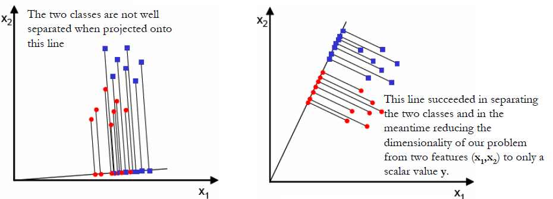
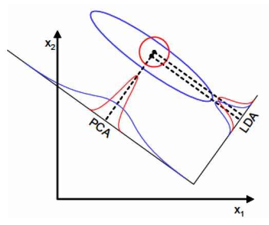
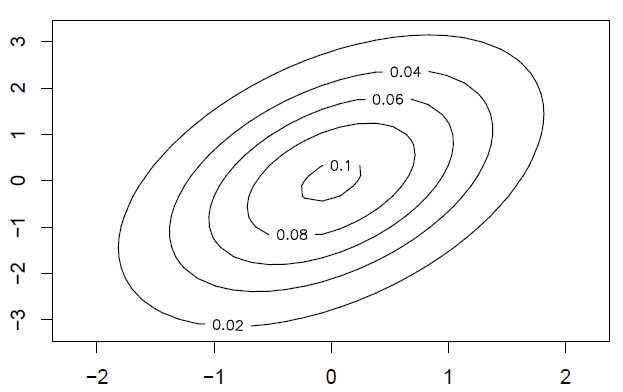

Introduction
--------------

Refs

+ [DM825 - Intro.to ML, Lecture 7](http://www.imada.sdu.dk/~marco/DM825/Slides/dm825-lec7.pdf)

+ **C.M.Bishop - Pattern Matching and ML**, pgs 201,203

The Gaussian Discriminant Analysis (GDA) is a generative method, given data $x$ and class $y$, we learn $p(x,y)$ and thus predict $p(y|x)$. 

The general steps for a generative model are:

1. Model $p(y)$ and $p(x|y)$

2. Learn parameters of the model by maximizing $p(x,y)=p(x|y)p(y)$

3. With $$p(y|x) = \frac{p(x|y)p(y)}{p(x)} = \frac{p(x|y)p(y)}{\sum_{y_i\in Y}p(x|y_i)p(y_i)} \propto p(x|y)p(y)$$ predict $p(y|x)$ by $$\arg \max_y p(y|x) = \arg \max_y \frac{p(x|y)p(y)}{p(x)} = \arg \max_y p(x|y)p(y)$$

Let's consider two classes for $y$, $y_0 = 0, y_1 = 1$. 

**Step 1.** In GDA we model $p(y)$ as:

$$y \sim \text{Bernoulli}(\phi) \implies p(y|\phi) = \phi^y(1-\phi)^{1-\phi}$$

and model $p(x|y)$ by a multivariate Gaussian with a given covariance matrix $\Sigma$:

$$x|y_i \sim \mathcal{N}(\mu_i,\Sigma) \implies 
p(x|y_i) = \frac{1}{(2\pi)^{n/2}|\Sigma|^{1/2}} \exp( \frac{1}{2} (x-\mu_i)^T \Sigma^{-1} (x-\mu_i) )$$

**Step 2.** Express the joint likelihood of the data $x=(x^1,x^2,\ldots,x^m), y=(y^1,y^2,\ldots,y^m)$:

$$p(x,y|\phi,\mu_0,\mu_1,\Sigma) = \prod_{i=1}^m p(x^i,y^i) = \prod_{i=1}^m p(x^i|y^i)p(y^i)$$

and maximize the expression in $\phi,\mu_0,\mu_1,\Sigma$.

The solutions are:

$$\phi = \frac{\sum_i I(y^i = 1)}{m}$$

$$\mu_k = \frac{\sum_i I(y^i = k)x^i}{I(y^i = k)}$$

$$\Sigma = \frac{1}{m} \sum_{I(y^i=0)} (x^i-\mu_0)(x^i-\mu_0)^T + \frac{1}{m} \sum_{I(y^i=1)} (x^i-\mu_1)(x^i-\mu_1)^T$$

**Step 3.** Given the parameters, maximize $$\arg \max_y p(x|y)p(y)$$ With two classes it is finding which $p(x|y=0)p(y=0)$ or $p(x|y=1)p(y=1)$ is larger.

Herein, we assumed that $\Sigma$ is the same for both class conditional densities. This is called **Linear Discriminant Analysis**. Otherwise, it is called **Quadratic Discriminant Analysis**.

Linear Discriminant Analysis
-----------------------------

Refs:

+ http://web.bahcesehir.edu.tr/atabey_kaygun/other/lda.html

Linear Discriminant Analysis (LDA) finds a linear combination of features that separates different classes. This combination can be used to perform classification or for dimensionality reduction before classification (using another method).

> LDA is closely related to [...] regression analysis, which also attempt to express one dependent variable as a linear combination of other features or measurements. In [regression analysis] however, the dependent variable is a numerical quantity, while for LDA it is a categorical variable (i.e. the class label). Logistic regression and probit regression are more similar to LDA, as they also explain a categorical variable. These other methods are preferable in applications where it is not reasonable to assume that the independent variables are normally distributed, which is a fundamental assumption of the LDA method. [wikipedia](http://en.wikipedia.org/wiki/Linear_discriminant_analysis)

Consider a classification problem with $K$ classes. Each class $C_i$ has $N_i$ m-dimensional samples.
Let $X$ be a matrix where each column corresponds to one sample. The goal is to obtain a transformation of $X$ to $X'$ by projecting the samples of $X$ onto a hyperplane of dimension $K-1$.

In two dimensions (2 classes) we want to project the matrix onto a line the maximizes the separability of the classes (images from Aly Farag's [LDA Tutorial](https://cvl.gist.ac.kr/wp-content/uploads/2013/11/LDA-Tutorial.pdf)):

<center></center>

LDA is a parametric method, ie, they assume some distribution over the data, in this case unimodal Gaussian likelihoods. If the distribution is significantly non-gaussian, LDA will perform badly since it will be unable to preserve the complex strucutre of the data. However, by assuming a distribution, it's possible to assign probabilities for group assignments (as shown in the next section).

If the discriminatory information is not in the mean, but in the variance, LDA will fail:

<center></center>

The Basic Idea
--------------

Let a sample $x^T = (x_1, \ldots, x_m)$ where $x_i$ is a random variable.

We assume that $x$ follows a Multivariate Normal Distribution (MVD) with mean $\mu$ (a m-dimensional vector) and covariance matrix $\Sigma$ (a m\times m matrix), ie, $x \sim N(\mu,\Sigma)$.

The pdf is:

$$f(x|\mu,\Sigma) = \frac{1}{(2\pi)^{m/2} |\Sigma|^{1/2}} exp \Big[ -\frac{1}{2} (x-\mu)^T \Sigma^{-1} (x-\mu) \Big]$$

Notice that the set $\{x:f(x|\mu,\Sigma)>C\}$ is a m-dimensional ellipsoid centered at point $\mu$, where $\Sigma$ determines the ellipsoid's shape.

Eg, for $\mu=(0,0)$ and $\Sigma = (1,0.8;0.8,3)$ the contour plot is:

<center></center>

Def: The [Mahalanobis distance](http://en.wikipedia.org/wiki/Mahalanobis_distance) of a point $x$ to mean $\mu$ is

$$D = \sqrt{ (x-\mu)^T \Sigma^{-1} (x-\mu) }$$

Two points have the same Mahalanobis distance if they are on the same ellipsoid centered on $\mu$.

Now suppose that given a point $x$ we wish the find the closest mean $\mu_k$ (of class $K$) measured by the Mahalanobis distance. A point is closer to $\mu_1$ than it is to $\mu_2$ when

$$(x-\mu_1)^T \Sigma^{-1}_1 (x-\mu_1) < (x-\mu_2)^T \Sigma^{-1}_2 (x-\mu_2)$$

this is a quadratic expression on $x$.

If we assume that all covariance matrixes are equal, $\Sigma = \Sigma_k, k=1\ldots K$, the expression simplifies to $$-2\mu_1^T\Sigma^{-1}x + \mu_1^T\Sigma^{-1}\mu_1 < -2\mu_2^T\Sigma^{-1}x + \mu_2^T\Sigma^{-1}\mu_2$$ which is a linear expression of $x$.

There are linear and quadratic discriminant analysis (QDA), depending on the assumptions we make. In LDA the different covariance matrixes are grouped into a single one, in order to have that linear expression. This makes it simpler but all the class groups share the same structure. In QDA the ellipsoid's shapes vary.

To classify a new sample, we must compute the posterior $p(x \in C_k|x)$. The classification is just to assign  the class with largest posterior probability. The likelihood of the data $p(x)$ is the MVD as seen above. The only thing needed to apply Bayes' theorem is a prior probability of $P(x \in C_k)$ which usually is just the proportion of samples belonging to class $C_k$. Another option is to have a vague prior $P(x \in C_k) = 1/K$

In LDA the decision boundary between classes $i$ and $j$ is given by $$\log \frac{p(x \in i|x)}{p(x \in j|x)} = 0$$

LDA for Classification
-----------------------

```{r}
library(MASS)

X <- matrix(c(2,3,3,4,4,5,5,6,5,7,2,1,3,2,4,2,4,3,6,4,7,6,1,6,2,7,1,7), ncol=2, byrow=T)
Y <- c(1,1,1,1,1,2,2,2,2,2,2,3,3,3);
plot(X,col=Y, pch=19)

idx_class1 <- which(Y==1)  # indexes of the observations for each class
idx_class2 <- which(Y==2)

my.data <- data.frame(X1=X[,1], X2=X[,2], Y=Y)
model <- lda(Y ~ . , data=my.data)
model
projected.data <- X %*% model$scaling
plot(projected.data, col=Y, pch=19)

# now let's predict the class of a new sample
new.data <- data.frame(X1=c(2), X2=c(5.1)) # new data point should be class 3
prediction <- predict(model, new.data)
model$prior          # the prior probabilities before the new data point
prediction$posterior # the posterior probs for the classes given this new data point
plot(X,col=Y, pch=19)
# Let's plot it with the color for the class it predicts:
points(new.data$X1, new.data$X2, pch=17, col=prediction$class)
# Plot the means:
points(model$means, pch="+", col=1:3)
```

Let's see the boundaries:

```{r}
library(klaR) # Classification and visualization package

partimat(x=my.data[,-3], grouping=as.factor(my.data[,3]), method="lda", 
         col.mean=1, image.colors = c("lightgrey","red","green"))
```

Let's do the same for QDA:

```{r}
model <- qda(Y ~ . , data=my.data)

new.data <- data.frame(X1=c(2), X2=c(5.1)) # new data point should be class 3
prediction <- predict(model, new.data)
prediction$posterior

partimat(x=my.data[,-3], grouping=as.factor(my.data[,3]), method="qda", 
         col.mean=1, image.colors = c("lightgrey","red","green"))
```


LDA for Dimensionality Reduction before Classification
------------------

Here the objective is to perform dimensionality reduction. But unlike PCA it preserves as much class information as possible.

Let's see an eg:

```{r}
set.seed(101) 
# Read Sample Data
my.data <- read.csv(url("http://archive.ics.uci.edu/ml/machine-learning-databases/wine/wine.data"),
                    header=FALSE)
Y <- my.data[,1]                            # classes
X <- as.data.frame(scale(my.data[,2:14]))   # scaling data (ie, mean=0 & sd=1 for all Xi)
names(X) <- paste0("X",1:13)
head(cbind(signif(X,3),Y), n=10)

train <- sample(1:dim(X)[1],50)  # define the training set indexes

# First test with a knn 
library(class)
prediction <- knn(X[train,], X[-train,], Y[train], k=1)
table1 <- table(old=Y[-train], new=prediction)
table1
```

This is the result of applying KNN.

The next test reduces the dataset by performing a LDA. Then we classify:

```{r}
library(MASS)
model <- lda(Y ~ . , data=cbind(X,Y), subset=train)
model$prior   # the prior probabilities used (by default, the class proportions for the training set)
model$scaling # the resulting projection matrix to project our dataset into a 2-dimensional vector space
projected.data <- as.matrix(X) %*% model$scaling  # make the projection to 2D space
head(projected.data)
plot(projected.data, col=Y)
prediction <- knn(projected.data[train,], projected.data[-train,], Y[train], k=1) # Now let's reapply knn:
table2 <- table(old=Y[-train], new=prediction)
table2
```

We have greatly improved the training error, from 9 misclassifications to just 5.

## LDA projections (iris eg)

```{r}
library(MASS)

X <- scale(as.matrix(iris[,-5])) # better scale mean and variance before LDA
Y <- unclass(iris$Species)
iris1 <- data.frame(X=X, Y=Y)
colnames(iris1) <- colnames(iris)
head(iris1)

model <- lda(Species ~ . , data=iris1, prior=c(1,1,1)/3)

plot(iris1[,"Sepal.Length"], iris1[,"Petal.Length"], 
     col=c("blue","green","red")[iris1$Species], pch=19,
     xlab="Sepal Length", ylab="Petal.Length")

means <- model$means
points(means[,c(1,3)], pch=3, lwd=2, col="purple")

model
model$scaling # the parameters of the linear discriminant functions
```

Eg, the first discriminant function is a linear combination of the variables 

$$0.687 \times \text{Sepal Length} + 0.669\times \text{Sepal Width} - 3.886 \times \text{Petal Length} - 2.14 \times \text{Petal Width}$$

We can use `predict` to calculate the value of a discriminant function for each sample in the data set

```{r} 
pred <- predict(model, iris[,-5])

# The next horizontal axis are meaningless, they depends on the sample order of the dataset
head(pred$x[,1]) # contains the values of the dataset observations for the first discriminant function
plot(pred$x[,1], col=c("blue","green","red")[iris1$Species], pch=19) # we can plot them
# Notice that the 2nd discriminant function does not separate that well the 2nd & 3rd class
plot(pred$x[,2], col=c("blue","green","red")[iris1$Species], pch=19) # we can plot them
```

Let's use Sepal.Length and Petal.Length to vizualize the projections by both linear discriminant functions

```{r}
vec <- c(model$scaling[1,1], model$scaling[3,1])
v   <- vec / sqrt(sum(vec^2))  # make it a unit vector
lda1.points <- as.matrix(iris1[,c(1,3)]) %*% v %*% t(v) # to project point X into unit vector v just calculate X.v.v^T

plot(iris1[,"Sepal.Length"], iris1[,"Petal.Length"], 
     col=c("blue","green","red")[iris1$Species], pch=19,
     xlab="Sepal Length", ylab="Petal.Length", ,  main="1st discriminant functions")
segments(-vec[1],-vec[2],vec[1],vec[2])
# points(lda1.points , col=c("blue","green","red")[iris1$Species], pch=18) # draw projection point
for(i in 1:nrow(iris1)) {
  segments(iris1[i,1], iris1[i,3], lda1.points[i,1], lda1.points[i,2], 
           lty=2, col=c("blue","green","red")[iris1[i,]$Species])
}

vec <- c(model$scaling[1,2], model$scaling[3,2])
v   <- vec / sqrt(sum(vec^2))
lda2.points <- as.matrix(iris1[,c(1,3)]) %*% v %*% t(v)

plot(iris1[,"Sepal.Length"], iris1[,"Petal.Length"], 
     col=c("blue","green","red")[iris1$Species], pch=19,
     xlab="Sepal Length", ylab="Petal.Length", ,  main="2nd discriminant functions")
segments(-2*vec[1],-2*vec[2],2*vec[1],2*vec[2])
# points(lda2.points , col=c("blue","green","red")[iris1$Species], pch=18) # draw projection point
for(i in 1:nrow(iris1)) {
  segments(iris1[i,1], iris1[i,3], lda2.points[i,1], lda2.points[i,2], 
           lty=2, col=c("blue","green","red")[iris1[i,]$Species])
}
```


```{r, echo=FALSE, eval=FALSE}
###################
###################
###################
# this is an aborted attempt to draw the boundary lines . Don't know what's going wrong... :-(
# cf. 
# http://stats.stackexchange.com/questions/92157/compute-and-graph-the-lda-decision-boundary
# http://sebastianraschka.com/Articles/2014_python_lda.html
####################

library(graphics)

model <- lda(Species ~ . , data=iris, prior=c(1,1,1)/3)

plot(iris[,"Sepal.Length"], iris[,"Sepal.Width"], 
     col=c("blue","green","red")[unclass(iris$Species)], pch=19,
     xlab="Sepal Length", ylab="Sepal Width")

means <- model$means
points(means[,1:2], pch=3, lwd=2)

model


The group means is the means for each covariate (ie, a variable that is possibly predictive of the outcome under study).

The singular values (svd) that gives the ratio of the between- and within-group standard deviations on the linear discriminant variables. We can use the singular values to compute the amount of the between-group variance that is explained by each linear discriminant:

prop = model$svd^2/sum(model$svd^2)
prop

In our example we see that the first linear discriminant explains more than $99\%$ of the between-group variance in the `iris` dataset.

library(DiscriMiner)

B <- betweenCov(variables = iris[,-5], group = iris[,5])
W <- withinCov(variables = iris[,-5], group = iris[,5])
W.inv <- solve(W)

# boundary between mu_1 and mu_2
middle <- ((means[1,]+means[2,])/2)[1:2]
vec12 <- (W.inv %*% (means[1,]-means[2,]))[1:2,] # only the first two, ie, Sepal Length & Sepal Width
segments(middle[1]+vec12[2], middle[2]-vec12[1], middle[1]-vec12[2], middle[2]+vec12[1], col="purple")

library(plot3D)
vec12 <- vec12/20
arrows2D(x0=middle[1], y0=middle[2], x1=middle[1]+vec12[1], y1=middle[2]+vec12[2], add=T)


projected.data <- as.matrix(iris[,-5]) %*% model$scaling
plot(projected.data, col=iris[,5], pch=19)

gmean <- model$prior %*% model$means
const <- as.numeric(gmean %*% model$scaling)
slope <- - model$scaling[1] / model$scaling[2]
intercept <- const / model$scaling[2]


pred <- predict(model, iris[,-5])
plot(pred$x, col=pred$class, pch=as.numeric(pred$class)+16)

pred.points <- t(model$scaling %*% t(pred$x))
plot(pred.points[,1], pred.points[,2], col=pred$class, pch=as.numeric(pred$class)+16)

# Plot decision boundary
#plot(x1 ~ x2, data = iris, pch = unclass(y),col = unclass(y))
abline(intercept, slope)

# computing the covariate matrix (Within-class scatter matrix)
Sigma <- matrix(rep(0,16), 4, 4)
for(i in 1:nrow(iris)) {
   mu_k  <- means[as.numeric(unclass(iris[i,5])),]
   subs  <- t(iris[i,-5]) - mu_k # x_i - mu_k
   Sigma <- Sigma + subs %*% t(subs)
}
Sigma <- Sigma / 150  
Sigma.inv <- solve(Sigma) 

###################
# boundary between mu_1 and mu_2
middle <- ((means[1,]+means[2,])/2)[1:2]
vec12 <- (Sigma.inv %*% (means[1,]-means[2,]))[1:2,] # only the first two, ie, Sepal Length & Sepal Width
segments(middle[1]+vec12[2], middle[2]-vec12[1], middle[1]-vec12[2], middle[2]+vec12[1], col="red")

library(plot3D)
vec12 <- vec12/20
arrows2D(x0=middle[1], y0=middle[2], x1=middle[1]+vec12[1], y1=middle[2]+vec12[2], add=T)

# boundary between mu_1 and mu_3
middle <- ((means[1,]+means[3,])/2)[1:2]
vec13 <- (Sigma.inv %*% (means[1,]-means[3,]))[1:2,] # only the first two, ie, Sepal Length & Sepal Width
segments(middle[1]-vec13[1], middle[2]-vec13[2], middle[1]+vec13[1], middle[2]+vec13[2], col="blue")

vec13 <- vec13/20
arrows2D(x0=middle[1], y0=middle[2], x1=middle[1]+vec13[1], y1=middle[2]+vec13[2], add=T)

# boundary between mu_2 and mu_3
middle <- ((means[2,]+means[3,])/2)[1:2]
vec23 <- (Sigma.inv %*% (means[2,]-means[3,]))[1:2,] # only the first two, ie, Sepal Length & Sepal Width
segments(middle[1]-vec23[1], middle[2]-vec23[2], middle[1]+vec23[1], middle[2]+vec23[2], col="green")


# boundary between mu_1 and mu_2
vec <- (Sigma.inv %*% (means[1,]-means[2,]))[1:2,] # only the first two, ie, Sepal Length & Sepal Width
middle <- ((means[1,]+means[2,])/2)[1:2]
segments(middle[1]+vec[2], middle[2]-vec[1], middle[1]-vec[2], middle[2]+vec[1], col="red")

```
