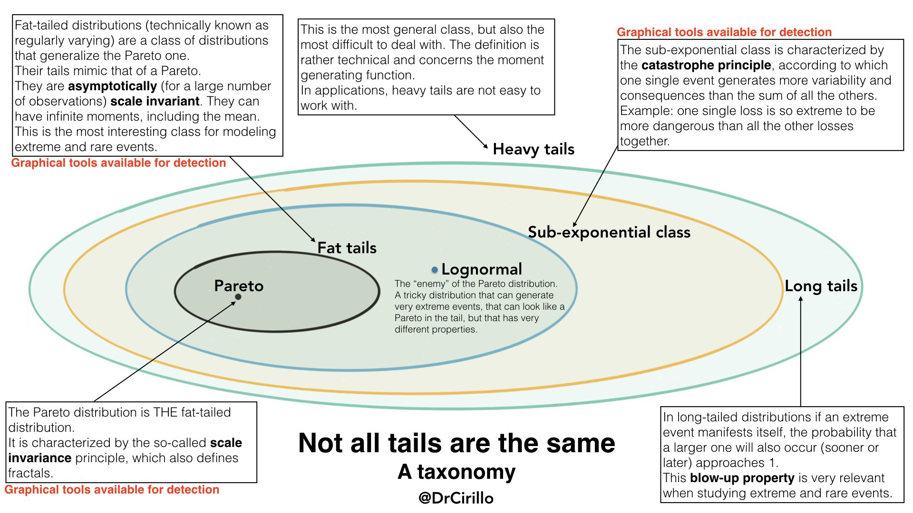

```{r setup, include=FALSE}
knitr::opts_chunk$set(echo = TRUE)
```

```{r, message=FALSE}
library(latex2exp)  # use latex expressions
library(actuar)     # pareto distribution
library(cumstats)
```


Refs:

+ [Quantitative Risk Management](https://www.youtube.com/playlist?list=PLgCR5H4IzggHyHw8dalrVHqHAqZfmTeWa) - Pasquale Cirillo

+ [Logs, Tails, Long Tails](https://moultano.wordpress.com/2013/08/09/logs-tails-long-tails/) -- Ryan Moulton

+ [Turning Distances into Distributions](http://www.johnmyleswhite.com/notebook/2016/09/19/turning-distances-in-distributions/) -- John Myles White

+ The Fundamentals of Heavy Tails (draft) - Nair et al.

## Tail Differences

Check these distributions. Which ones correspond to a Gaussian?

```{r, fig.width=10, fig.height=10, echo=FALSE}
dbeta_ls <- function(x, mu, sc, a, b)    1/sc * dbeta((x - mu)/sc, a, b)

xs <- seq(-4.4,4.5,len=1000)

par(mfrow=c(2,2))
plot(xs, dnorm(xs,0,1), type='l', lwd=2, col='dodgerblue')
plot(xs, dlogis(xs,0,.5), type='l', lwd=2, col='dodgerblue')
plot(xs, dcauchy(xs,0,1), type='l', lwd=2, col='dodgerblue')
plot(xs, dbeta_ls(xs,-4,8,5,5), type='l', lwd=2, col='dodgerblue')
```

The shapes are similar but only the first is Gaussian. The others are the logistic, the Cauchy and a location–scaled Beta. They are all unimodal, symmetric and seem to decrease at similar rates. It seems we can just pick the one more convenient mathematically, ie, the Gaussian, and model stuff with it.

The difference are in the tails. The small parts that go out of the plots into infinity. However, these differences make a lot of difference!

Let's duplicate each distribution and shift their centers by -4 and +4. The next plots show their density product:

```{r, fig.width=10, fig.height=10, echo=FALSE}
xs <- seq(-5,5,len=1000)

par(mfrow=c(2,2))
plot(xs, dnorm(xs,-4,1)   * dnorm(xs,4,1)   , type='l', lwd=2, col='dodgerblue', ylab='')
plot(xs, dlogis(xs,-4,.5) * dlogis(xs,4,.5) , type='l', lwd=2, col='dodgerblue', ylab='')
plot(xs, dcauchy(xs,-4,1) * dcauchy(xs,4,1) , type='l', lwd=2, col='dodgerblue', ylab='')
plot(xs, dbeta_ls(xs,-8,8,5,5) * dbeta_ls(xs,0,8,5,5), type='l', lwd=2, col='dodgerblue', ylab='')
```

The results are strikingly different! The products of similar shape distributions does not reflect the superficial similarity the distribution curves shown before. If we choose an inadequate distribution to model 'stuff', we will produce estimations that will be quite far off from what happens in reality.

We can get some intuition for the previous plots by plotting the original distributions in log scale:

```{r, fig.width=10, fig.height=10, echo=FALSE}
dbeta_ls <- function(x, mu, sc, a, b)    1/sc * dbeta((x - mu)/sc, a, b)

xs <- seq(-4.5,4.5,len=1000)

par(mfrow=c(2,2))
plot(xs, log(dnorm(xs,0,1)), type='l', lwd=2, col='dodgerblue')
plot(xs, log(dlogis(xs,0,.5)), type='l', lwd=2, col='dodgerblue')
plot(xs, log(dcauchy(xs,0,1)), type='l', lwd=2, col='dodgerblue')
plot(xs, log(dbeta_ls(xs,-4,8,5,5)), type='l', lwd=2, col='dodgerblue')
```

The log of a Gaussian is a parabola and summing two parabolas give us a parabola. For the logistic the flat plateau is the sum of two lines with opposite slopes. For the Cauchy the tails decrease very slowly so they are still not too small at the other peak, resulting in the bimodal shape. For the Beta both domain are disjoint resulting in a flat zero.

The next plots show each log component in orange and the log sum in blue.

```{r, fig.width=10, fig.height=10, echo=FALSE}
dbeta_ls <- function(x, mu, sc, a, b)    1/sc * dbeta((x - mu)/sc, a, b)

xs <- seq(-8,8,len=1000)

par(mfrow=c(2,2))
plot(xs, log(dnorm(xs,-4,1)), type='l', lwd=2, col='orange', ylab='')
lines(xs, log(dnorm(xs,-4,1))+log(dnorm(xs,4,1)), type='l', lwd=2, col='dodgerblue')
lines(xs, log(dnorm(xs, 4,1)), type='l', lwd=2, col='orange')

plot(xs, log(dlogis(xs,-4,.5)), type='l', lwd=2, col='orange', ylab='')
lines(xs, log(dlogis(xs,-4,.5))+log(dlogis(xs,4,.5)), type='l', lwd=2, col='dodgerblue')
lines(xs, log(dlogis(xs, 4,.5)), type='l', lwd=2, col='orange')

plot(xs, log(dcauchy(xs,-4,1)), type='l', lwd=2, col='orange', ylim=c(-8,-1), xlim=c(-5,5), ylab='')
lines(xs, log(dcauchy(xs,-4,1))+log(dcauchy(xs,4,1)), type='l', lwd=2, col='dodgerblue')
lines(xs, log(dcauchy(xs,4,1)), type='l', lwd=2, col='orange')

xs <- seq(-4.5,12.5,len=1000)
plot(xs, log(dbeta_ls(xs,-4,8,5,5)), type='l', lwd=2, col='orange', xlim=c(-4,12), ylab='')
lines(xs, log(dbeta_ls(xs, 4,8,5,5)), type='l', lwd=2, col='orange')
```

## Distances and Distributions

Consider a unimodal symmetrical distribution with its mode at $x=0$. Let's assume that its density decreases with its distance to zero. The distribution's pdf will follow

$$p(x) = \frac{c}{f(|x|)}  \propto \frac{1}{f(|x|)}$$

where $c$ must be a value such that the pdf integrates to $1$ over $x\in (-\infty,+\infty)$.

What are the possible functions $f$ defining proper distributions?

Function $f$ must have the following restrictions

+ $f(0) \neq 0$, here we restrict that $f(0)=1$

+ $f$ must increase fast enough so that $\int_{-\infty}^{+\infty} \frac{1}{f(|x|)} < +\infty$, this is necessary so we can pick a value $c$ to integrate the area to $1$

The first candidate is linear growth, $f(x) = 1 + |x|$, however

$$\int_{-\infty}^{+\infty} \frac{1}{1 + |x|} = +\infty$$
The expression

$$\int_{-\infty}^{+\infty} \frac{1}{1 + |x|^k} < +\infty$$

is only true when $k>1$.

For $k=2$ we have the Cauchy distribution, a distribution with such heavy tails that no moments exist (even the mean does not exist). The monstrosities between $(1,2)$ have no name, as far as I can tell. The only distribution I know heavier than the Cauchy, with a closed form is the [Levy distribution](https://en.wikipedia.org/wiki/L%C3%A9vy_distribution), but it does not fit this distance expression.

If we know the CDF of a distribution we can apply the inverse transformation to sample from such a distribution. Here's an example for the Cauchy ($k=2$)

```{r}
sample.f <- function(n, k) {
  
  f <- function(x) (1 / (1+abs(x)^k))
  c <- integrate(f, -Inf, +Inf)$value
  
  inv.f <- function(u) tan(u*pi - 0.5)  # inverse transformation

  inv.f(runif(n,0,1))
}

set.seed(201)
xs <- sample.f(1e5, 2)
hist(xs, breaks=5e4, prob=T, xlim=c(-12,12), col='lightblue', border='white', main='')
curve(dcauchy(x), add=T, lwd=2, col='dodgerblue')
```

However, for most values $k$ there is no closed formula for the CDF. And most sampling methods fail since these distributions are unbounded and have infinite variance.

For $k>2$ the distributions are similar to the t-Student, but t-Student follows

$$p(x) \propto \frac{1}{(1 + \frac{|x|^2}{2k – 1})^k}$$

basically, when distances fall proportional to a polynomial, we get heavy-tailed distributions.

The next step is to consider exponential growth.

$$p(x) \propto \frac{1}{\exp(|x|)}$$

is the family of sub-exponential distributions, like the Laplace and the Exponential. The tail falls exponentially fast but slower than a Gaussian. This is the frontier between light and heavy tails.

For 

$$p(x) \propto \frac{1}{\exp(|x|^2)}$$

we get the Gaussian where almost all probabilistic mass is around the center. This is already a thin-tailed distribution.

For 

$$p(x) \propto \frac{1}{\exp(|x|^k)}$$

with $k>2$ we have tails even thinner than the Gaussian.

The slower the decreasing velocity of $f$ the harder is to do inference, because more and more information gets trapped in the tails, which are not so easily sampled.

## Taxonomy of Heavy Tails



**Heavy Tails** are distributions with pdf $f$ which survival function 

$$S_f(x) = p(X>x) = \int_x^{\infty}\!\!f(u) ~ du = 1 - F(x)$$

decays slower that the exponential distribution $exp(\lambda)$ with $\lambda > 0$. So, the exponential distribution defines the frontier of thin and heavy tails.

$$\lim_{x \rightarrow \infty} \frac{S_f(x)}{S_{exp}(x)} = \infty$$

A strict subset of Heavy Tails are **Long Tails** distributions.

Long tails follow the _explosion principle_

$$\lim_{x \rightarrow \infty} p(X > x+t | X > x) = 1, \forall t>0$$
Here's an example:

```{r}
set.seed(133)

n <- 200
xs <- rlnorm(n,0,2)
maxs <- cummax(xs)==xs
barplot(xs, col=ifelse(maxs, 'red', 'grey'), border=NA)
```
and if we continued:

```{r}
set.seed(133)

n <- 320
xs <- rlnorm(n,0,2)
maxs <- abs(cummax(xs)-xs)<1e-1
barplot(xs, col=ifelse(maxs, 'red', 'grey'), border=NA)
```

No matter the current most extreme event we recorded, another larger will surely happen given enough time.

A strict subset of Long Tails is the **sub-exponential class**. These distributions follow the _catastrophe principle_ or _winner takes all_, for iid $X_1 \ldots X_n$

$$p \left[  \sum X_i > x \right] \approx p \left[ max(X_1 \ldots X_n) > x \right], ~ \text{ as  } ~ x \rightarrow \infty$$

At a certain point the sum of samples will be dominated by a single sample.

The sub-exponential class includes the most used heavy-tailed distributions, like the log-Normal or the Pareto. There are severy tools that can be used in this context.

A strict subset of a sub-exponential class is the **fat-tailed** distributions. These distributions survival functions can be expressed as

$$S(x) \approx x^{-\alpha}, ~ \text{ as  } ~ x \rightarrow \infty$$

which states that, asymptotically, the tail of the distribution decays like a power law.

Fat-tailed are widely used to model many different phenomena in Economics (like income or wealth), and in Nature (eg, earthquakes follow a fat-tailed distribution). 

Known distributions include the Pareto and the Cauchy distributions.

For $k>\alpha-1$ the distribution will have an infinite $k^{th}$ moment. For $\alpha>3$ the distribution will have finite variance, skewness, and kurtosis.

## Identifying Heavy Tails

There are plot tools that can help us identifying heavy tails. They are helpful as a diagnostic procedure to help us select or filter out some possibilities. Next we show several ways to plot the samples in order to classify its tail.

### QQ plots

The **QQ-plot** is normally used to check the normality assumption of the residuals of, say, a regression.

We can use the QQ-plot to compare our data with the exponential, the distribution at the frontier between thin and thick tails. A convex shape is evidence of heavier tail than the exponential, while a concave shape is evidence for tails lighter than the exponential.

```{r}
set.seed(101)

n <- 1000
x.baseline <- rexp(n)
x.normal   <- rnorm(n)
x.lnormal  <- rlnorm(n,0,2)

par(mfrow=c(1,2))
qqplot(x.baseline, x.normal , pch=20, col=rgb(0,1,0,0.2), main="Thin tail")
qqplot(x.baseline, x.lnormal, pch=20, col=rgb(0,1,0,0.2), main="Thick tail")
```

### Zipf plots

A **Zipf plot** is a log-log plot of the empirical survival function. 

The empirical survival function is

$$\widehat{S}(t)=\frac{\# \mbox{ of individuals with } T\geq t}{\mbox{total sample size}}$$

```{r}
esf <- function(xs, n.bins=100) {
  width.bins <- (range(xs)[2] - range(xs)[1]) / n.bins
  
  result <- sapply(1:n.bins, function(t) sum(xs >= width.bins*t))
  result / length(xs)
}
```

The Zipf plot gives necessary but not sufficient information about tails. It can be used to check for a power law behavior in the data.

For a Pareto

$$S(x) = \left(\frac{x}{x_0}\right)^{-\alpha} \implies \log S(x) = \alpha \log x_0  - \alpha \log x = C - \alpha \log x$$
which gives us a linear equation.

Let's try one example:

```{r, warning=FALSE, message=FALSE}
set.seed(121)

x.pareto <- rpareto(n, 1, 2)

n.bins <- 250
plot( 1:n.bins, esf(x.baseline,    n.bins), log='xy', type='l', col='orange', lwd=2)
lines(1:n.bins, esf(abs(x.normal), n.bins), col='red'  , lwd=2)
lines(1:n.bins, esf(x.lnormal,     n.bins), col='green', lwd=2)
lines(1:n.bins, esf(x.pareto,      n.bins), col='blue' , lwd=2)
```

The blue line does seem to approximate a linear behavior. However, the log-normal also seems like a line. In practice it is hard to distinguish between both. But for thin tails the difference is stark.

Real data might start behaving as a thin tail but, after some point, displays a power law decay. Real data is complex and can have mixed effects across its range.

At the end, for larger values, there is a typical effect called _Small Sample Bias_ that result on data points outside the linear behavior.

Data following a power law show an invariant effect if we aggregate it. In the next example, we create two new data sets based on the original one.

```{r}
set.seed(101)
n <- 1e4

x.pareto  <- rpareto(n, 1, 1.6)
x.pareto2 <- sort(x.pareto) + rev(sort(x.pareto))
x.pareto3 <- 2 * sort(x.pareto) + 3 * rev(sort(x.pareto))

n.bins <- 250
plot( 1:n.bins, esf(x.pareto,  n.bins), log='xy', type='l', col='orange', lwd=2)
lines(1:n.bins, esf(x.pareto2, n.bins), col='red'  , lwd=2)
lines(1:n.bins, esf(x.pareto3, n.bins), col='blue' , lwd=2)
```

As we see, the power law behavior remains. 

### Mean Excess Function plots

The **Mean Excess Function** (MEF) is also used to confirm that iid data is consistent with a  Pareto assumption since data will have a roughly linear mean excess plot. 

$$e(t) = E[X-t | X>t]$$


```{r}
mef <- function(xs, t) {
  ones <- xs > t
  sum(xs[ones]-t)/sum(ones)
}

mefs <- function(xs, ts) {
  sapply(ts, function(t) mef(xs,t))
}
```

There is a theoretical result stating that Pareto distributions have a positive linear slope MEF. The log-normal becomes concave after some scale. 

```{r}
set.seed(101)
ts   <- 1:200

plot (ts, mefs(x.pareto, ts), type='l', col='dodgerblue', lwd=2, ylab='')
lines(ts, mefs(x.lnormal,ts), col='green', lwd=2)
lines(ts, 100*mefs(x.baseline, ts/100), col='orange', lwd=2)
```

### Ratio of Max and Sum plot

For iid $X_1, X_2, \ldots$define

$$S_n(p) = \sum_{i=1}^n |X_i|^p$$
$$M_n(p) = max(|X_1|^p, \ldots, |X_n|^p)$$

$$R_n(p) = \frac{M_n(p)}{S_n(p)}, n \geq1, p> 0$$

The LLN tell us that 

$$R_n(p) \rightarrow 0 \iff E[|X|^p] < \infty$$
$$R_n(p) \rightarrow 1 \iff \text{catastrophe principle holds}$$

```{r}
ratios <- function(xs, p) {
  xs <- abs(xs)^p
  cummax(xs) / cumsum(xs)
}
```

This can be used to distinguished between a log-normal and a Pareto. Log-normal distributions have all their moments. Pareto, depending on the $\alpha$ parameter, will not. For $\alpha<1$ Pareto does not have a mean, for $\alpha<2$ will not have the variance, and so on...

The MSPlot uses the ratios $R_n(p)$ to detect infinite moments

```{r, fig.width=12, fig.height=12}
set.seed(101)

n <- 1e4
x.pareto  <- rpareto(n, 1, 2.5)

par(mfrow=c(2,2))
for (p in 1:4) {
  plot(1:n, ratios(x.pareto, p), type='l', col='dodgerblue', lwd=2,
       xlab=TeX('$X_i$'), ylab=TeX(paste0('$R_n(',p,')$')))
}
```

We can check that only the means as a finite moment, so if this was a Pareto, the $\alpha$ would be between $[2,3]$.

Let's check the behavior of a log-normal:

```{r, fig.width=12, fig.height=12}
set.seed(121)

n <- 2e5
x.lnormal <- rlnorm(n, 1, 2)
par(mfrow=c(2,2))
for (p in 1:4) {
  plot(1:n, ratios(x.lnormal, p), type='l', col='dodgerblue', lwd=2,
       xlab=TeX('$X_i$'), ylab=TeX(paste0('$R_n(',p,')$')))
}
```

Despite the number of needed observations, the log-normal is slowly converging to zero.

## Scale Invariance

A distribution function $f$ is said to **scale invariant** if there exists $x_0>0$ and a continuous positive function $g$ such that

$$\bar{F}(\lambda x) = g(\lambda) \bar{F}(x) ~ , ~ \lambda x>x_0$$

where $\bar{F}(x) = 1 - p(X>x), X \sim f$, the ccdf of $f$.

Value $\lambda$ is the change of scale for the units being used. This means the shape of $\bar{F}$ is invariant up to factor $g(\lambda)$.

A well-known scale invariant distribution is the Pareto

$$\bar{F}(\lambda x) = \left( \frac{\lambda x}{x_m} \right)^{-\alpha} = \lambda^{-\alpha} \bar{F}(x) ~ , ~ x>x_m, \lambda x>x_m$$

The exponential, however, is not scale invariant

$$\bar{F}(\lambda x) = e^{-\lambda \mu x} = e^{-(\lambda-1) \mu x} \bar{F}(x)$$

where function $g$ depends on value $x$.

Let's compare the shapes from the Pareto ($\alpha=2, x_m=1$) and an exponential in three different scales:

```{r, fig.width=12, fig.height=6}
par(mfrow=c(2,3))

xs1 <- seq( 1, 4,len=100)
xs2 <- 4 * xs1  # lambda=4
xs3 <- 4 * xs2

plot(xs1, dpareto(xs1,1,2), type='l', lwd=2, col='dodgerblue')
plot(xs2, dpareto(xs2,1,2), type='l', lwd=2, col='dodgerblue', main='Pareto')
plot(xs3, dpareto(xs3,1,2), type='l', lwd=2, col='dodgerblue')

plot(xs1, dexp(xs1), type='l', lwd=2, col='orange')
plot(xs2, dexp(xs2), type='l', lwd=2, col='orange', main='Exponential')
plot(xs3, dexp(xs3), type='l', lwd=2, col='orange')
```

The _only_ distributions that are scale invariant are distributions with a power law tail, that is, all distributions $f$ such that

$$\exists x_0>0, c\geq0, \alpha>0 : \bar{F}(x) = c x^{-\alpha}, x \geq x_0$$

Despite being a property so specific to a family of distributions, many natural and human phenomena can be modeled by distributions where their tails approach a power law.

Here's an example with a data set with US cities population:

```{r, message=FALSE}
df <- read.csv2('data/us.cities.csv') # US cities 2019 population

esf <- function(xs, n.bins=100) {
  width.bins <- (range(xs)[2] - range(xs)[1]) / n.bins
  
  result <- sapply(1:n.bins, function(t) sum(xs >= width.bins*t))
  list(values = result / length(xs),
       bins   = width.bins*(1:n.bins))
}

results <- esf(df$population.2019, 250)

plot(results$bins, results$values, log='xy', type='l',
     col='orange', lwd=2, xlab='city population', ylab='', xaxt='n')
axis(1, at=10^(4:7), labels=TeX(paste0('$10^{',4:7,'}$')) )
```


