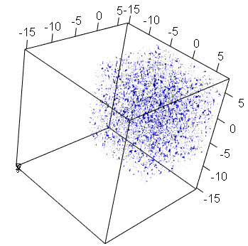
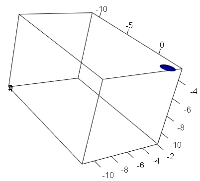

Refs:

+ [Computational Methods for Data Analysis MOOC](https://class.coursera.org/compmethods-005)

These page presents some egs taken mostly from the mentioned MOOC.

```{r, fig.width=10}
L <- 20;  # interval of interest
n <- 128; # sampling rate

x = head(seq(-L/2,L/2,len=n+1), -1);  # the sampling rate was taken on regular intervals
u = exp(-x ^ 2);                      # some signal (in this case, a gaussian)

plot(x,u,type='l', xlab="samples", ylab="signal")
```


```{r, fig.width=10, warning=FALSE, f}
ut <- fft(u)    # compute the signal's fourier transform

k <- (2*pi/L) * c(seq(0,n/2-1),seq(-n/2,-1)); # rescaling frequencies from [0,2pi] to [-L/2,L/2]

library(pracma) # sech, tanh, fftshift, ifft

par(mfrow=c(2,2))
plot(x,ut,type='l',main="signal spectra", xaxt='n',xlab=NA, ylab="strength")
# fft rearranges the outputs of fft by moving the zero-frequency component 
# to the center of the array
plot(fftshift(k),     fftshift(ut), type='l', main="spectra centered at frequency zero", xlab="frequencies", ylab="strength")
# take the norm, here the phase doesn't matter
plot(fftshift(k), abs(fftshift(ut)),type='l', main="norm of spectra", xlab="frequencies", ylab="strength") 
```

Yeap, the FFT of a Gaussian is a Gaussian.

# FFT and derivatives

The FFt can be used to approximate derivatives.

Given function $f$ and its n-th derivative $f^{(n)}$,
$$\text{fft}( f^{(n)} ) \approx (ik)^n \text{fft}( f )$$
where $i$ is $\sqrt{-1}$ and $k$ the vector of frequencies

```{r, warning=FALSE, fig.width=10}
u   =  sech(x)                # a function
ud  = -sech(x) *   tanh(x)    # its first derivative
u2d =  sech(x) - 2*sech(x)^3  # and its 2nd derivative

ut   = fft(u)
uds  = ifft( (1i*k)  *ut)     # ifft: Inverse fast Fourier transform
u2ds = ifft( (1i*k)^2*ut)

# draw first derivative and the fourier approximation
plot(x,ud,type='l',col='black', xlab="x", ylab="df/dx")
points(x,uds,col='red')
# draw second  derivative and the fourier approximation
plot(x,u2d,type='l',col='black', xlab="x", ylab="d^2f/dx^2")
points(x,u2ds,col='red')      
```

# Noisy signals

This is the original signal:

```{r, fig.height=8, fig.width=10}
T <- 30;  # signal lasted 30 seconds and was sampled 512 times
n <- 512; 

t <- head(seq(-T/2,T/2,len=n+1),-1); # the sampling rate was taken on regular intervals
k <- (2*pi/T) * c(seq(0,n/2-1),seq(-n/2,-1)) # rescaling for interval T
ks <- fftshift(k)                           # center frequencies around zero

u  <- sech(t);    # some signal (in this case, a hiperbolic cos)
ut <- fft(u)

par(mfrow=c(2,1))
plot(t,u,type='l',main="signal in time", xlab="time samples", ylab="signal") 
plot(ks,abs(fftshift(ut))/max(abs(fftshift(ut))),type='l',main="signal in frequency", xlab="frequencies", ylab="strength") 
```

Now, let's add noise to the frequency spectra:

```{r}
noise <- 20
utn   <- ut + noise*(rnorm(n) + 1i*rnorm(n))
```

It's important to add imaginary noise, which means noise has also a phase. 

Adding only real noise will make it symmetric in the time domain; adding only imaginary noise will make it anti-symmetric.

```{r, fig.height=8, fig.width=10}
un = ifft(utn); # the noisy signal from the noisy spectra

par(mfrow=c(2,1))
plot(ks,abs(fftshift(ut))/max(abs(fftshift(ut))),type='l') 
points(ks,abs(fftshift(utn))/max(abs(fftshift(utn))),col='magenta',type='l') 
legend("topleft",c("real spectra", "noisy spectra"), col=c("black","magenta"),lty=1)
plot(t,u,type='l',ylim=c(0,3))                # real signal
points(t,abs(un),col='magenta',type='l')      # noisy signal
legend("topleft",c("real signal", "noisy signal"), col=c("black","magenta"),lty=1)
```

## Filtering

Let's assume we just have the noisy data

If we are interesting just in certain frequencies (like in Radar) we can filter the signal (here 'utn') to have just the interval we want

Assume we are interested in frequency zero, and are using a gaussian filter:

```{r, fig.height=8, fig.width=10}
filter = exp(-k^2)   # gaussian filter
utnf = filter * utn  # the filterted frequencies

unf = ifft(utnf);    # and we rebuild the filtered signal

par(mfrow=c(2,1))
plot(t,abs(unf),col='magenta',type='l')
# we also include a decision line (herein at 0.5) which is the threshold 
# in where we decide that it's a relevant signal
abline(h=0.5,col="red",lty=2)  
plot(ks,abs(fftshift(utnf))/max(abs(fftshift(utnf))),col='magenta',type='l') 
```

Let's try to apply the same process at another place, say at -10:

```{r, fig.height=8, fig.width=10}
mu = -10
filter = exp(-(k-mu)^2)   # gaussian filter
utnf = filter * utn  # the filterted frequencies

unf = ifft(utnf);    # and we rebuild the filtered signal

par(mfrow=c(2,1))
plot(t,abs(unf),col='magenta',type='l',ylim=c(0,0.6))
abline(h=0.5,col="red",lty=2)  
plot(ks,abs(fftshift(utnf))/max(abs(fftshift(utnf))),col='magenta',type='l') 
```

This happens because the signal is coherent, ie, it is in phase, reinforcing itself. The noise on the other hand is out of phase.

## Noise cancellation by Averaging

If we don't know the frequency of the signal *and* we can sample several times, averaging is a powerful way to remove noise, since noise will cancel itself out, while the signal continues. We could average in time/space or in frequency. In frequency is more robust because the signal can be moving and not be in the same place on each sampling, while the object (in principle) keeps signalling at the same frequencies.

```{r, fig.width=10}
avg <- rep(0, n)
realizations <- 30

for (j in 1:realizations) {
  avg <- avg + ut + noise*(rnorm(n) + 1i*rnorm(n))
}

avg <- abs(fftshift(avg))/realizations

plot(ks,avg, type='l') # lo and behold
```


# Image Processing

Refs:

+ [Fourier Transform](http://homepages.inf.ed.ac.uk/rbf/HIPR2/fourier.htm)

Some useful functions:

```{r}
# to install: source("http://bioconductor.org/biocLite.R"); biocLite("EBImage")
library("EBImage")

# plot a picture
show_pic <- function(pic, adjust=FALSE) {
  dims <- dim(pic)
  plot(c(0, dims[1]), c(0, dims[2]), type='n', xlab="", ylab="")
  rasterImage(pic,0,0,dims[1],dims[2])        # present image
}

# log transformation
# http://homepages.inf.ed.ac.uk/rbf/HIPR2/pixlog.htm
log_transf <- function(pic) { 
  c <- 1/(log(1+max(abs(pic)))) # pixels in [0,1]
  c * log(1+abs(pic))
}

# compute the abs of a matrix and normalizes it to [0,1]
abs_norm <- function(pic) {
  nm <- abs(pic)
  nm/max(nm)  
}

# place the dc-component in the middle (like a 2D fftshift)
# if m is a square 2^n matrix, 
#   center_matrix(center_matrix(m)) == m
center_matrix <- function(m) {
  dims <- dim(m)
  m1 <- cbind(m[,(dims[2]/2+1):dims[2]],m[,1:(dims[2]/2)])
  rbind(m1[(dims[1]/2+1):dims[1],],m1[1:(dims[1]/2),])
}

# an eg:
clown <- readImage("cln1.png")
show_pic(clown)
```

FFTs can be use to decompose the image into its frequency spectra:

```{r}
clown_f       <- fft(clown)
shift_clown_f <- center_matrix(Re(clown_f)) # show magnitudes (the real part)
show_pic( abs_norm(shift_clown_f) )
```

In this picture the dc-component -- the middle pixel, since it was centered -- represents the maximum magnitude by far.

We need a frequency log tranformation to see more detail

```{r}
shift_clown_flog <- log_transf(shift_clown_f)
show_pic( abs_norm(shift_clown_flog) )
```

The next pic shows phase information of the (centered) image:

```{r}
show_pic( abs_norm(center_matrix(Im(clown_f))) ) 
```

Given the frequencies (magnitude and phase), we can recover the image:

```{r}
clown_r <- fft(clown_f, inverse=TRUE)  # get the original picture back
show_pic( abs_norm(clown_r) )
```

But before that, we can apply all kinds of transformations to the frequency spectra.

The next eg applys a low-pass filter, ie, a filter that passes signals with a frequency lower than a certain cutoff frequency and attenuates signals with frequencies higher than the cutoff (black is 0, white is 1):

```{r}
low_pass <- imageData(readImage("filter_lowpass.png"))[,,1] 
show_pic( low_pass )

# place the DC component in the middle before applying the filter
clown_flow <- low_pass * center_matrix(clown_f)
# place the DC component back to its place before the ifft
clown_low  <- fft(center_matrix(clown_flow), inverse=TRUE)

show_pic( rotate(abs_norm(clown_low),0) )
```

The removal of high frequencies produced a blurred image, where part of the details were lost.

A high-pass filter is useful to find the edges of a picture:

```{r}
high_pass <- imageData(readImage("filter_highpass.png"))[,,1] 
show_pic( high_pass )

# place the DC component in the middle before applying the filter
clown_fhigh <- high_pass * center_matrix(clown_f)
# place the DC component back to its place before the ifft
clown_high  <- fft(center_matrix(clown_fhigh), inverse=TRUE)

show_pic( rotate(abs_norm(clown_high),0) )
```

# 3D FFT

> Your dog fluffy swallowed a marble. The vet suspects that it has now worked its way into the intestines. Using ultrasound, data is obtained concerning the spatial variations in a small area of the intestines where the marble is suspected to be. Unfortunately, fluffy keeps moving and the internal fluid movement through the intestines generates highly noisy data.  Do you want your dog to live? In order to save your dog's life you must located and compute the trajectory of the marble. [ref](582hw1.pdf)

```{r}
L <- 15  # the space domain
n <- 64  # sampling rate

x <- head(seq(-L/2,L/2,len=n+1), -1);  # the sampling rate was taken on regular intervals
k <- (2*pi/L) * c(seq(0,n/2-1),seq(-n/2,-1)); # the frequency resolution
```

Read the data:

```{r, message=FALSE}
library(R.matlab)

data <- readMat('Testdata.mat') # cf. http://courses.washington.edu/amath582/Testdata.mat
dim(data$Undata)
samples <- dim(data$Undata)[1]  # the number of samples
```

Apply the fft to the XY plane, and average the frequencies over all 20 timestamps. We could also select another plane, but, since the marble is a sphere, this choice should be irrelevant:

```{r, message=FALSE, fig.width=13}
fft2_z = rep(0,64^2)   # this fft is done is 2 dimensions (namely, in the plane XY)
dim(fft2_z) <-  c(n,n) # reshape do 2D vector

for (t in 1:samples) {
  sample_t      <- data$Undata[t,] # get t-th time stamp
  dim(sample_t) <- c(n,n,n)        # reshape vector into 3D matrix
  
  for (z in 1:n) {  # for each XY slice (there are n slices)
    fft2_z = fft2_z + fft(sample_t[,,z])
  }
}
fft2_z = fft2_z / (n*samples)  # take the average

par(mfrow=c(1,2))
contour(1:n,1:n,abs(fft2_z), col=rainbow(5))
library(fields)
image.plot(1:n,1:n,abs(fft2_z), nlevel=4, col=c("blue","green","gold","red"))
```

There's a noticeable peak at point (60,10), so we should create a filter to remove all frequencies not in this vicinity.

```{r}
library(mvtnorm)
library(pracma)

f <- function (x,y) {
  dmvnorm(c(x,y), mean=c(k[60],k[10]), sigma=diag(2))
}

gaussian_filter <- outer(k,k, Vectorize(f))

persp(1:n, 1:n, gaussian_filter,
      xlab="x", ylab="y", zlab="f(x,y)",  main="Gaussian Filter", 
      cex=0.7, lwd=0.1, theta=-45, phi=30 , d=5.0, shade=0.05)
```

Now, let's repeat the previous averaging process but filtering the noisy frequencies:

```{r, message=FALSE}
fft2_z = rep(0,n^2)
dim(fft2_z) <-  c(n,n)

for (t in 1:samples) {
  sample_t      <- data$Undata[t,] # get t-th time stamp
  dim(sample_t) <- c(n,n,n)        # reshape vector into 3D matrix
  
  for (z in 1:n) {
    fft2_z = fft2_z + fft(sample_t[,,z])*gaussian_filter
  }

}
fft2_z = fft2_z / (n*samples)
```

The same contour and heat maps for the filtered result:

```{r, message=FALSE, fig.width=13}
par(mfrow=c(1,2))
contour(1:n,1:n,abs(fft2_z), col=rainbow(5))
image.plot(1:n,1:n,abs(fft2_z), nlevel=4, col=c("blue","green","gold","red"))
```

Let's use the data from the last timestamp and rebuild the signal from the filtered frequencies:

```{r, warning=FALSE}
library(misc3d)
library(rgl)

sample_20      <- data$Undata[20,] # get last time stamp
dim(sample_20) <- c(n,n,n) 

plot3d(NULL, xlim=c(x-L/2,L/2), ylim=c(x-L/2,L/2), zlim=c(x-L/2,L/2),
       xlab="x", ylab="y", zlab="z")
contour3d(abs(sample_20), level=c(0.12,0.08,0.04), x,x,x, color="blue", add=T)
```

<center></center>

```{r,warning=FALSE}
fft2_z = rep(0,n^2)
for (z in 1:n) {
   temp <- fft(sample_20[,,z])*gaussian_filter
   sample_20[,,z] <- fft(temp, inverse=TRUE) / length(temp)
}

plot3d(NULL, xlim=c(x-L/4,L/4), ylim=c(x-L/4,L/4), zlim=c(x-L/4,L/4),
       xlab="x", ylab="y", zlab="z")
contour3d(abs(sample_20), level=c(0.12,0.08,0.04), x,x,x, color="blue", add=T)
```

<center></center>

We could also use the same process for the previous timestamps to rebuild the marble trajectory.