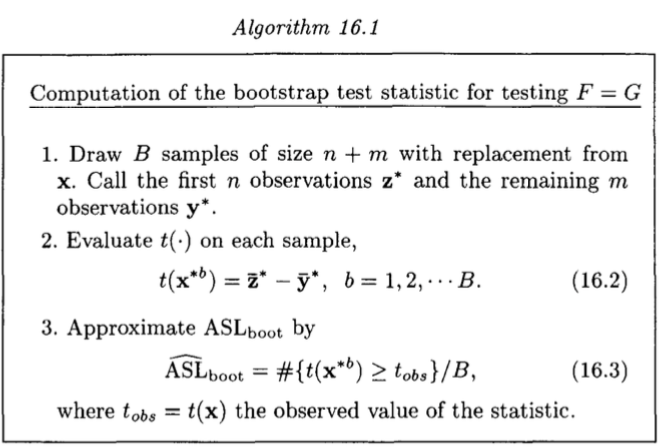

```{r}
library(magrittr)
```


Probability distributions are functions that assign probability mass or density to a universe of outcomes, which are useful to model random events. Different distributions have different mappings from events to probabilities, and some are more uncertain than others.

Since entropy is a measure of uncertainty, it is to no surprise that 
distributions have an associated entropy.

## Entropy for Discrete Distributions

For discrete distributions, over all values $x$ inside the domain, the entropy $H$ is given by expression

$$H = -\sum_x p(x) \log p(x)$$

Consider the example of the Poisson where

$$p(k~|~\lambda) = \frac{\lambda^k e^{-\lambda}}{k!}$$

the analytic solution is

$$\lambda (1- \log \lambda) + e^{-\lambda}\sum_{k=0}^\infty \frac{\lambda^k \log k!}{k!}$$

The next function approximates this expression

```{r}
entropy.poisson <- function(lambda) {
  lambda*(1-log(lambda)) + 
    exp(-lambda) * 
    sum(sapply(0:20, 
               function(k) lambda^k * log(factorial(k)) / factorial(k)))
}
```

Say, for $\lambda=5$ the entropy will be

```{r}
lambda <- 5
entropy.poisson(lambda)
```

## Empirical Entropy for Discrete Distributions

What if we have a discrete sample taken from some distribution?

```{r}
lambda <- 5
xs1 <- rpois(1e6, lambda)
head(xs1, 10)
```

If we know which distribution the sample was taken, we can infer the parameters and then apply the respective entropy formula.

In our case, `xs1` was the result of a Poisson sampling, so:

```{r, message=FALSE}
lambda.hat <- mean(xs1)
entropy.poisson(lambda.hat)
```

But if we don't have a clue about the underlining distribution?

The first step is to compute the empirical point probabilities

$$\hat{p}(x_i) = \frac{1}{n} \sum_{k=1}^n \delta_{x_i}(x_k)$$

where $\delta_{x_i}(x_k)$ is 1 if $x_i = x_k$, zero otherwise.

The empirical entropy is then

$$\hat{H} = -\sum_x \hat{p}(x) \log \hat{p}(x)$$

The next R function computes this value,

```{r}
# ref: https://stats.stackexchange.com/questions/28178
empirical.entropy <- function(xs) {
  # empirical point probabilities
  epps <- (table(xs) / length(xs)) %>%  as.vector()
  
  -sum(epps * log(epps))
}
```

Let's check the true entropy with the empirical entropy of the Poisson sample:

```{r, collapse=TRUE}
entropy.poisson(lambda) # true entropy
empirical.entropy(xs1)  # empirical entropy
```

Another example, this time with a discrete uniform $\mathcal{U}\{a,b\}$, with theoretical entropy $\log (b-a+1)$,


```{r, collapse=TRUE}
xs2 <- sample(1:6, 1e6, rep=TRUE)  # uniform U{1,6}

log(6-1+1)             # true entropy
empirical.entropy(xs2) # empirical entropy
```

## Entropy for Continuous Distributions

Claude Shannon tried to generalize his entropy formula for the continuous case simply replacing the sum with an integral,

$$H = - \int_x f(x) \log(x) dx$$

but without any mathematical derivation. This is denoted as _differential entropy_.

This formula lacks many properties of the discrete case.

For the classic continuous distributions, their entropy is known. For the Gaussian $\mathcal{N}(\mu, \sigma$ the entropy is $\frac{1}{2}\log(2\pi e \sigma^2)$

```{r}
entropy.normal <- function(mu, sigma) {
  0.5 * log(2*pi*exp(1)*sigma^2)
}
```

Let's check an example,

```{r}
mu <- 0
sigma <- 0.35

entropy.normal(mu, sigma)
```

ET Jaynes [argued](https://en.wikipedia.org/wiki/Limiting_density_of_discrete_points) that the continuous case should be defined as the limiting case of increasingly dense discrete distributions.

## Empirical Entropy for Continuous Distributions

One approximation is given by producing an histogram of the continuous values, and then accounting for the values $x_i$ inside bin $i$ with  width $w_i$,

$$\hat{H} = -\sum_i \hat{p}(x_i) \log \frac{\hat{p}(x_i)}{w_i}$$

In R:

```{r}
# ref: https://en.wikipedia.org/wiki/Entropy_estimation
empirical.entropy.continuous <- function(xs, breaks=1e3) {
  range.xs   <- max(xs)-min(xs)
  width.bins <- range.xs/breaks # all bins have the same width

  # bin the results into finite intervals
  xs <- xs %>% cut(breaks=breaks) %>% as.numeric()
  # empirical point probabilities
  epps <- (table(xs) / length(xs)) %>%  as.vector()
  
  -sum(epps * (log(epps) - log(width.bins)))
}
```

Let's compare the true and empirical entropy for a normal sample,

```{r, collapse=TRUE}
n <- 1e6
xs3 <- rnorm(n, 0, sigma)

entropy.normal(mu, sigma)         # true entropy
empirical.entropy.continuous(xs3) # empirical entropy
```

## Using Empirical Entropy to compare distributions

From Efron's et al. "An Introduction to the Bootstrap" about how to compare distributions $F,G$ (chapter 16, pg 221)



The suggestion to bootstrap with replacement using a difference of means, or, for more accuracy, using the studentized test, a two sample t-statistic,

$$t(x) = \frac{\bar{z}-\bar{y}}{\bar{\sigma}\sqrt{1/n + 1/m}}$$
where $n,m$ are the size of the two sets, and $\bar{\sigma}^2 = \sum_i \left[ (z_i-\bar{z})^2 + (y_i-\bar{y})^2 \right] / (n+m-2)$

```{r}
# Efron and Tibshinari, Intro to Bootstrap, pag.221
stat.student <- function(pop1, pop2) {
  n <- length(pop1)
  m <- length(pop2)

  mean1 <- mean(pop1)
  mean2 <- mean(pop2)

  sigma <- (sum((pop1-mean1)^2) + sum((pop2-mean2)^2)) / (n+m-2)
  sigma <- sigma**0.5

  (mean1-mean2) / (sigma*(1/n+1/m)**0.5)
}
```

Let's compare its performance against the difference of entropies,

```{r}
# Difference of Empirical Entropies
stat.entropy <- function(pop1, pop2, sample_size) {
  empirical.entropy.continuous(pop1, breaks=100) -
  empirical.entropy.continuous(pop2, breaks=100)
}
```

The simulation is performed by the next function,

```{r}
simulation <- function(xs, ys, stat, isBoot=TRUE, n.sims=2000) {
  
  universe <- c(xs,ys)
  
  replicate(n.sims, {
    
    if (isBoot) { # Bootstrap algorithm
      xs.boot <- sample(universe, length(xs), rep=TRUE)
      ys.boot <- sample(universe, length(ys), rep=TRUE)
    } else {      # Permutation algorithm
      indexes <- sample(1:length(universe), length(xs), rep=FALSE)
      xs.boot <- universe[ indexes]
      ys.boot <- universe[-indexes]
    }
    stat(xs.boot, ys.boot)
    
  })
}
```

And the next function shows the histogram of results and summarizes the $\widehat{ASL}_{boot}$ given at the book, together with the ratio of the two partitions that are to the left and right of the observed effect,

```{r}
present_results <- function(results, observed.effect, label="", breaks=50, precision=3) {
  partition.1 <- sum(results < observed.effect)
  partition.2 <- length(results) - partition.1
  
  if (partition.1 < partition.2)
    odds <- partition.1/partition.2
  else
    odds <- partition.2/partition.1
  
  ASL.boot <- sum(results > observed.effect) / length(results)
    
  hist(results, breaks=breaks, prob=T, main=label, col = "dodgerblue", 
       sub=paste0("ASL.boot = ", ASL.boot),
       xlab=paste("partition's sizes ", round(1/odds), ":1"))
  abline(v=observed.effect, lty=2, lwd=2, col="red")
}
```

Let's check what happens when we have two distributions with similar mean and variance:

```{r}
set.seed(101)

n <- 250
xs <- rnorm (n, 1.1, 1.2)
ys <- rgamma(n, 1.0, 1.0)

results <- simulation(xs, ys, stat.student, isBoot=TRUE)
observed.effect <- stat.student(xs, ys)
present_results(results, observed.effect)
```

The t statistic is not able to easily distinguish distributions. Also, with different random seeds, the results are unstable,

```{r}
set.seed(102)

n <- 250
xs <- rnorm (n, 1.1, 1.2)
ys <- rgamma(n, 1.0, 1.0)

results <- simulation(xs, ys, stat.student, isBoot=TRUE)
observed.effect <- stat.student(xs, ys)
present_results(results, observed.effect)
```

Let's try with a test statistic based on empirical entropy,

```{r}
set.seed(101)

n <- 250
xs <- rnorm (n, 1.1, 1.2)
ys <- rgamma(n, 1.0, 1.0)

results <- simulation(xs, ys, stat.entropy, isBoot=TRUE)
observed.effect <- stat.entropy(xs, ys)
present_results(results, observed.effect)
```

The results also seem more stable,

```{r}
set.seed(102)

n <- 250
xs <- rnorm (n, 1.1, 1.2)
ys <- rgamma(n, 1.0, 1.0)

results <- simulation(xs, ys, stat.entropy, isBoot=TRUE)
observed.effect <- stat.entropy(xs, ys)
present_results(results, observed.effect)
```

Check this [question](https://stats.stackexchange.com/questions/494166/bootstrap-permutation-test-for-equality-of-two-distributions)