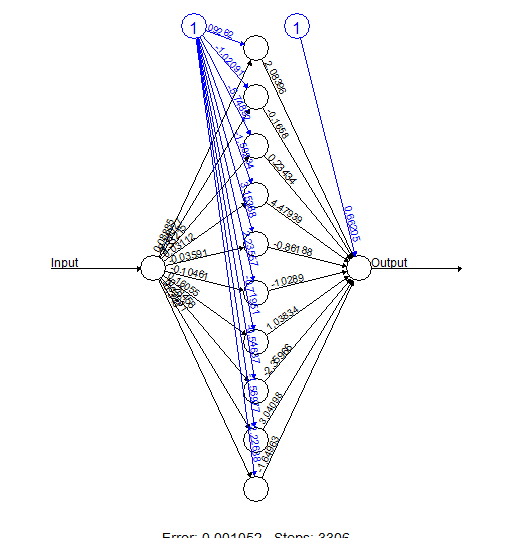

A neural network (NN) model is very similar to a non-linear regression model, with the exception that the former can handle an incredibly large amount of model parameters. For this reason, neural network models are said to have the ability to approximate any continuous function.

Neural network is very good at learning non-linear function and also multiple outputs can be learnt at the same time.  However, the training time is relatively long and it is also susceptible to local minimum traps.  This can be mitigated by doing multiple rounds and pick the best learned model.

R has several packages for dealing with NNs, like `neuralnet`, `nnet` or `RSNNS`.

Using package neuralnet
---------------

From [http://gekkoquant.com/2012/05/26/neural-networks-with-r-simple-example/](http://gekkoquant.com/2012/05/26/neural-networks-with-r-simple-example/)

```{r, message=FALSE}
library(neuralnet)

#Going to create a neural network to perform square rooting (using backpropagation)
#Type ?neuralnet for more information on the neuralnet library
 
#Generate 50 random numbers uniformly distributed between 0 and 100
#And store them as a dataframe
traininginput <-  as.data.frame(runif(50, min=0, max=100))
trainingoutput <- sqrt(traininginput)
 
#Column bind the data into one variable
trainingdata <- cbind(traininginput,trainingoutput)
colnames(trainingdata) <- c("Input","Output")
 
#Train the neural network with backpropagation
#Going to have 10 hidden layers
#Threshold is a numeric value specifying the threshold for the partial
#derivatives of the error function as stopping criteria.
net.sqrt <- neuralnet(Output ~ Input, trainingdata, hidden=10, threshold=0.01)
print(net.sqrt)
 
#Plot the neural network
plot(net.sqrt)
```

<center></center>

```{r}
#Test the neural network on some training data
testdata <- as.data.frame((1:10)^2) #Generate some squared numbers
net.results <- compute(net.sqrt, testdata) #Run them through the neural network
 
#Lets see what properties net.sqrt has
ls(net.results)
 
#Lets see the results
print(net.results$net.result)
 
#Lets display a better version of the results
cleanoutput <- cbind(testdata,sqrt(testdata),
                         as.data.frame(net.results$net.result))
colnames(cleanoutput) <- c("Input","Expected Output","Neural Net Output")
print(cleanoutput)
```

Another [example](http://horicky.blogspot.pt/2012/06/predictive-analytics-neuralnet-bayesian.html)

```{r}
library(neuralnet)

set.seed(101)
size.sample <- 50
iristrain <- iris[sample(1:nrow(iris), size.sample),] # get a training sample from iris
nnet_iristrain <- iristrain

# Binarize the categorical output
nnet_iristrain <- cbind(nnet_iristrain, iristrain$Species == 'setosa')
nnet_iristrain <- cbind(nnet_iristrain, iristrain$Species == 'versicolor')
nnet_iristrain <- cbind(nnet_iristrain, iristrain$Species == 'virginica')

names(nnet_iristrain)[6] <- 'setosa'
names(nnet_iristrain)[7] <- 'versicolor'
names(nnet_iristrain)[8] <- 'virginica'

head(nnet_iristrain)

nn <- neuralnet(setosa+versicolor+virginica ~ 
                Sepal.Length+Sepal.Width
                            +Petal.Length
                            +Petal.Width,
                data=nnet_iristrain, 
                hidden=c(3))

plot(nn)
```

<center></center>

```{r}
mypredict <- compute(nn, iris[-5])$net.result
# Put multiple binary output to categorical output
maxidx <- function(arr) {
    return(which(arr == max(arr)))
}
idx <- apply(mypredict, c(1), maxidx)
prediction <- c('setosa', 'versicolor', 'virginica')[idx]
table(prediction, iris$Species)
```

Using package nnet
---------------

From [http://www.r-bloggers.com/visualizing-neural-networks-from-the-nnet-package/](http://www.r-bloggers.com/visualizing-neural-networks-from-the-nnet-package/)

Let's use the iris dataset as an example:

```{r}
library(nnet)

ir      <- rbind(iris3[,,1], iris3[,,2], iris3[,,3])
targets <- class.ind( c(rep("s", 50), rep("c", 50), rep("v", 50)) )
samp    <- c(sample(1:50,25), sample(51:100,25), sample(101:150,25))
nn.iris <- nnet(ir[samp,], targets[samp,], size = 2, rang = 0.1,decay = 5e-4, maxit = 200)
```

This is a plot function for nnet neural nets called `plotnet`. Read [https://beckmw.wordpress.com/2013/11/14/visualizing-neural-networks-in-r-update/](https://beckmw.wordpress.com/2013/11/14/visualizing-neural-networks-in-r-update/) for visualizing options.

Here are some:

+ mod.in  model object for input created from nnet function
+ nid	logical value indicating if neural interpretation diagram is plotted, default T
+ all.out	logical value indicating if all connections from each response variable are plotted, default T
+ all.in	logical value indicating if all connections to each input variable are plotted, default T
+ wts.only	logical value indicating if connections weights are returned rather than a plot, default F
+ rel.rsc	numeric value indicating maximum width of connection lines, default 5
+ circle.cex	numeric value indicating size of nodes, passed to cex argument, default 5
+ node.labs	logical value indicating if text labels are plotted, default T
+ line.stag	numeric value that specifies distance of connection weights from nodes
+ cex.val	numeric value indicating size of text labels, default 1
+ alpha.val	numeric value (0-1) indicating transparency of connections, default 1
+ circle.col	text value indicating color of nodes, default 'lightgrey'
+ pos.col	text value indicating color of positive connection weights, default 'black'
+ neg.col	text value indicating color of negative connection weights, default 'grey'

Now let's plot the previous trained neural net:

```{r}
library(NeuralNetTools)

plotnet(nn.iris, alpha=0.6)
```

Using NNs via the Caret package
-------------------------------

The caret package (short for classification and regression training) contains functions to streamline the model training process for complex regression and classification problems.

Check [http://caret.r-forge.r-project.org/modelList.html](http://caret.r-forge.r-project.org/modelList.html) for a list of available methods.

```{r}
library(quantmod) 
library(nnet)
library(caret)

t <- seq(0,20,length=200)                       # time stamps
y <- 1 + 3*cos(4*t+2) +.2*t^2 + rnorm(200)      # the time series we want to predict
dat <- data.frame( y, x1=Lag(y,1), x2=Lag(y,2)) # create a triple with lagged values
names(dat) <- c('y','x1','x2')
head(dat)

#Fit model
model <- train(y ~ x1+x2, dat, method='nnet', linout=TRUE, trace = FALSE)
ps <- predict(model, dat)

#Examine results

plot(t,y,type="l",col = 2)
lines(t[-c(1:2)],ps, col=3)
legend(1.5, 80, c("y", "pred"), cex=1.5, fill=2:3)
```

Caret is also able to make train/test sets. Using Caret for the isis dataset:

```{r}
inTrain <- createDataPartition(y=iris$Species, p=0.75, list=FALSE)   # We wish 75% for the trainset 

train.set <- iris[inTrain,]
test.set  <- iris[-inTrain,]
nrow(train.set)/nrow(test.set) # should be around 3

model <- train(Species ~ ., train.set, method='nnet', trace = FALSE) # train
# we also add parameter 'preProc = c("center", "scale"))' at train() for centering and scaling the data
prediction <- predict(model, test.set[-5])                           # predict
table(prediction, test.set$Species)                                  # compare

# predict can also return the probability for each class:
prediction <- predict(model, test.set[-5], type="prob")  
head(prediction)
```


