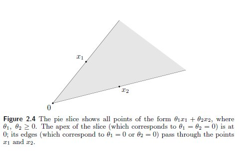
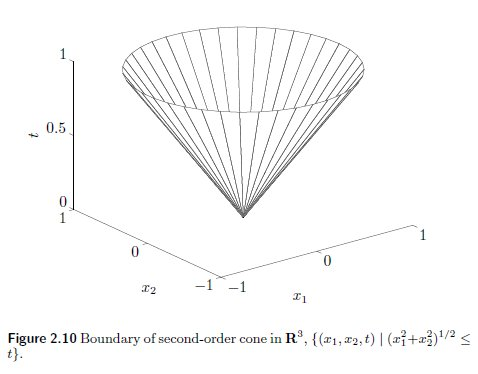
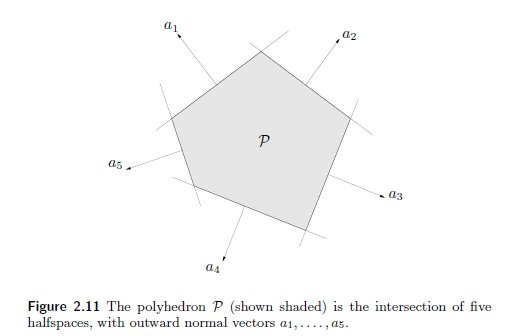
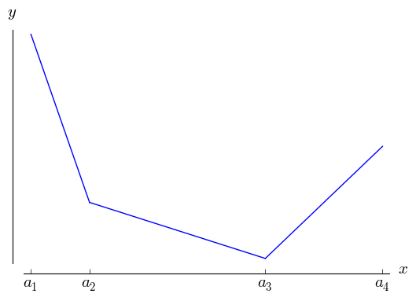
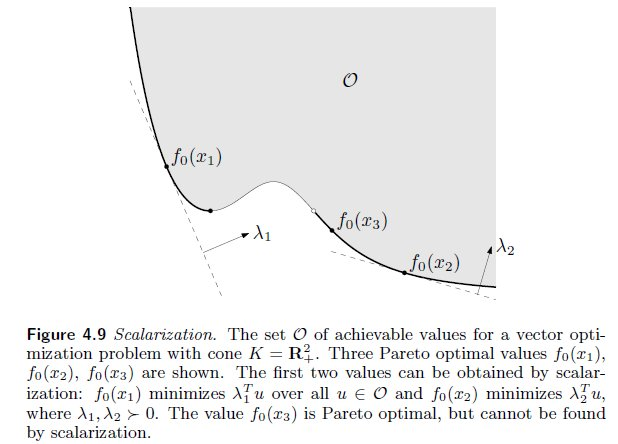

<style>
div.blue { 
   background-color:#e6f0ff; 
   border-radius: 3px; 
   padding: 10px;
}
</style>

Refs:

+ [Convex Optimization in R](https://cvxr.rbind.io/)
+ [Convex Optimization – Boyd and Vandenberghe](http://stanford.edu/~boyd/cvxbook/)
+ [CVX MOOC](https://lagunita.stanford.edu/courses/Engineering/CVX101/Winter2014/about)
+ [CVX Examples](http://cvxr.com/cvx/examples/)


```{r}
suppressWarnings(library(CVXR, warn.conflicts=FALSE))

library(magrittr)
library(ggplot2)
library(ggforce)
```


## Introduction

A **convex combination** of $x_1 \ldots x_k$ is any point 

$$x = \theta_1 x_1 + \ldots + \theta_k x_k$$

with $\theta_1 + \ldots + \theta_k = 1, \theta_i \geq 0$

A **convex hull** of set S is the set of all convex combinations of points in S.

A **conic combination** of $x_1, x_2$ is any point

$$x = \theta_1 x_1 + \theta_2 x_2$$

with $\theta_i \geq 0$

A **convex cone** of set S is the set of all conic combinations of points in S.

<center></center>

### Important convex sets

A **hyperplane** is a set of form $\{ x | a^T x = b\}$, where $a \in \mathbb{R}^n, a \neq 0, b \in \mathbb{R}$. In 2D (n=2) this is a line, in 3D it's a plane.

$a$ can be seen as the normal vector to the hyperplane, and $b$ its offset from the origin.

A hyperplane divides $\mathbb{R}^n$ into two **hyperplanes**.

An **Euclidian ball** in $\mathbb{R}^n$ with center $x_c$ and radius $r$ has the form

$$B(x_c, r) = \{ x | \Vert  x-x_c \Vert_2 \leq r \} = \{ x|(x-x_c)^T(x-x_c) \leq r^2  \}$$

where $\Vert \Vert_2$ is the Euclidean norm, i.e., $\Vert u \Vert_2 = (u^T u)^{1/2}$

An **ellipsoid** is a set of the form:

$$\{ x|(x-x_c)^T P^{-1}(x-x_c) \leq 1  \}$$

where $P$ is a symmetric and [positive-definite matrix](https://en.wikipedia.org/wiki/Positive-definite_matrix), i.e., $P=P^T \succ 0$. The matrix $P$ determines hor far the ellipsoid extends in every direction form the center $x_c$. A Euclidean ball is an ellipsoid when $P=r^2 I$.

A **norm ball** given norm $\Vert \cdot \Vert$ is $\{ x | \Vert  x-x_c \Vert \leq r \}$.

Remember that a function is a norm if $\Vert x \Vert \geq 0$, $\Vert t x \Vert = |t| \Vert x \Vert$, and $\Vert x+y \Vert \leq \Vert x \Vert + \Vert y \Vert$.

A **norm cone** is a set $\{ (x,t) | \Vert x \Vert \leq t  \}$

If the norm is the Euclidean norm, then the norm cone is called **second-order cone**.

<center></center>

A **Polyhedra** is the solution set of several linear inequalities and equalities

$$Ax \preceq b, \quad Cx = d$$

with $A \in \mathbb{R}^{m \times n}, C \in \mathbb{R}^{p \times n}$.

A **Polyhedra** is the intersection of a finite number of halfspaces and halfplanes.

<center></center>

## Optimization Problems

An optimization problem in standard form:

`minimize` $f_0(x)$

`subject to` 

+ $f_i(x) \leq 0, i=1,\dots,m$

+ $h_i(x) = 0, i=1,\dots,p$


$x$ is the **optimization variable** (can be a vector or matrix), $f_0$ is the **objective or cost function**, $f_i$ are the **inequality constraints** and $h_i$ the **equality constraints**.

If instead of minimizing, we wish to maximize, $f_0$ usually is called the utility or profit function.

$x$ is **feasible** if satisfies the constraints and belongs to the domain of $f_0$. 

The **optimal value** $p^*$ is the solution we want, if it exists. If $p^* = \infty$ the problem is infeasible (no $x$ satisfies the constraints). If $p^* = - \infty$ the problem in unbounded below which is a sign of a incorrect model.

The **set of optimal points** is $X_{opt} = \{x | p^*=f_0(x) \land x \in \text{dom} f_0 \}$

There are implicit constraints that determine that $x$ must fall into the domain of functions $f_0, f_i, h_i$. 

The next eg does not have explicit constraints 

Say we have some data:

```{r}
set.seed(100)
k <- 3
A <- matrix(rnorm(k*k, 10), k, k)
b <- rnorm(k, 10)
```

and this is our optimization problem:

`minimize` $f_0(x) = - \sum_{i=1}^k \log (b_i - a_i^T x)$

but $a^T_ix < b_i$ is an implicit constraint.

Using CVXR:

```{r, collapse=TRUE}
x <- Variable(k)      # define variable as a vector 3x1

objective <- Minimize( -sum(log(b-A%*%x)) )  # define objective function
problem   <- Problem(objective)              # create problem instance

## Checking problem solution

solution <- solve(problem) 
solution$status       # can return optimal, optimal_inaccurate, infeasible or unbounded
solution$getValue(x)  # an optimal x
solution$value        # p* = f0(x)
```

Package CVXR deals with **convex optimization problems**. These are optimization problems where functions $f_0, f_i$ are [convex](https://en.wikipedia.org/wiki/Convex_function), and the equality constraints are affine (ie, linear functions with translation):

<div class = "blue">
`minimize` $f_0(x)$

`subject to`

+ $f_i(x) \leq 0, i=1,\dots,m$

+ $a_i^T x = b_i, i=1,\dots,p$ or just $Ax = b$
</div>

An important property is that the feasible set of a convex problem is itself convex.

Another important property is that a _locally optimal point of a convex problem is (globally) optimal_.

One important point is that _convexity is an attribute of the description of the problem_.

Consider the following problem

<div class = "blue">
`minimize` $f_0(x) = x_1^2 + x_2^2$

`subject to` 

+ $f_1(x) = x_1 / (1+x_2^2) \leq 0$

+ $h_1(x) = (x_1 + x_2)^2 = 0$
</div>

which definitely is not a convex problem ($h_1$ is not affine, for eg).

However, asking if some $x^2 = 0$ is the same as asking if some $x=0$

Also, $1+x_2^2$ is always positive.

So the original problem can be transformed into an equivalent problem:

<div class = "blue">
`minimize` $f_0(x) = x_1^2 + x_2^2$

`subject to` 

+ $f_1(x) = x_1 \leq 0$

+ $h_1(x) = x_1 + x_2 = 0$
</div>

which is a convex problem!

```{r, collapse=TRUE}
x1 <- Variable(1)      # a scalar
x2 <- Variable(1)      # a scalar

objective   <- Minimize( x1^2 + x2^2 ) 
constraints <- list(x1 <= 0, x1 + x2 == 0)
problem     <- Problem(objective, constraints)

## Checking problem solution

solution <- solve(problem) 
solution$status       
solution$getValue(x1) 
solution$getValue(x2) 
solution$value
```

### Linear Optimization

A linear program (LP) has an affine objective and constraint functions.

The feasible set is a polyhedron (the simplex method is an algorithm that moves in this polyhedron to find the optimal solution).

Example: choose cheapest healthy diet $x$ with quantities $x_1 \ldots x_n$ of $n$ foods, where (a) one unit of food $j$ costs $c_j$ and contains amount $a_{ij}$ of nutrient $i$; (b) healthy diet requires nutrient $i$ in quantity at least $b_i$.

<div class = "blue">
`minimize` $c^T x$

`subject to` 

+ $Ax \geq b$

+ $x \geq 0$
</div>

```{r}
n <- 4  # number of foods
i <- 3  # number nutrients

# nutrient's amounts (column is food, row is nutrient)
A <- matrix(c(10, 40,  0, 20,   
               5, 20, 15, 11,
              20, 10,  6,  0), ncol=n, nrow=i, byrow = T)
# minimal amounts
b <- c(50, 10, 20)
# costs
c <- c(30, 10, 5, 15)
```

The problem specification:

```{r, collapse=TRUE}
x <- Variable(4)      # 4x1 vector

objective   <- Minimize( t(c) %*% x ) 
constraints <- list(A%*%x >= b, x >= 0)
problem     <- Problem(objective, constraints)

## Checking problem solution

solution <- solve(problem) 
solution$status       
round(solution$getValue(x),3)
solution$value
```

### Piecewise-linear optimization

These are problems like:

<div class = "blue">
`minimize` $\text{max}_{i=1\ldots m} a_i^T x + b_i$
</div>

graphically, it's the minimum of a given section of a polyhedra



This problem is equivalent to the following LP:
<div class = "blue">
`minimize` $t$

`subject to` 

+ $a_i^T x + b_i \leq t, i=1\ldots m$
</div>

Example: find the [Chebyshev center](https://en.wikipedia.org/wiki/Chebyshev_center) of a polyhedron.

The Chebyshex center $x_c$ is the center of the largest inscribed circle (in a sense, the deepest point inside the polyhedron). Be $r$ the radius of that circle.

```{r}
n <- 2
A <- matrix(c(2,  1, 
              2, -1, 
             -1,  2,
             -1, -2), nrow=4, ncol=n, byrow = TRUE)
b <- c(1,1,1,1)
norm_A <- rowSums(A^2)^0.5  # given A, norms are just scalars
```

```{r, fig.width=5, fig.height=5}
ggplot() +
    geom_abline(slope = -A[,1]/A[,2], intercept = b/A[,2]) +
    labs(x = "x", y = "y") +
    theme_bw() +
    xlim(-1, 1) + ylim(-1, 1)
```

This problem can be solved by the following LP:

<div class = "blue">
`maximize` $r$

`subject to` 

+ $a_i^T x_c + r \Vert a_i \Vert_2  \leq b_i, i=1\ldots m$
</div>

```{r, collapse=TRUE}
r   <- Variable(1, name="radius")
x_c <- Variable(n, name="center")

objective   <- Maximize( r ) 
constraints <- list(A%*%x_c + r*norm_A <= b)
problem     <- Problem(objective, constraints)

## Checking problem solution

solution <- solve(problem) 
solution$status       
solution$getValue(x_c)
solution$value
```


```{r, fig.width=5, fig.height=5}
center <- round(as.double(solution$getValue(x_c)),3)
radius <- round(as.double(solution$getValue(r)),3)

ggplot() +
    geom_abline(slope = -A[,1]/A[,2], intercept = b/A[,2]) +
    geom_circle(mapping = aes(x0 = center[1], y0 = center[2], r = radius), color = "blue") +
    geom_point(mapping = aes(x = center[1], y = center[2]), color = "red", size = 2) +
    labs(x = "x", y = "y") +
    theme_bw() +
    xlim(-1, 1) + ylim(-1, 1)
```

## Quadratic Programming


A convex optimization problem is called a quadratic programmin (QP) if the objective function is a convex quadratic and the constraint functions are affine.

<!--
$$
\begin{array}{ll}
  \mbox{minimize} & x^2 + y^2 \\
    \mbox{subject to} & x \geq 0, \quad 2x + y = 1
\end{array}
$$
-->

An example:

<div class = "blue">
`minimize` $x^2 + y^2$

`subject to` 

+ $x \geq 0$

+ $2x+y=1$
</div>

```{r, collapse=TRUE}
x <- Variable(1)
y <- Variable(1)

objective   <- Minimize(x^2 + y^2)
constraints <- list(x >= 0, 2*x + y == 1)
problem     <- Problem(objective, constraints)

# Probleolution
solution <- solve(problem) 
solution$status
solution$getValue(x)
solution$getValue(y)
solution$value
```

### Least Squares 

A very well known problem that's QP is least squares (linear regression)

Let's generate some data based on a linear model: $Y = X \beta + \epsilon$

```{r}
set.seed(123)

n <- 100  
p <- 10
beta <- -4:5   # the true parameters are [−4,...,−1,0,1,...,5]

X <- matrix(rnorm(n * p), nrow=n)
Y <- X %*% beta + rnorm(n)
```

The QP is

<div class = "blue">
`minimize` $\|Y - X\beta\|_2^2$
</div>

<!--
$$\begin{array}{ll}
    \underset{\beta}{\mbox{minimize}} & \|y - X\beta\|_2^2,
  \end{array}$$
-->

```{r}
betaHat   <- Variable(p)
objective <- Minimize(sum((Y - X %*% betaHat)^2))
problem   <- Problem(objective)

result <- solve(problem)
result$getValue(betaHat) %>% round(3)
```

We can compare with the use of R's `lm`:

```{r}
ls.model <- lm(Y ~ 0 + X)
matrix(coef(ls.model), ncol = 1) %>% round(3)
```

So we just emulate `lm`... But this QP can be updated to include variants of the classical method. Consider we would like all estimates of $\beta$ to be positive (nonnegative least squares regression).

While the classical regression has an analytical solution, this variant does not. However, it's just an extra constraint for the QP:

```{r}
constraints <- list(betaHat >= 0)
problem <- Problem(objective, constraints)

result <- solve(problem)
result$getValue(betaHat) %>% round(3)
```

Another eg. If we would like to force $2*\beta_2 + \beta_3 = 0$:

```{r}
A <- matrix(c(0, 2, 1, rep(0, 7)), nrow = 1)
constraints <- list(A %*% betaHat == 0)
problem <- Problem(objective, constraints)

result <- solve(problem)
result$getValue(betaHat) %>% round(3)
```

### Support Vector Classifier

Let's make some data:

```{r, fig.width=5, fig.height=5}
set.seed(101)
n <- 20
X1 <- c(rnorm(n), rnorm(n, mean=1.5))
X2 <- c(rnorm(n), rnorm(n, mean=1.5))
X <- matrix(c(X1,X2), ncol=2)
Y <- c(rep(1,n), rep(-1,n))

ggplot() + 
  geom_point(mapping = aes(x = X[,1], y = X[,2]), color = Y+2, size = 2) +
  labs(x = "x1", y = "x2") +
  theme_bw()
```

The Support Vector Classifier (SVC) is an affine function (hyperplane) that separates two sets of points by the widest margin. When the sets are not linearly separable, the SVC is determined by a trade-off between the width of the margin and the number of points that are misclassified.

Variable $\xi$ is the amount by which a point can violate the separating hyperplane. Its cost is the penalty $C>0$ (as $C$ increases, fewer misclassifications will be allowed).

The model is:

<div class = "blue">`minimize` $\frac{1}{2} \Vert \beta \Vert^2 + C\sum_{i=1}^m \xi_i$

`subject to`

+ $\xi_i \geq 0$

+ $y_i(x_i^T\beta + \beta_0) \geq 1 - \xi_i, \quad i = 1,\ldots,m$
</div>

```{r}
C <- 100
beta0 <- Variable()
beta  <- Variable(2)
slack <- Variable(2*n)

# Form problem
objective <- (1/2) * sum_squares(vstack(beta, beta0)) + C * sum(slack)
constraints <- list(Y * (X %*% beta + beta0) >= 1 - slack, slack >= 0)
problem <- Problem(Minimize(objective), constraints)
solution <- solve(problem)
```

To plot the separating hyperplane (here, a line) we need to get the $\beta$ to find its slope and intercept:

```{r, fig.width=5, fig.height=5}
beta.hat  <- solution$getValue(beta)
beta0.hat <- solution$getValue(beta0)

ggplot() + 
  geom_point(mapping = aes(x = X[,1], y = X[,2]), color = Y+2, size = 2) +
  geom_abline(slope = -beta.hat[1,]/beta.hat[2,], intercept = -beta0.hat/beta.hat[2,]) +
  labs(x = "x1", y = "x2") +
  theme_bw()
```


### Vector Optimization

Vector optimization occurs when the objective function $f_0(x)$ to minimize is vector-valued, i.e., $x \in \mathbb{R}^n$.

For this problem to work there must be a proper cone $K$ in order to compare objective values.
If $x,y$ are two feasible points (they satisfy the contraints), the respective objective values $f_0(x), f_0(y)$ are to be compared using the inequality $\preceq_K$. If $f_0(x) \preceq_K f_0(y)$ the we interpret that by saying $x$ is better or equal than $y$.

The main problem is that $f_0(x), f_0(y)$ might not be comparable, something that cannot happen in scalar objective functions.

If for every feasible $y$, $f_0(x) \preceq_K f_0(y)$ we say that $x$ is a **optimal value**. If it exists, it will be unique ($K$ is a cone). This, however, is not common.

A feasible $x$ is **Pareto optimal** if, for every feasible $y$, $f_0(y) \preceq_K f_0(x) \implies f_0(y) = f_0(x)$. That is, among all comparable values, $x$ is the smallest. 

A vector optimization problem usually has many Pareto optimal values. Every Pareto optimal value lies in the boundary of the set of feasible objective values.

<center></center>

#### Scalarization

Scalarization is a technique to find Pareto optimal values.

Chose any vector $\lambda \succ_K 0$ and transform the objective function into

<div class = "blue">`minimize` $f_0(x) = \lambda^T f_0(x)$</div>

If $x^*$ is the optimal value of this problem, then $x^*$ is a Pareto optimal for the original vector optimization problem.

Vector $\lambda$ is called the **weight vector**, satisfying $\lambda \succ_K 0$. It is a free parameter which we can vary to obtain different Pareto optimal solutions. However, there might be Pareto optimal solutions that cannot be found using scalarization.

<center></center>

Only when the vector optimization problem is convex, the scalarization is able to find all Pareto optimal solutions.

### Regularized Least Squares

In regularized least squares we add an extra objective, $F_2(x) = \Vert x \Vert_2^2$, which is a measure of the size of the coefficients $x$. By minimizing the sum with $F_1(x) = \Vert Ax - b \Vert_2^2$, the goal is to find a good fit ($F_1$) which is not large ($F_2$).

This can be seen as a vector optimization problem:

<div class = "blue">`minimize` $f_0(x) = (F_1(x), F_2(x))$</div>

We can scalarize this problem by taking $\lambda_1, \lambda_2 > 0$:

<div class = "blue">`minimize` $f_0(x) = \lambda_1 F_1(x) + \lambda_2 F_2(x)$</div>

As an eg, assume the following data:

```{r, fig.height=5, fig.width=5, collapse=TRUE}
n <- 2 
my.data <- data.frame(tannin= c(0:8),
                      growth= c(12,10,8,11,6,7,2,3,3))

lm(my.data[,2] ~ my.data[,1])$coefficients

ggplot(data = my.data, aes(x = tannin, y = growth)) + 
  geom_point(size = 2) +
  geom_smooth(method='lm', se=FALSE) +
  theme_bw()
```

Let's translate the data frame into the matrix form `Ax=b`:

```{r}
n.samples <- nrow(my.data)
# first column of 1s is for the intercept, 2nd column in the independent variable (tannin)
A <- matrix(c(rep(1,n.samples), my.data[,1]), ncol=2)
# b has the depedent variable (growth)
b <- my.data[,2]
```

Using function `glmnet` to compute the ridge regression:

```{r, fig.height=5, fig.width=5, collapse=TRUE}
library(glmnet)

# lambda value is the impact of the regularization term
#   if lambda=0, we have ordinary least squares, if lambda=Inf all coefficients will be zero
# alpha=0 is ridge penalty, alpha=1 is lasso
fit.lm <- glmnet(A, b, alpha=0, lambda=0) # OLS
coef(fit.lm)
fit.reg <- glmnet(A, b, alpha=0, lambda=2)
coef(fit.reg)

ggplot(data = my.data, aes(x = tannin, y = growth)) + 
  geom_point(size = 2) +
  geom_abline(intercept=coef(fit.lm)[1,1],  slope=coef(fit.lm)[3,1],  color="blue", size=1.25) +
  geom_abline(intercept=coef(fit.reg)[1,1], slope=coef(fit.reg)[3,1], color="red", size=1.25) +
  theme_bw()
```

Now, let's use `CVXR` functions to implement the optimization problem:

```{r}
regularized_regression <- function(A, b, lambdas=c(1,0)) {
  x <- Variable(ncol(A))
  
  objective <-  sum(lambdas[1] * cvxr_norm(A %*% x - b)^2, lambdas[2] * cvxr_norm(x)^2 )
  problem <- Problem(Minimize(objective))
  result <- solve(problem)
  
  result$getValue(x) %>% round(3)
}
```

And let's compare a regularized result ($\lambda_1=1, \lambda_2=0.7$) with the ordinary least squares:

```{r, fig.height=5, fig.width=5, collapse=TRUE}
fit.lm  <- regularized_regression(A,b,lambdas=c(1,0)) # OLS
fit.lm
fit.reg <- regularized_regression(A,b,lambdas=c(1,0.7))
fit.reg

ggplot(data = my.data, aes(x = tannin, y = growth)) + 
  geom_point(size = 2) +
  geom_abline(intercept=fit.lm[1],  slope=fit.lm[2],  color="blue", size=1.25) +
  geom_abline(intercept=fit.reg[1], slope=fit.reg[2], color="red",  size=1.25) +
  theme_bw()
```

## Norm Approximation

Norm approximation refers to the unconstrained problem

<div class = "blue">`minimize` $f_0(x) = \Vert Ax - b \Vert$</div>

with $A \in \mathcal{R}^{m \times n}$, $b \in \mathcal{R}^m$ which are the problem data, $x \in \mathcal{R}^n$ which is the variable, and $\Vert \cdot \Vert$ is the norm.

The vector $r = Ax - b$ is called the residual.

The norm approximation is a solvable convex problem which can be stated in the perspective of a penalty function approximation:

<div class = "blue">
`maximize` $\phi(r_1) + \phi(r_2) + \ldots + \phi(r_n)$

`subject to` 

+ $r = A x - b$
</div>

where $\phi(\cdot)$ is a convex penalty function.

Let's just make some fake data:

```{r}
set.seed(100)
m <- 100
n <- 30

A <- matrix(rnorm(m*n), m, n)
b <- rnorm(m)
```

### $l_2$-norm

The most common norm approximation is least-squares, i.e., minimize the sum of the residuals' squares, that is, $\phi(x)=x^2$.

<div class = "blue">
`minimize` $r_1^2 + r_2^2 + \ldots + r_n^2$

`subject to` 

+ $r = A x - b$
</div>

```{r}
x.l2 <- Variable(n)
objective <- Minimize(sum((A %*% x.l2 - b)^2))
problem   <- Problem(objective)

result.l2 <- solve(problem)
coefs.l2 <- result.l2$getValue(x.l2)  # coefs.l2 == coef(lm(b~0+A))
```

### $l_1$-norm

We can choose other penalty functions. If instead of summing the residuals' squares, we add their absolute values we get $l_1$-norm:

<div class = "blue">
`minimize` $|r_1| + |r_2| + \ldots + |r_n|$

`subject to` 

+ $r = A x - b$
</div>

```{r}
x.l1   <- Variable(n)
objective <- Minimize(sum(abs(A %*% x.l1 - b)))  # or Minimize(CVXR::norm1(A %*% r + b))
problem   <- Problem(objective)

result.l1 <- solve(problem)
coefs.l1 <- result.l1$getValue(x.l1)
```

### $l_\infty$-norm

The $l_\infty$-norm or minimax approximation is stated as:

<div class = "blue">
`minimize` $max \{|r_1|, |r_2|, \ldots, |r_n| \}$

`subject to` 

+ $r = A x - b$
</div>

```{r}
x.inf   <- Variable(n)
objective <- Minimize(max(abs(A %*% x.inf - b)))  # or Minimize(CVXR::norm_inf(A %*% r - b))
problem   <- Problem(objective)

result.linf <- solve(problem)
coefs.linf <- result.linf$getValue(x.inf) 
```

### Deadzone-linear

In this norm, we assume that residuals close to zero are not costly, and after that thresold, we implement a linear cost function:

$$ \phi(r) = 
\left\{
 \begin{array}{l}
   0 & |r| \leq a  \\
   |r|-a & |r| > a 
 \end{array} \right.
$$

```{r}
a.dz <- 0.5 ## deadzone threshold
x.dz <- Variable(n)
objective <- Minimize(sum(max(abs(A %*% x.dz - b) - a.dz, 0)))
problem   <- Problem(objective)

result.dz <- solve(problem)
coefs.dz <- result.dz$getValue(x.dz) 
```

### Huber-norm

In this case function $\phi$ is, for threshold $M>0$:

$$ \phi(r) = 
\left\{
 \begin{array}{l}
   r^2 & |r| \leq M  \\
   2Mr-M^2 & |r| > M 
 \end{array} \right.
$$

```{r, echo=FALSE}
huber.penalty <- function(r, M=1) {
  cond <- ceiling((1+sign(M-abs(r)))/2)
  r^2          *    cond + 
  (2*M*r-M^2)  * (1-cond)
}

# objective <- Minimize(sum(huber.penalty(b - A %*% x.huber, M)))
```


The behaviour of the Huber function is to treat small residuals as lest-squares, and after that, use a linear penalty function. This is more forgiving to outliers and does not care much for small residues (it prevents sparcity, lots of zero residuals as in the $l_1$-norm).

```{r}
M <- 1 ## Huber threshold
x.huber <- Variable(n)

objective <- Minimize(sum(CVXR::huber(b - A %*% x.huber, M)))
problem   <- Problem(objective)

result.huber <- solve(problem)
coefs.huber <- result.huber$getValue(x.huber) 
```

Let's compute and plot the residuals for each norm approximation:

```{r}
plot.residuals <- function(coefs, A, b, my.norm) {
  residual <- A %*% coefs - b
  residual %>% as.vector() %>% hist(breaks=20, xlim=c(-3, 3), ylab=my.norm, main="")
}
```

```{r, collapse=TRUE}
plot.residuals(coefs.l2,    A, b, "l_2 norm")
plot.residuals(coefs.l1,    A, b, "l_1 norm")
plot.residuals(coefs.linf,  A, b, "l_inf norm")
plot.residuals(coefs.dz,    A, b, "dead zone")
plot.residuals(coefs.huber, A, b, "huber")
```

Notice how $l_1$ promotes sparcity, lots of values lie at zero. This is an implication of the linear penalty. Even small residues are encouraged to shrink (while for the least squares, they become very small very quickly for residuals less than 1).

```{r, echo=FALSE}
# result$getValue(r) %>% as.data.frame() -> residual
# names(residual) <- "residuals"
# 
# residual %>% 
#   ggplot(aes("residuals", xmin=-.5, xmax=.5)) +
#   geom_histogram()
```


## Regularization

In regularization the goal is to find a vector $x$ that is as small as possible, while also keeping the residuals small.

There is a trade-off between these two goals. If $x=0$ we minimize the later while making the residuals equal to $\Vert b \Vert$. 

A common way to mix the two goals is to sum both using some specific function to determine the impact of $x$ in the objective.

<div class = "blue">
`minimize` $\Vert Ax-b \Vert + \delta \Vert x \Vert$
</div>

for some positive $\delta$ that determines how costly are the values of $x$.

```{r}
delta <- 2
x.reg <- Variable(n)
objective <- Minimize(sum((A %*% x.reg - b)^2) + delta * sum(x.reg^2))
problem   <- Problem(objective)

result.reg <- solve(problem)
coefs.reg <- result.reg$getValue(x.reg)

#plot.residuals(coefs.reg, A, b, "regularization")
```

## Robust Approximation

Usually when fitting or optimizing a model, people do not consider that the exact values they are using are quite probably suffer from measurement errors. This attitute can provide models that are not robust. 

One way to deal with it is to apply sensitivity analysis which tries to fit the model using small differences on its initial parameters to check if the final results are similar to the original (evidence that the model is robust) or not (bad news).

Another solution is to include in the model the uncertainty itself.

Let's say we have the objective $\Vert Ax - b\Vert$ but we need to consider uncertainty on matrix $A$, given that we don't know for certain its exact values.

Assuming $A$ as a random var in $\mathcal{R}^{m \times n}$, with mean $\bar{A}$, we can describe $A$ as

$$A = \bar{A} + U$$

where $U$ is random matrix with zero mean describing $A$'s statistical variation.

Thus, the original problem becomes

<div class = "blue">
`minimize` $E||(\bar{A}+U)x-b||$
</div>

which is know as the _stochastic robust approximation problem_. It is a convex problem but usually not tractable.

For eg, if the norm is the square norm, $|| \cdot ||_2$, the U is uniform over an interval, we get stochastic robust least squares:

<div class = "blue">
`minimize` $E||(\bar{A}+U)x-b||_2^2$
</div>

If the objective is solved  (cf. pp 318-9 of Boyd et al.)

$$E||(\bar{A}+U)x-b||_2^2 = \ldots = E||\bar{A}x-b||_2^2 + x^T P x$$

where $P = E U^T U = U^T U /3$, we will get the classic regularized least-squares problem! Regularization is a process to create robust models.

So, let's fake some data:

```{r}
set.seed(100)
m <- 20
n <- 10

A <- matrix(rnorm(m*n), m, n)
b <- rnorm(m)

U <- matrix(rnorm(m*n), m, n)
P <- t(U) %*% U / 3
```

Then, let's optimize $x$ for the classic norm and the robust version:

```{r}
x.norm <- Variable(n)
objective <- Minimize(sum((A %*% x.norm - b)^2))
problem   <- Problem(objective)

result.norm <- solve(problem)
coefs.norm <- result.norm$getValue(x.norm) 

##############

x.stoch <- Variable(n)
objective <- Minimize( norm2(A%*%x.stoch - b) + quad_form(x.stoch,P)) 
problem   <- Problem(objective)

result.stoch <- solve(problem)
coefs.stoch <- result.stoch$getValue(x.stoch) 
```

Now, we'll produce several $\bar{A}$ adding $A$ with different values of $U$:

```{r}
set.seed(100)
us <- seq(-2,2,len=100)

residual.norm  <- rep(NA,100)
residual.stoch <- rep(NA,100)

for (i in 1:length(us)) {
  A.bar <- A + us[i]*U
  residual.norm[i]  <- norm(A.bar %*% coefs.norm  - b, "2")
  residual.stoch[i] <- norm(A.bar %*% coefs.stoch - b, "2")
}
```

And plot them:

```{r}
plot  (us, residual.norm,  col="red",  lwd=2, ty="l", ylab="residual", xlab="u")
points(us, residual.stoch, col="blue", lwd=2, ty="l")
```

As we can see, the classic norm achieves smaller residuals when the error is zero. However, it has a worst performance when the error increases. The robust version paid the price of having larger residuals at $u=0$ but becomes much more robust!


## MaxEnt

MaxEnt is a method to select a prior distribution in Bayesian inference. Among many available distributions, choose the one with largest entropy, meaning, the one that assumes less about the problem. More info [here](../maxent/maxent.html).

```{r}
n <- 100
a <- seq(0,20,len=n) # theoretical support [0,+oo) but we assume a light tail 
lambda <- .5

A <- matrix(a, ncol=n)
b <- 1/lambda 
```

The next code tries uses vector `pmaxent` as an approximation to a continuous distribution (by using constraint `sum(pmaxent) == 1`). In this eg, the other constraint (`A %*% pmaxent == b`) determines that it must have mean `b`. Of course, there are infinite possibilities. We wish the one that maximizes its entropy:

```{r}
pmaxent   <- Variable(n)
objective <- Maximize(sum(entr(pmaxent)))

constraints  <- list(sum(pmaxent) == 1, A %*% pmaxent == b)
prob.max.ent <- Problem(objective, constraints)

solution.max.ent <- solve(prob.max.ent)
```

The distribution that maxent selects knowing only the mean is the exponential distribution. The next plot shows the optimization result compared with the theoretical result:

```{r}
plot(a,solution.max.ent$getValue(pmaxent), pch=20, ylab="")
diff <- dexp(0,rate=lambda) / solution.max.ent$getValue(pmaxent)[1] # scale back to maxent approx
curve(dexp(x,rate=lambda)/diff, col="red", add=T)
```

