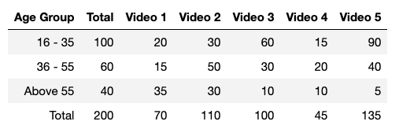

```{r setup, include=FALSE}
knitr::opts_chunk$set(echo = TRUE)
```


An advertising agency want to analyze the advertisements for a product. They want to target people from all age groups. They show 5 advertisement videos to 200 people. The following is the data on how many people from each group liked which videos.



A new consumer is shown the videos and he likes videos 2, 3 and 5. Which age group is he most likely to belong to?

```{r}
# the collected data
ages.16.35 <- c(20,30,60,15,90)
ages.36.55 <- c(15,50,30,20,40)
ages.older <- c(35,30,10,10, 5)

total.16.35 <- 100
total.36.55 <-  60
total.older <-  40
```

Let the new data be coded as $D=\{v_1, v_2, \ldots, v_5\}$ where $v_i$ is 1 if the video $i$ was liked, 0 otherwise. In the example you give, that is $D=\{0,1,1,0,1\}$.

```{r}
# the new data
new.data <- c(0,1,1,0,1)
```

Concerning video $j$ for age category $i$, we model its binary response as a Bernoulli,

$$v_j \sim \text{Bern}(\theta_{ij})$$

$\theta_{ij}$ means the probability of liking video $j$ for category $i$.

I will assume that, for a given age category, liking a video is independent of liking or not any other video.

Now we consider the existence of three models, $\mathcal{M_i}$, one per age category.

Applying Bayes theorem,

$$p(\mathcal{M}_i~|~D) \propto p(D~|~\mathcal{M}_i)p(\mathcal{M}_i)$$

The priors for models $\mathcal{M}_i$ can be either the uniform $p(\mathcal{M_i}) = 1/3$ or we assume that the collected data is representative of the company's clients and use,

$$p(\mathcal{M}_1) = \frac{100}{200} = 0.5; p(\mathcal{M}_2) = 0.3; p(\mathcal{M}_3) = 0.2$$

In the next computations, I'm using this second option.

For the likelihood, we plug the Bernoulli probability mass functions together with the independence assumption and get:

$$p(D~|~\mathcal{M}_i) = \prod_{j=1}^5 \theta_{ij}^{v_j} (1-\theta_{ij})^{1-v_j}$$
Ok, let's R it:

```{r}
thetas <- matrix(c(c(ages.16.35)/total.16.35,
                   c(ages.36.55)/total.36.55,
                   c(ages.older)/total.older), nrow=3, byrow=TRUE)

priors <- c(total.16.35, total.36.55, total.older)
priors <- priors / sum(priors)

likelihood <- function(D, i, thetas) {
  prod(thetas[i,]^D * (1-thetas[i,])^(1-D))
}

likelihoods <- sapply(1:3, function(i) likelihood(new.data,i,thetas))

posteriors <- likelihoods * priors
posteriors <- posteriors / sum(posteriors)

round(100*posteriors, 2) # in percentages
```

If you want to dig deeper in the Bayesian rabbit hole, use the collected data to assign priors for the $\theta_{ij}$ parameters. The model would become,

$$v_{ij} \sim \text{Bern}(\theta_{ij})$$

$$\theta_{ij} \sim \text{Beta}(k_{ij}+1,n_i-k_{ij}+1)$$

where $k_{ij}$ is the total of likes for video $j$ for age category $i$, and $n_i$ is the total of persons at age category $i$.

One last thing. The probabilities that you get after the model fit have uncertainties (as described by the posteriors distributions, if you use Stan or similar software tools). The decision of assigning the new data to an age category is not the model's responsibility. Decision comes after inference in a Bayesian workflow.

You need to think if the costs of false positives are the same for all age categories. Perhaps assigning an older person to a younger category is twice as costly. That should have impact in your final classification.