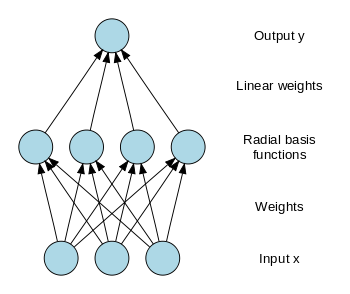

```{r, message = FALSE, tidy = FALSE, echo = F}
## knitr configuration: http://yihui.name/knitr/options#chunk_options
opts_chunk$set(comment = "", error= TRUE, warning = FALSE, message = FALSE,
               tidy = FALSE, cache = FALSE, echo = T,
               fig.width = 8, fig.height = 8)
```

Radial Basis Functions
========================================================

A radial basis function, RBF, $\phi(x)$ is a function with respect to the origin or a certain point $c$, ie, $\phi(x) = f(\|x-c\|)$ where the norm is usually the Euclidean norm but can be other type of measure.

The RBF learning model assumes that the dataset ${\cal D} = (x_n,y_n), n = 1\ldots N~~$ influences the hypothesis set $h(x)$, for a new observation $x$, in the following way:

$$h(x) = \sum_{n=1}^N w_n \times exp(-\gamma \|x-x_n\|^2)$$

which means that each $x_i$ of the dataset influences the observation in a gaussian shape. Of course, if a datapoint is far away from the observation its influence is residual (the exponential decay of the tails of the gaussian make it so). It is an example of a localized function ($x \rightarrow \infty \implies \phi(x) \rightarrow 0$). Notice that other type of radial functions can be used. Some egs:

+ Multi-quadratic: $\phi(x) = \sqrt{x^2 + \gamma^2}$
+ Thin plate spline: $\phi(x) = x^2 ln(x)$

Let's use a one-dimensional dataset as an ilustration of the gaussian influence:

```{r}
rbf.gauss <- function(gamma=1.0) {
  
  function(x) {
    exp(-gamma * norm(as.matrix(x),"F") )
  }
}

D <- matrix(c(-3,1,4), ncol=1) # 3 datapoints
N <- length(D[,1])

xlim  <- c(-5,7)
plot(NULL,xlim=xlim,ylim=c(0,1.25),type="n")
points(D,rep(0,length(D)),col=1:N,pch=19)
x.coord = seq(-7,7,length=250)
gamma <- 1.5
for (i in 1:N) {
  points(x.coord, lapply(x.coord - D[i,], rbf.gauss(gamma)), type="l", col=i)
}
```

The value of gamma controls how far or how little the influnce of each datapoint is felt:

```{r}
plot(NULL,xlim=xlim,ylim=c(0,1.25),type="n")
points(D,rep(0,length(D)),col=1:N,pch=19)
x.coord = seq(-7,7,length=250)
gamma <- 0.25
for (i in 1:N) {
  points(x.coord, lapply(x.coord - D[i,], rbf.gauss(gamma)), type="l", col=i)
}
```

We will need a learning algorithm to find the appropriate $\boldsymbol w=(w_1,w_2,\ldots,w_n)$.

The choice of ${\bf w}$ should follow the goal of minimizing the in-sample error of the dataset ${\cal D}$, $E_{in}({\cal D})$, or simply $E_{in}$.

This means ${\bf w}$ should satisfy:

$$\sum_{m=1}^N w_m \times exp(-\gamma \|x_n-x_m\|^2) = y_n$$

for each datapoint $x_n \in {\cal D}$.

There are $N$ equations for $N$ unknowns. In matrix form:

$$
\underbrace{
\left\lbrack
\begin{matrix}
exp(-\gamma \|x_1-x_1\|^2) & \cdots & exp(-\gamma \|x_1-x_N\|^2) \cr
exp(-\gamma \|x_2-x_1\|^2) & \cdots & exp(-\gamma \|x_2-x_N\|^2) \cr
\vdots & \ddots & \vdots \cr
exp(-\gamma \|x_N-x_1\|^2) & \cdots & exp(-\gamma \|x_N-x_N\|^2) \cr
\end{matrix}
\right\rbrack
}_{\Phi}

\underbrace{
\left\lbrack
\begin{matrix}
w_1  \cr
w_2  \cr
\vdots \cr
w_N
\end{matrix}
\right\rbrack
}_{\boldsymbol w}

=

\underbrace{
\left\lbrack
\begin{matrix}
y_1  \cr
y_2  \cr
\vdots \cr
y_N
\end{matrix}
\right\rbrack
}_{\boldsymbol y}
$$

or simply: ${\bf w} = \Phi^{-1} y$ which is an exact interpolation of the dataset.

Sometimes there is an inclusion of a bias parameter, $b$:

$$h(x) = b + \sum_{n=1}^N w_n \times exp(-\gamma \|x-x_n\|^2)$$

This produces the following change in the matrix form above ($b$ becomes $w_0$):

$$
\underbrace{
\left\lbrack
\begin{matrix}
1 & exp(-\gamma \|x_1-x_1\|^2) & \cdots & exp(-\gamma \|x_1-x_N\|^2) \cr
1 & exp(-\gamma \|x_2-x_1\|^2) & \cdots & exp(-\gamma \|x_2-x_N\|^2) \cr
\vdots & \vdots & \ddots & \vdots \cr
1 & exp(-\gamma \|x_N-x_1\|^2) & \cdots & exp(-\gamma \|x_N-x_N\|^2) \cr
\end{matrix}
\right\rbrack
}_{\Phi}

\underbrace{
\left\lbrack
\begin{matrix}
w_0  \cr
w_1  \cr
w_2  \cr
\vdots \cr
w_N
\end{matrix}
\right\rbrack
}_{\boldsymbol w}

=

\underbrace{
\left\lbrack
\begin{matrix}
y_1  \cr
y_2  \cr
\vdots \cr
y_N
\end{matrix}
\right\rbrack
}_{\boldsymbol y}
$$

Notice now that $\Phi$ is not a square matrix, so we need to compute the pseudo-inverse:

$$w = (\Phi^T \Phi)^{-1} \Phi^T y$$

This is a regression method. To adapt it for classification tasks (i.e., $y_n \in \{-1,1\}$), we compute:

$$h(x) = sign( b + \sum_{n=1}^N w_n \times exp(-\gamma \|x-x_n\|^2) )$$

where $sign()$ is the typical sign function.

However, if N is large, the need to use all in-sample datapoints is exagerated and might overfit. A variant is to choose K representatives ($K\lt\lt N$) that can do the interpolation. Choose the best $K$ centers among the possible $x_i \in {\cal D}$ is NP-hard, so a possible option is to select $K$ centers using a clustering algorithm, namely a K-means clustering. Let's name those centers $\mu_1, \ldots, \mu_K$. These $\mu_k$ define the set of _basis functions_.

Thus, the matrix form reduce the matrix $\Phi$ from a $N \times (N+1)$ matrix to a smaller $N \times (K+1)$ matrix:

$$
\underbrace{
\left\lbrack
\begin{matrix}
1 & exp(-\gamma \|x_1-\mu_1\|^2) & \cdots & exp(-\gamma \|x_1-\mu_K\|^2) \cr
1 & exp(-\gamma \|x_2-\mu_1\|^2) & \cdots & exp(-\gamma \|x_2-\mu_K\|^2) \cr
\vdots & \vdots & \ddots & \vdots \cr
1 & exp(-\gamma \|x_N-\mu_1\|^2) & \cdots & exp(-\gamma \|x_N-\mu_K\|^2) \cr
\end{matrix}
\right\rbrack
}_{\Phi}

\underbrace{
\left\lbrack
\begin{matrix}
w_0  \cr
w_1  \cr
w_2  \cr
\vdots \cr
w_N
\end{matrix}
\right\rbrack
}_{\boldsymbol w}

=

\underbrace{
\left\lbrack
\begin{matrix}
y_1  \cr
y_2  \cr
\vdots \cr
y_N
\end{matrix}
\right\rbrack
}_{\boldsymbol y}
$$

And again: $$w = (\Phi^T \Phi)^{-1} \Phi^T y$$

Let's implement this in R

```{r, echo=FALSE}
library("corpcor") # include pseudoinverse()
library(stats)     # include kmeans()
```

```{r}
# returns a rbf model given the:
# * observations x1, xN of dataset D
# * output value for each observation
# * number of centers
# * gamma value

rbf <- function(X, Y, K=10, gamma=1.0) {
  N     <- dim(X)[1] # number of observations
  ncols <- dim(X)[2] # number of variables
  
  repeat {
    km <- kmeans(X, K)  # let's cluster K centers out of the dataset
    if (min(km$size)>0) # only accept if there are no empty clusters
      break
  }

  mus <- km$centers # the clusters points
  
  Phi <- matrix(rep(NA,(K+1)*N), ncol=K+1)
  for (lin in 1:N) {
    Phi[lin,1] <- 1    # bias column
    for (col in 1:K) {
      Phi[lin,col+1] <- exp( -gamma * norm(as.matrix(X[lin,]-mus[col,]),"F")^2 )
    }
  }
  
  w <- pseudoinverse(t(Phi) %*% Phi) %*% t(Phi) %*% Y  # find RBF weights

  list(weights=w, centers=mus, gamma=gamma)  # return the rbf model
}
```

And also an implementation for the prediction function:

```{r}
rbf.predict <- function(model, X, classification=FALSE) {
  
  gamma   <- model$gamma
  centers <- model$centers
  w       <- model$weights
  N       <- dim(X)[1]    # number of observations
  
  pred <- rep(w[1],N)  # we need to init to a value, so let's start with the bias

  for (j in 1:N) {  
    # find prediction for point xj
    for (k in 1:length(centers[,1])) {
      # the weight for center[k] is given by w[k+1] (because w[1] is the bias)
      pred[j] <- pred[j] + w[k+1] * exp( -gamma * norm(as.matrix(X[j,]-centers[k,]),"F")^2 )
    }
  }
  
  if (classification) {
    pred <- unlist(lapply(pred, sign))
  }
  pred
}
```

Let's see an example:

```{r}
target <- function(x1, x2) {
  2*(x2 - x1 + .25*sin(pi*x1) >= 0)-1
}

N <- 100
X <- data.frame(x1=runif(N, min=-1, max=1),
                x2=runif(N, min=-1, max=1))
Y <- target(X$x1, X$x2)
plot(X$x1, X$x2, col=Y+3)
```

Now let's learn the dataset using the RBFs:

```{r}
rbf.model <- rbf(X, Y) # using default values for K and gamma
rbf.model
```

And make a prediction over a new test set:

```{r}
N.test <- 200
X.out <- data.frame(x1=runif(N.test, min=-1, max=1),
                    x2=runif(N.test, min=-1, max=1))
Y.out <- target(X.out$x1, X.out$x2)

rbf.pred <- rbf.predict(rbf.model, X.out, classification=TRUE)
binary.error <- sum(rbf.pred != Y.out)/N.test
binary.error

plot(X.out$x1, X.out$x2, col=Y.out+3, pch=0)
points(X.out$x1, X.out$x2, col=rbf.pred+3, pch=3)
points(rbf.model$centers, col="black", pch=19) # draw the model centers
legend("topleft",c("true value","predicted"),pch=c(0,3),bg="white")
```

It is also possible to generalize this method to assign different values of $\gamma$ for each center, i.e., instead of having one $\gamma$ we would have $\gamma_1, \ldots, \gamma_K$. In this scenario the model will contain a mixture of gaussians.

One way to solve this problem is to iterate using a EM algorithm in the following way:

1. Set init values for $\gamma_k$
2. Solve RBF to find $w$
3. With fixed $w$ minimize error with respect to $\gamma_k$
4. Repeat 1&2 until a convergence condition is satisfied

Radial basis function network
--------------------------

This radial basis function can be organized into the hidden layer of a neural network, and this type of network is called RBF Networks. The output of the network is a linear combination of RBFs of the inputs and neuron parameters.

<center></center>

Given the an observation $x$, and using $K$ neurons (like before, there correspond to centers computed by clustering), the output is 

$$y = \phi(x) = \sum_{i=1}^K w_i exp(-\gamma \|x-\mu_i\|^2)$$

where $w_i$ is the weigth of the $i^{th}$ neuron and $\mu_i$ is the center vector of that same neuron.

Given the gaussian decays, changing parameters of one neuron has only a small effect for input values that are far away from the center of that neuron. RBF network are universal approximators, so with enough hidden neurons they approximate any continuous function with arbitrary precision.

Again a learning algorithm chooses $w_i$, $\mu_i$ and $\gamma$ to optimize the fit between $\phi(x)$ and the training dataset ${\cal D}$.

Let's try an example using the RSNNS R package:

```{r}
library("RSNNS")

rbfn.model <- RSNNS::rbf(as.matrix(X,ncol=2), 
                         as.matrix(Y), 
                         size=30,    # number of centers, ie, number of neurons in hidden layer
                         maxit=1000, # max number of iterations to learn
                         linOut=TRUE) # linear activation function (otherwise logistic)

rbf.network.pred <- sign( predict(rbfn.model, X.out) ) # apply sign, since this is a classification eg
binary.error <- sum(rbf.network.pred != Y.out)/N.test
binary.error             

plot(X.out$x1, X.out$x2, col=Y.out+3, pch=0)
points(X.out$x1, X.out$x2, col=rbf.network.pred+3, pch=3)
legend("topleft",c("true value","predicted"),pch=c(0,3),bg="white")
```


