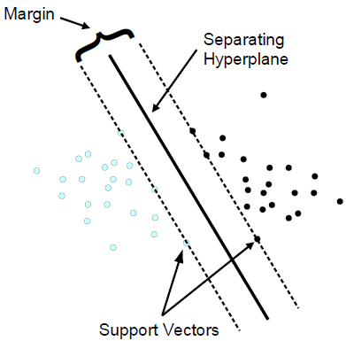
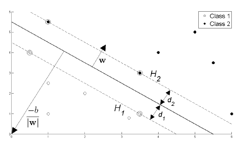
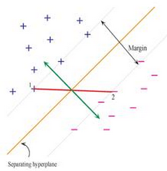
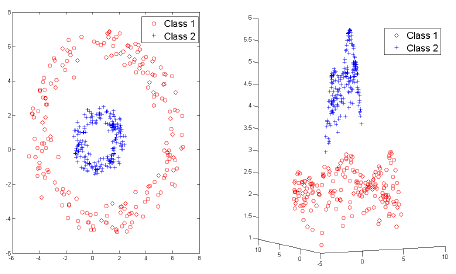
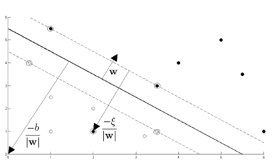
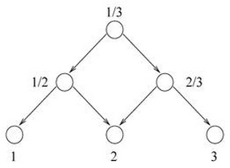
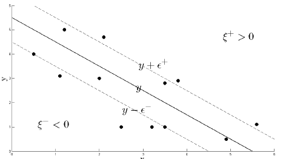

```{r, message = FALSE, tidy = FALSE, echo = FALSE}
## knitr configuration: http://yihui.name/knitr/options#chunk_options
opts_chunk$set(comment = "", error= TRUE, warning = FALSE, message = FALSE,
               tidy = FALSE, cache = FALSE, echo = TRUE,
               fig.width = 6, fig.height = 6)
```
Support Vector Machines
========================================================

ref:
+ [http://www.tristanfletcher.co.uk/SVM%20Explained.pdf](http://www.tristanfletcher.co.uk/SVM%20Explained.pdf)
+ [cran.r-project.org/web/packages/e1071/vignettes/svmdoc.pdf](cran.r-project.org/web/packages/e1071/vignettes/svmdoc.pdf)
+ [http://videolectures.net/epsrcws08_campbell_isvm/](http://videolectures.net/epsrcws08_campbell_isvm/) [video]

Introduction
------------

Consider a binary classification, where input vectors $x_i$ (the input space) and labels (aka, targets, classes) $y_i = \pm 1$.

```{r}
x1s <- c(.5,1,1,2,3,3.5,     1,3.5,4,5,5.5,6)
x2s <- c(3.5,1,2.5,2,1,1.2,  5.8,3,4,5,4,1)
ys <- c(rep(+1,6),          rep(-1,6))
my.data <- data.frame(x1=x1s, x2=x2s, type=as.factor(ys))
my.data
plot(my.data[,-3],col=(ys+3)/2, pch=19); abline(h=0,v=0,lty=3)
```

In SVM the error is minimized by maximizing the _margin_ $\gamma$, ie., the minimal distance between the hyperplane separating the two classes and the closest datapoints of each class (called _support vectors_).

<center></center>

The separating hyperplane can be written as
$$w.x + b = 0$$
where vector b is the bias, and w the weigths.

w is the normal to the hyperplane and $\frac{b}{\|w\|}$ is the perpendicular distance from the hyperplane to the origin

<center></center>

Deciding the class for a new observation $x_i$ is calculated by
$$D(x_i) = signal(w.x_i + b)$$

$D()$ is invariant under a positive scaling $w \rightarrow \lambda w$, $b \rightarrow \lambda b$. We fix $\lambda$ such that the _margin_ has distance $1$, and so
$$w.x + b = 1$$
or
$$w.x + b = -1$$
for the support vectors of one or the other side. This defines what is called by _canonical hyperplane_.

If $x_1, x_2$ are support vectors of each side, then subtracting the previous equations:
$$w.(x_1 - x_2) = 2$$

<center></center>

If we project the vector $x_1 - x_2$ (the red vector above) onto the normal to the hyperplane, ie, $\frac{w}{\|w\|}$, we get twice the size of the margin:

$$(x_1 - x_2) . \frac{w}{\|w\|} = \frac{w.(x_1 - x_2)}{\|w\|} = \frac{2}{\|w\|}$$

So $\gamma = \frac{1}{\|w\|}$.

We want to maximize the margin $\gamma$. So we need to maximize $\frac{1}{\|w\|}$, ie, minimize $\|w\|$ which is the same as minimize $\frac{1}{2}\|w\|^2$.

But this minimization has constraints. The vector $w$ must be such that all following conditions remain true
$$y_i (w.x_i + b) \geq 1$$
which respects the classification of the original dataset. The equations only return 1 for the support vectors. For every other datapoint, the value will be greater than one.

_This optimization requires Langrage multipliers which we will not follow (check the references above)_

This optimization will provide us with values $\alpha_i$ such that:
$$w = \sum_i \alpha_i y_i x_i$$
$$\sum_i \alpha_i y_i = 0$$

where if $x_i$ is a support vector then $\alpha_i>0$ (or zero otherwise).

and being $S$ the indexes of the support vectors:
$$b = \frac{1}{|S|} \sum_{s \in S} \Big( y_s - x_s . \sum_{m \in S} \alpha_m y_m x_m \Big)$$

with $b$ and $w$ the hyperplane is defined and we get our SVM!


```{r}
library(e1071)
svm.model <- svm(type ~ ., data=my.data, type='C-classification', kernel='linear',scale=FALSE)

plot(my.data[,-3],col=(ys+3)/2, pch=19, xlim=c(-1,6), ylim=c(-1,6)); abline(h=0,v=0,lty=3)
points(my.data[svm.model$index,c(1,2)],col="blue",cex=2) # show the support vectors

# get parameters of hiperplane
w <- t(svm.model$coefs) %*% svm.model$SV
b <- -svm.model$rho
# in this 2D case the hyperplane is the line w[1,1]*x1 + w[1,2]*x2 + b = 0
abline(a=-b/w[1,2], b=-w[1,1]/w[1,2], col="blue", lty=3)
```

And let's make a prediction:

```{r}
observations <- data.frame(x1=c(1,3.5),x2=c(4,3.5))

plot(my.data[,-3],col=(ys+3)/2, pch=19, xlim=c(-1,6), ylim=c(-1,6)); abline(h=0,v=0,lty=3)
points(observations[1,], col="green", pch=19)
points(observations[2,], col="blue", pch=19)
abline(a=-b/w[1,2], b=-w[1,1]/w[1,2], col="blue", lty=3)
predict(svm.model, observations) # the results are right
```

Another eg with the iris dataset:

```{r}
data(iris)
svm.model <- svm(Species ~ Sepal.Length + Sepal.Width, data = iris, kernel = "linear")
# the + are support vectors
plot(iris$Sepal.Length, iris$Sepal.Width, col = as.integer(iris[, 5]), 
     pch = c("o","+")[1:150 %in% svm.model$index + 1], cex = 2, 
     xlab = "Sepal length", ylab = "Sepal width")
plot(svm.model, iris, Sepal.Width ~ Sepal.Length, 
     slice = list(sepal.width = 1, sepal.length = 2))
svm.pred  <- predict(svm.model, iris[,-5]) 
table(pred = svm.pred, true = iris[,5]) # show the confusion matrix
```

<!--
TODO: experimentar fazer um eg 3d?
http://stackoverflow.com/questions/8017427/plotting-data-from-an-svm-fit-hyperplane
-->

Non linearly separable data
------------------------------

Notice that $x_i$ always appear in a dot product. This means that the results do not depend in the input space's dimension. So, one way is to increase the dimension of the data using a mapping $\phi$, turning each  $x_i$ into $\phi(x_i)$, such that the new data may be linearly separable:
$$x_i . x_j \rightarrow \phi(x_i) . \phi(x_j)$$

Here's an eg how to separate the 2D blue cloud using height in 3D:

<center></center>

This higher dimensional space is called a _feature space_ and it must be a _Hilbert space_ (ie, the concept of dot product applies).

The function
$$K(x_i,x_j) = \phi(x_i) . \phi(x_j)$$
is called a _kernel_ (in fact we just need to know the kernel, not the mapping $\phi$). The kernel is, therefore, the inner product between mapped pairs of points in feature space.

Different choices of kernel define different Hilbert spaces to use.

Some popular kernels:

+ Linear kernel (the one used implicitly)
$$K(x_1,x_2) = x_1^T.x_2$$

+ RBF kernels
$$K(x_1,x_2) = exp(\frac{-\|x_1-x_2\|^2}{2\sigma^2})$$

+ Polynomial kernels
$$K(x_1,x_2) = ( x_1.x_2 + a)^b$$

+ Sigmoidal kernels
$$K(x_1,x_2) = tanh(a x_1.x_2 - b)$$

where $a,b$ are parameters defining the kermel's behaviour.

Kernels can also be defined by algorithms, not only by functions.

The decision function becomes
$$D(z) = sign\big(\sum_i \alpha_i y_i K(x_i,z) + b\big)$$

An R eg using the polynomial kernel $(0.1 x_1.x_2 + 1)^8$:

```{r}
svm.model <- svm(type ~ ., data=my.data, type='C-classification', kernel='polynomial', degree=8, gamma=0.1, coef0=1, scale=FALSE)

plot(my.data[,-3],col=(ys+3)/2, pch=19, xlim=c(-1,6), ylim=c(-1,6)); abline(h=0,v=0,lty=3)
points(my.data[svm.model$index,c(1,2)],col="blue",cex=2) # show the support vectors
svm.pred <- predict(svm.model, my.data[,-3])
table(pred = svm.pred, true = my.data[,3]) 
```

Using the same kernel with the iris dataset:

```{r}
svm.model <- svm(Species ~ Sepal.Length + Sepal.Width, data = iris, kernel = 'polynomial', degree=8, gamma=0.1, coef0=1)
plot(svm.model, iris, Sepal.Width ~ Sepal.Length, 
     slice = list(Sepal.Width = 1, Sepal.Length = 2))
svm.pred  <- predict(svm.model, iris[,-5]) 
table(pred = svm.pred, true = iris[,5]) # show the confusion matrix
# not very great, but we had just used two attributes. If we use all four:
svm.model <- svm(Species ~ ., data = iris, kernel = 'polynomial', degree=8, gamma=0.1, coef0=1)
plot(svm.model, iris, Sepal.Width ~ Sepal.Length, 
     slice = list(Petal.Width = 3, Petal.Length = 2.5)) # showing a 2D slice of the 4D space
svm.pred  <- predict(svm.model, iris[,-5]) 
table(pred = svm.pred, true = iris[,5]) # show the confusion matrix
```

Soft Margins
------------

The constraints that SVM must abide
$$w.x_i + b \geq 1, y_i = +1$$
$$w.x_i + b \leq -1, y_i = -1$$
may be too strict to handle data not fully linearly separable (perhaps because of noise or outliers)

One way is to relax these constraints:
$$w.x_i + b \geq 1 - \xi_i, y_i = +1$$
$$w.x_i + b \leq -1  + \xi_i, y_i = -1$$
with $\forall_i \xi_i \geq 0$

creating what is called _soft margins_.

<center></center>

In this soft margin SVM, data points on the incorrect side of the margin
boundary have a penalty that increases with the distance from it. As we are
trying to reduce the number of misclassications, a sensible way to adapt
our objective function $\frac{1}{2}\|w\|^2$, is to minimize:
$$\frac{1}{2}\|w\|^2 + C \sum_i \xi_i$$
obyeing the relaxed restrictions, where $C$ controls the trade-of between the slack variable penalty and the size of the margin. A value $C$ much larger than $0$ converges to the original SVM algorithm. Unfortunately the optimal value of $C$ must come from trial-and-error.

This is again an optimization procedure that falls out the scope of this tutorial.

Let's test it with a wicked dataset:

```{r}
set.seed(101)
x1s <- c( rnorm(20,1,0.1), 2.5, rnorm(20,3,0.1))
x2s <- c( rnorm(20,1,0.1), 2.5, rnorm(20,3,0.1))
ys  <- c( rep(-1,21), rep(1,20))
my.data <- data.frame(x1=x1s, x2=x2s, type=as.factor(ys))
plot(my.data[,-3],col=(ys+3)/2, pch=19)
```

First with a hard-core margin (use option `cost`):

```{r}
svm.model <- svm(type ~ ., data=my.data, type='C-classification', kernel='linear', cost=1e10, scale=FALSE)

plot(my.data[,-3],col=(ys+3)/2, pch=19)
points(my.data[svm.model$index,c(1,2)],col="blue",cex=2) # show the support vectors

# get parameters of hiperplane
w <- t(svm.model$coefs) %*% svm.model$SV
b <- -svm.model$rho
# in this 2D case the hyperplane is the line w[1,1]*x1 + w[1,2]*x2 + b = 0
abline(a=-b/w[1,2], b=-w[1,1]/w[1,2], col="blue", lty=3)
```

Now a soft-margin:

```{r}
svm.model <- svm(type ~ ., data=my.data, type='C-classification', kernel='linear', cost=1, scale=FALSE)

plot(my.data[,-3],col=(ys+3)/2, pch=19)
points(my.data[svm.model$index,c(1,2)],col="blue",cex=2) # show the support vectors

# get parameters of hiperplane
w <- t(svm.model$coefs) %*% svm.model$SV
b <- -svm.model$rho
# in this 2D case the hyperplane is the line w[1,1]*x1 + w[1,2]*x2 + b = 0
abline(a=-b/w[1,2], b=-w[1,1]/w[1,2], col="blue", lty=3)
```

An important variant is when we consider one type of error more costly than the other (say, in a medical test for cancer, we prefer a false positive than a false negative, since in the later a sick patient will go untreated). To solve it, we assign different costs to each class:
$$\frac{1}{2}\|w\|^2 + C_+ \sum_{i_+} \xi_i + C_- \sum_{i_-} \xi_i$$
where $i_-$ are the indexes where $y_i=-1$, and $i_+$ for $y_i=+1$.

This is done at R's `svm()` with option `class.weights`

```{r}
# using the previous dataset...
costs <- table(my.data$type)  # the weight vector must be named with the classes names
costs[1] <- 1e10 # a class -1 mismatch has a terrible cost
costs[2] <- 1    # a class +1 mismatch not so much...
costs
svm.model <- svm(type ~ ., data=my.data, type='C-classification', kernel='linear', class.weights=costs, scale=FALSE)

plot(my.data[,-3],col=(ys+3)/2, pch=19)
points(my.data[svm.model$index,c(1,2)],col="blue",cex=2) # show the support

# get parameters of hiperplane
w <- t(svm.model$coefs) %*% svm.model$SV
b <- -svm.model$rho
# in this 2D case the hyperplane is the line w[1,1]*x1 + w[1,2]*x2 + b = 0
abline(a=-b/w[1,2], b=-w[1,1]/w[1,2], col="blue", lty=3)
```

We see that the algorithm, even with soft margins, decided to not take the risk of assigning a mismatch despite the probably outlier of class -1 (ie, the (2.5,2.5) data point).

Multi-classes
----------

If the dataset has a small number of classes, it's possible to reduce them into a set of binary classifications. Say we have three classes, $1,2,3$, we can split the process into three binary classifications like the method shown in the next DAG:

<center></center>

If the dataset has many classes, it's probably best to pick another method...

Anyway, to allow for multi-class classification, `svm()` uses the one-against-one technique by fitting all binary subclassifiers and finding the correct class by a voting mechanism. There are several classification variants, which can be specified in the `type` option (check `?svm` help file). This is done automatically.

SVM for regression
------------------

In this task we are not trying to classify a new observation $x_i$ into $y_i \pm 1$ but, instead, predict a real value for $y$ such that for all $x_i$ we have a real (not just binary) $y_i$ such that
$$y_i = w.x_i + b$$

The algorith will output a $y$ that minimizes some error function. However, it considers that for a given minimal distance $\epsilon$ the error is still zero, so the regression line, in terms of the error function is more like a tube (called the _$\epsilon$-insensitive tube_):

<center></center>

The regions outside the tube are given different penalties, if they lie 'above', $\xi^+ \gt 0$, or 'below', $\xi^- \gt 0$.

The error function for SVM regression is
$$\frac{1}{2}\|w\|^2 + C \sum_i (\xi^+_i + \xi^-_i)$$

which is again the subject of an optimization procedure that finds the optimal $y$.

Function `svd()` uses option `type="eps-regression"`. An eg:

```{r}
# must transform type from factor to numeric, in order to perform regression
my.data$type <- (my.data$type == "1")*2 - 1
svm.model <- svm(type ~ ., data=my.data, type="eps-regression")
predict.y <- predict(svm.model, my.data[,-3]) 
plot(my.data$x1, my.data$x2, pch=19, col=round(predict.y+3)/2) # perfect
# we can also predict one attribute based on another
svm.model <- svm(my.data$x1, my.data$x2, type="eps-regression")
predict.x2 <- predict(svm.model, my.data$x1) 
plot(my.data$x1, my.data$x2, pch=19)
points(my.data$x1, predict.x2, pch=19, col="red")
```
